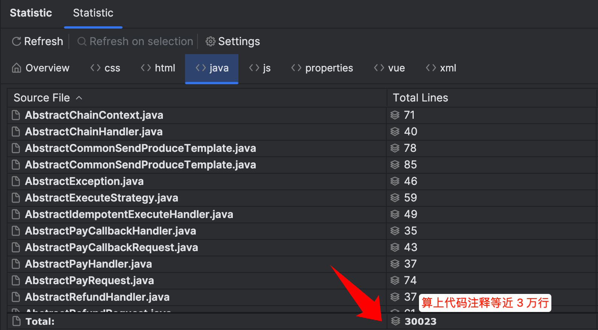
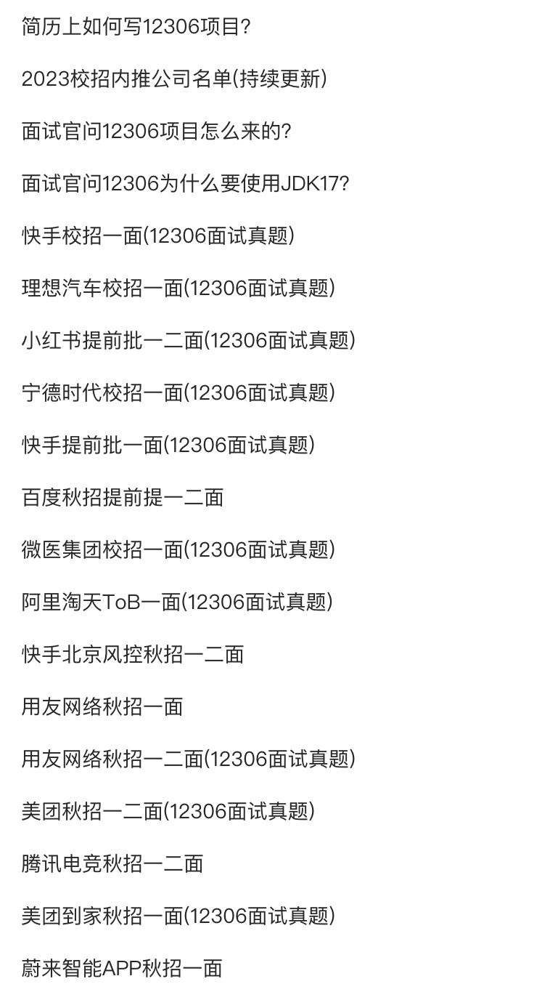
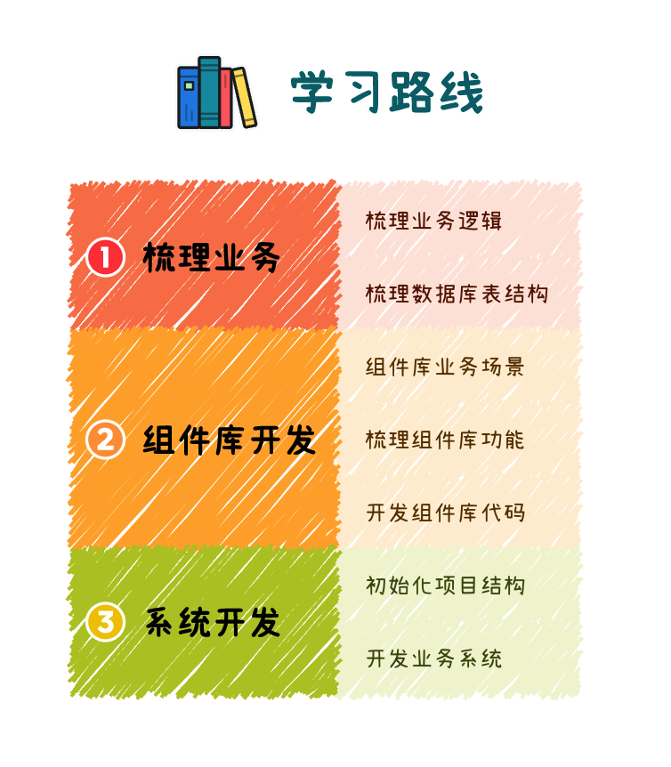
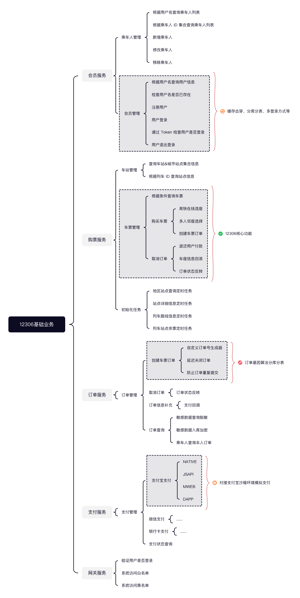
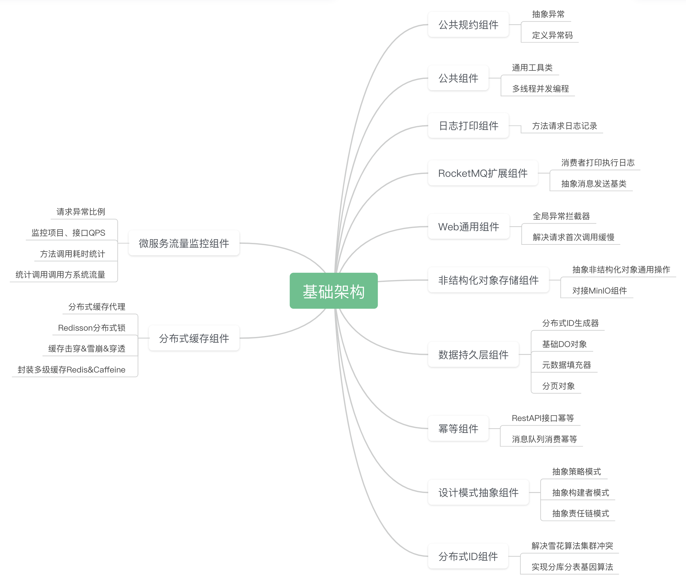
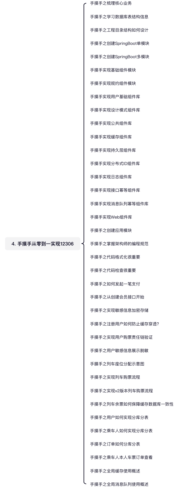

# 🔥如何选择适合自己的学习方式

学习前，要保证自己的项目运行完成：[如何快速启动项目](https://www.yuque.com/magestack/12306/rp9ie888uw73a0yr)。

这个文档分为两个部分，面试冲刺和从零到一学习，大家根据自身情况灵活选择。录制了相关视频，大家也可以根据视频来加深不同学习方式的理解。

[知识星球 | 深度连接铁杆粉丝，运营高品质社群，知识变现的工具](https://wx.zsxq.com/dweb2/index/topic_detail/188511412552282)

## 如何学习
众所周知 12306 是我近几年不管从业务、代码优雅以及架构上来说，耗费心血以及投入精力最多的项目。算上空行、注释以及代码共接近 3 万行，而且里面的很多设计都是我高度封装后的，基本上没有重复造轮子一说。总结了个 3 N 原则：设计模式 N 多，优雅代码 N 多，架构方案 N 多。

因为代码整体设计以及业务众多，如果从零到一把 12306 写出来，**无疑会耗费非常多的时间**。为此，我推荐大家学习 [面试冲刺章节](#MKkfs)。

那面试冲刺环节应该如何学习呢？这里我给大家梳理了一份学习方向和目标。

很多时候，我们针对一个陌生的系统，如何更快以及更好的进行学习，这是个问题。但是凑着这个机会，给大家推荐一个万金油理论。

一般我习惯从两个方面认识和学习系统或框架，拿 12306 举例。我们要想写到简历上，那自然是要知道 12306 的核心业务和核心技术是什么，这里我给大家梳理下。

核心业务&技术：

+ 判断用户名是否已被注册接口，如何应对海量并发请求带来的缓存穿透问题？
+ 用户敏感数据存储到数据库后，如何避免被黑客将数据库攻破并窃取用户信息？
+ 海量并发查询车票列表接口，如何应对海量请求的查询，以及众多条件如何满足？
+ 海量并发下单接口，如何应对海量用户下单请求，如何进行限流以保证系统不崩溃？以及如何正确落库？
+ 用户下单后如何保障列车座位余票缓存和数据库一致性？非常典型的数据库和缓存一致性问题。
+ 用户下单十分钟未支付，如何取消用户未付款订单？如果用户已支付，如何避免错误取消？
+ 系统中用了消息队列后，如何确保消息不会被重复消费，保证业务系统消费幂等性？
+ 海量用户和订单数据如何存储，通过什么分库分表规则保障系统高性能响应用户查询等请求？
+ 如何通过分库分表基因算法保障分片键的易用性？比如一个订单号字段同时支持订单号和用户 ID 查询。
+ 海量数据分库分表后，为什么选择雪花算法作为 ID？如何保障雪花算法在大规模集群下生成不重复？

好吧，亮点有点多，暂时先列这些......我们通过面试冲刺中所列的资料，以及咱们多多 Debug 项目代码，上面的这些问题都可以找到答案。如果找不到，你来找我。

将上面这些问题整理清楚，12306 系统你也基本上掌握七七八八了，应付大部分面试是绰绰有余的。而且，如果你有其他项目，也可以参考 12306 里的技术亮点进行代入。

:::info
如果看 12306 觉得有些技术不是很理解，比如微服务或者消息队列这些，希望能有个通过视频从零到一写的过程，那么我推荐学习咱们星球内的另一个项目 [SaaS短链接系统](https://t.zsxq.com/18Y3YuigM)，作为上手 12306 的跳板，架构基本类似，学习完该系统再看 12306 就会好很多。

:::

## 面试冲刺
根据星球中已经在面试的小伙伴反馈，基础还算可以的话，10-15天学习面试冲刺相关的（具体要看自己对于技术栈掌握情况，理论上如果 12306 用到的技术知道是什么并且会用，基本上就是这个时间段能掌握），已经可以去参加面试。

### 项目写到简历
如果你正在备战校招，学习时间有限，那就不要按照正常的从零到一学习了，只专注面试相关的文章即可。学习其中的代码设计思路，而不需要一行一行的去研究代码。

在这之前，大家首先要把 12306 项目写到简历上：[简历上如何写12306项目？](https://www.yuque.com/magestack/12306/mduoyi3ciwu61q2q)不一定要严格按照这上面去写，可以自己适当扩展。

### 中间件学习
接到众多球友们的反馈，说网上关于 12306 用到的中间件讲解太过于繁琐。为此，我新开了一个中间件从零到一学习专栏，旨在帮助大家更聚焦中间件基础学习，更好的了解 12306 对应的使用场景。

专栏会持续更新，最终会包括 `RocketMQ`、`ShardingSphere`、`Canal`、`Hippo4j`、`Redisson`、`Sentinel`、`Nacos`、`SpringCloud Gateway` 等。

如果大家已经对这些中间件掌握了基本的使用，可以跳过该章节。

+ [从零到一学习中间件之RocketMQ | 拿个offer-开源&项目实战](https://nageoffer.com/docs/rocketmq/)
+ [从零到一学习中间件之Sharding-JDBC | 拿个offer-开源&项目实战](https://nageoffer.com/docs/shardingsphere-jdbc/)

> 因为这一块内容是我从众多中间件的官网以及云服务产品中梳理而来，所以就没有把原创挂载到星球，而是外链到了拿个offer的公开网站里。
>

### 了解系统
其次，开始对项目进行初步的了解，通过视频以及文档形式：

+ [教学视频之手摸手快速启动项目](https://www.yuque.com/magestack/12306/qfwi0o4vsq2kv8uv)
+ [教学视频之如何发起一笔支付](https://www.yuque.com/magestack/12306/vawsamgsg02uwh7f)
+ [手摸手之梳理核心业务](https://www.yuque.com/magestack/12306/xd3vdnl1gsnb9p2c)
+ [视频教学之如何重置列车余票数据](https://www.yuque.com/magestack/12306/on455hhf6x1upmhq)
+ [视频教学之项目模块结构梳理](https://www.yuque.com/magestack/12306/yucgksziodfvg7a4)
+ [教学视频之手摸手梳理用户管理表结构](https://www.yuque.com/magestack/12306/flougseda5i8r6ls)
+ [教学视频之手摸手梳理列车管理表结构](https://www.yuque.com/magestack/12306/ru83o4gr7zeilgn0)
+ [教学视频之手摸手梳理订单管理表结构](https://www.yuque.com/magestack/12306/gdqtaygachdtsnas)

### 针对性学习
接下来，就是开始针对简历上的技能亮点针对式学习：

+ [手摸手之车票搜索为什么用Redis而不是ES？](https://www.yuque.com/magestack/12306/zd9wok8w0dn8eig5)
+ [手摸手之如何完成列车数据检索](https://www.yuque.com/magestack/12306/tygc8hs113al2c2z)
+ [手摸手之实现用户购票责任链验证](https://www.yuque.com/magestack/12306/ggg2txzbfgfqp6tm)
+ [手摸手之注册用户如何防止缓存穿透？](https://www.yuque.com/magestack/12306/go6vg8whk9g1lyhp)
+ [手摸手之从注册用户接口开始](https://www.yuque.com/magestack/12306/bhzetv04b8ydt1kg)
+ [手摸手之实现敏感信息加密存储](https://www.yuque.com/magestack/12306/vhf4i3c604t2qex7)
+ [手摸手之用户敏感信息展示脱敏](https://www.yuque.com/magestack/12306/myl4gqx84bxyxmay)
+ [手摸手之实现列车购票流程](https://www.yuque.com/magestack/12306/nmmgqkgbfxb2bwl0)
+ [手摸手之实现v2版本列车购票流程](https://www.yuque.com/magestack/12306/ov3u6lpgartx0mst)
+ [手摸手之列车余票如何保障缓存数据库一致性](https://www.yuque.com/magestack/12306/glv5e0785b2d7oag)
+ [手摸手之用户如何实现分库分表](https://www.yuque.com/magestack/12306/pb98neetmww1rr9y)
+ [手摸手之乘车人如何实现分库分表](https://www.yuque.com/magestack/12306/zhsauz6ksng8wvgf)
+ [手摸手之订单如何分库分表](https://www.yuque.com/magestack/12306/dyr1d4r3me19gg7l)
+ [手摸手之乘车人本人车票订单查看](https://www.yuque.com/magestack/12306/uonb6m6pgx1okebs)

### 面试常见问题
12306 的核心功能设计看完后，接下来就是看和面试相关的知识点。如果你去面试后，最好能把面试题给我一份，我会根据其中的常问内容总结面经或者视频进行解答。

目前已收录且做出回答的内容：

+ [列车数据查询为什么用Redis而不是ES？](https://www.yuque.com/magestack/12306/xvfml0biohw9c04l)
+ [列车数据查询有没有数据检索功能？](https://www.yuque.com/magestack/12306/mpwl0al8eskzw5mr)
+ [创建订单并支付后延时关闭订单消息怎么办？](https://www.yuque.com/magestack/12306/ldw8nxp96yfg7cgx)
+ [缓存击穿之双重判定锁如何优化性能？](https://www.yuque.com/magestack/12306/xrtg5mibquardvvi)
+ [项目什么场景使用线程池？参数如何设置？](https://www.yuque.com/magestack/12306/cwh86n5b149dz91a)
+ [购买列车余票如何防止库存超卖？](https://www.yuque.com/magestack/12306/pemih6p8h7xaw2b3)
+ [用户注册布隆过滤器容量设置以及碰撞率问题](https://www.yuque.com/magestack/12306/fr3zurztaq3xwfkc)
+ [节假日高并发购票Redis能扛得住么？](https://www.yuque.com/magestack/12306/eq6v9p9dfre117mg)
+ [购买列车中间站点余票如何更新？](https://www.yuque.com/magestack/12306/efhhtogdr8ouz6t2)
+ [余票Binlog更新延迟问题如何解决？](https://www.yuque.com/magestack/12306/kxuug8l6zslfyz21)
+ [12306核心接口性能优化都做了什么？](https://www.yuque.com/magestack/12306/bh7c4x3i4sn682bn)

把上面这些全部掌握，恭喜你，你去面试问题就不大了。掌握后，然后再结合星球已有的面试经验，深度挖掘 12306 可能被问到的技能点。也就是面试系列章节。

如果情况允许，可以将 12306 部署到自己的云服务器，增加项目可信度。[云服务器部署如何12306项目？](https://www.yuque.com/magestack/12306/bxcsdlnrsgzqtmnd)

## 从零到一学习
### 学习路线
12306 铁路购票系统学习总体分为三块：业务梳理、组件库开发以及业务系统开发。

### 业务梳理
在 12306 铁路购票系统中，包括会员、购票、订单、支付以及网关服务。

### 组件库开发
组件库的产出源于对公共功能的封装，避免了在不同项目之间相互复制代码的情况。当然，如果这种复制代码的方式出现问题，那么需要同时对所有项目进行改造，从成本和优雅设计的角度来看并不可取。

为了统一各个项目可能使用的公共内容，我们在这里规划了常用且通用的功能点，供大家使用，以提高编码效率。如果有一些好的想法，在通用的前提下，可以联系我们将其加入到各自语义的起始包中。

组件库的开发宗旨是汇总资源，更高效地提供业务敏捷开发的能力，后续的迭代也将遵循这一原则。目前，这只是一个起点，是整体规划的一部分，还有许多可以提升的空间。

目前已有组件如下，可能新增加的组件更新不及时，实际以代码库 `/frameworks` 目录下为准。

### 系统开发
当你对 12306 系统的业务有了初步认识，就可以考虑对这个系统进行从零到一的开发。

在正式开发框架之前，你需要把一些前置技术都有一定的掌握。不然极有可能是稀里糊涂的写，虽然写完了，但是吸收情况达不到最终的理想效果。

| 技术 | 名称 | 版本 | 官网 |
| --- | --- | --- | --- |
| Spring Boot | 基础框架 | 3.0.7 | [https://spring.io/projects/spring-boot](https://spring.io/projects/spring-boot) |
| MyBatis-Plus | 持久层框架 | 3.5.3.1 | [https://baomidou.com](https://baomidou.com) |
| Redis | 分布式缓存数据库 | Latest | [https://redis.io](https://redis.io) |
| RocketMQ | 消息队列 | 2.2.3 | [https://rocketmq.apache.org](https://rocketmq.apache.org) |
| ShardingSphere | 数据库生态系统 | 5.3.2 | [https://shardingsphere.apache.org](https://shardingsphere.apache.org) |
| SpringCloud Alibaba | 分布式框架 | 2022.0.0.0-RC2 | [https://github.com/alibaba/spring-cloud-alibaba](https://github.com/alibaba/spring-cloud-alibaba) |
| SpringCloud Gateway | 网关框架 | 2022.0.3 | [https://spring.io/projects/spring-cloud-gateway](https://spring.io/projects/spring-cloud-gateway) |
| TTL | 增强版 ThreadLocal | 2.14.3 | [https://github.com/alibaba/transmittable-thread-local](https://github.com/alibaba/transmittable-thread-local) |
| FastJson2 | JSON 序列化工具 | 2.0.36 | [https://github.com/alibaba/fastjson2](https://github.com/alibaba/fastjson2) |
| Canal | BinLog 订阅组件 | 1.1.6 | [https://github.com/alibaba/canal](https://github.com/alibaba/canal) |
| HuTool | 小而全的工具集项目 | 5.8.2 | [https://hutool.cn](https://hutool.cn) |
| Redisson | Redis Java 客户端 | 3.21.3 | [https://redisson.org](https://redisson.org/) |
| Sentinel | 流控防护框架 | 1.8.6 | [https://github.com/alibaba/Sentinel](https://github.com/alibaba/Sentinel) |
| Hippo4j | 动态线程池框架 | 1.5.0 | [https://hippo4j.cn](https://hippo4j.cn) |
| XXL-Job | 分布式定时任务框架 | 2.4.0 | [http://www.xuxueli.com/xxl-job](http://www.xuxueli.com/xxl-job) |
| SkyWalking | 分布式链路追踪框架 | 9.5.0 | [https://skywalking.apache.org](https://skywalking.apache.org/) |

另外，我们在手摸手从零到一开发章节中，会有非常详细的系列教程，帮助大家梳理以及开发。

大家在学习过程中有任何疑问，都可以在知识星球中发表主题或者向我提问，一般都会在 24 小时内保质保量回复。

> 更新: 2024-09-09 13:38:13  
> 原文: <https://www.yuque.com/magestack/12306/un0ded7hs43s7o7c>