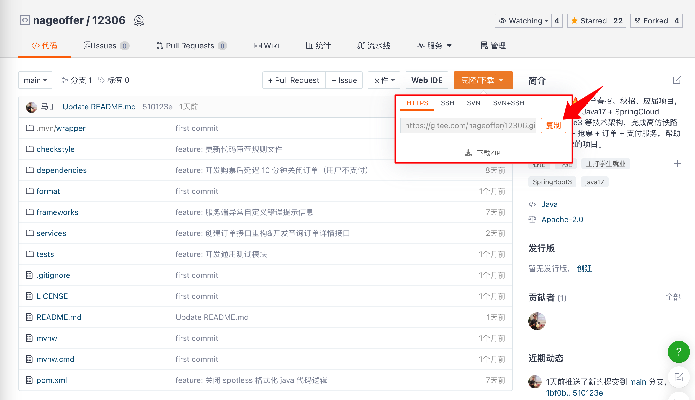
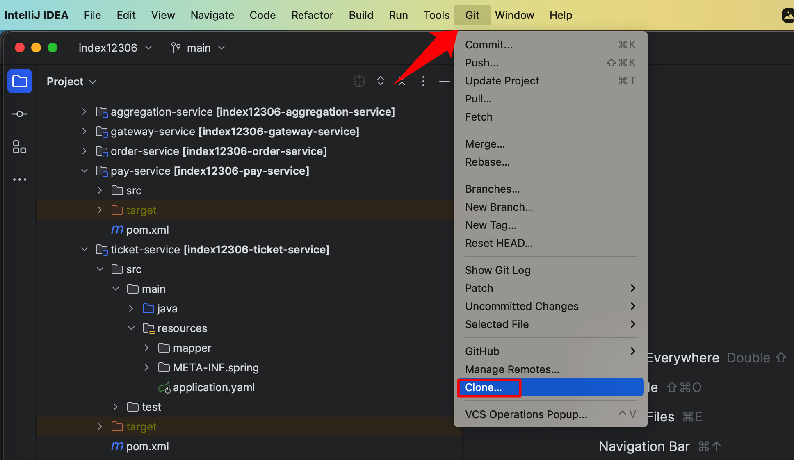
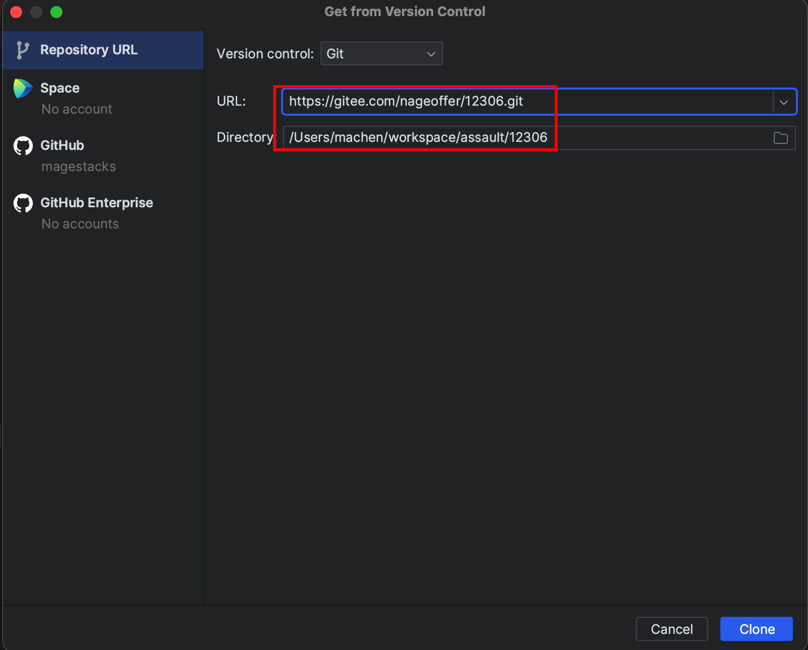
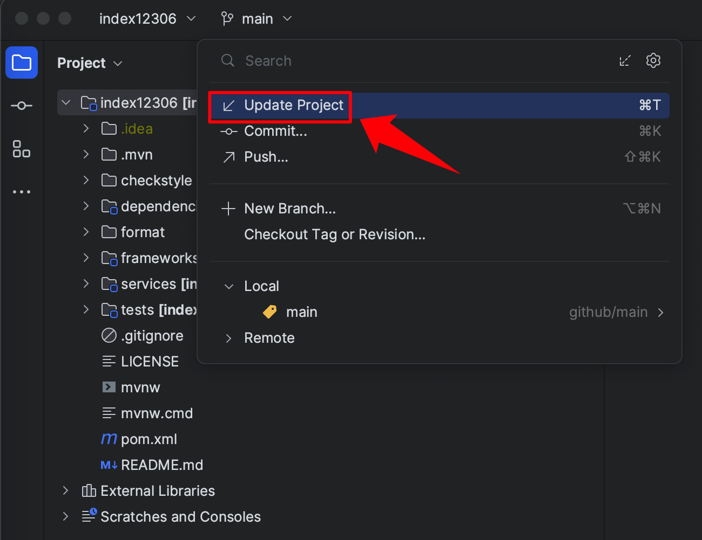
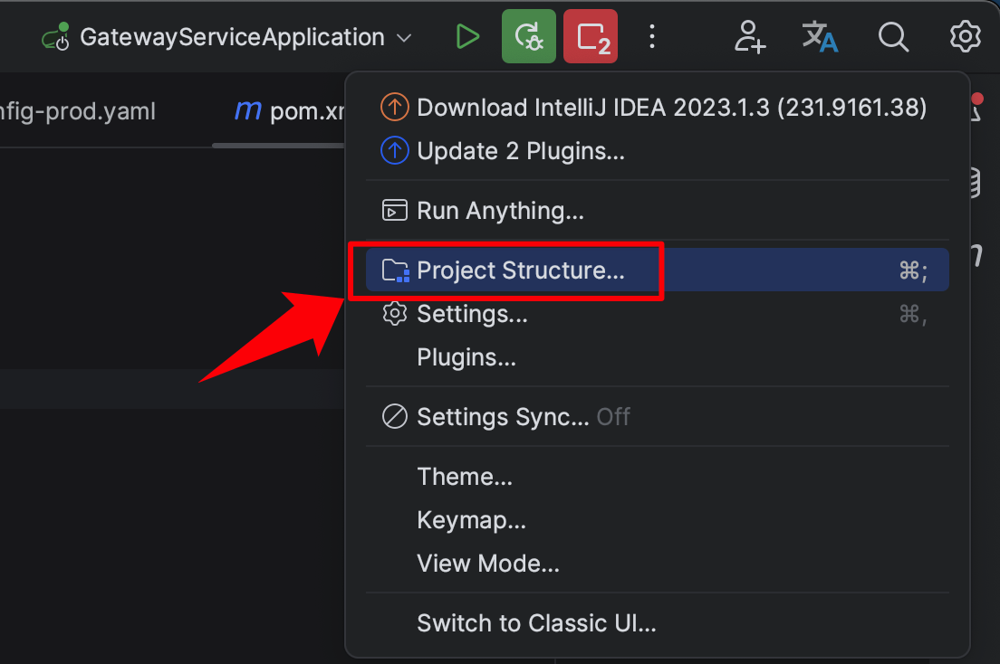
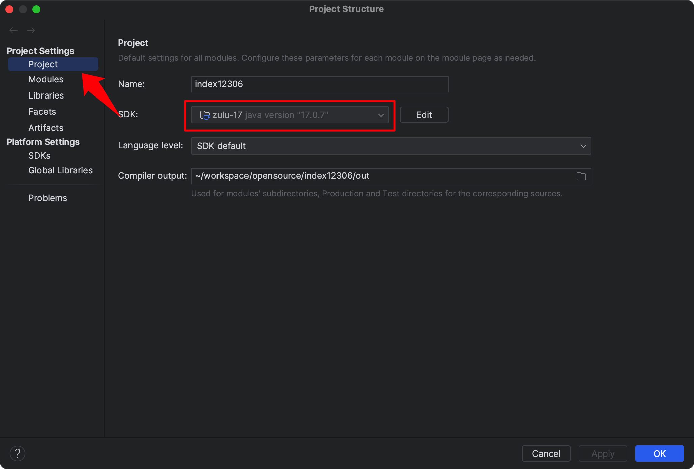

# 克隆项目

## 拉取项目到本地
打开 Gitee 项目地址：[https://gitee.com/nageoffer/12306](https://gitee.com/nageoffer/12306) 复制对应的 SSH 或 HTTP 克隆地址。

不要图省事选择下载 ZIP，因为下载后的项目是没办法通过 Git 去更新远程仓库最新代码的。12306 现在的代码还在不断更新迭代，每次打开项目都可以选择 Pull 下最新代码。




打开 IntelliJ  IDEA，菜单栏顶部找到 Git -> Clone 选项。不同电脑 Windows 或者 Mac 的位置可能有所不同，找到 Clone 这个按钮即可。




URL 文本框填写 12306 的 HTTP 或 SSH 地址，比如 HTTP 的地址：`https://gitee.com/nageoffer/12306.git`，Directory 填写项目存储在本地的目录地址。



等待克隆及 Maven 初始化即可。

拉下来后，可在项目根目录执行 `mvn clean install` 测试是否具备运行环境。


**<font style="background-color:#FBDE28;">⚠️</font>****<font style="background-color:#FBDE28;"> 重要提示。</font>**

建议大家在打开项目时，都执行下 Update Project 流程，因为代码目前还在快速迭代中，避免错过新功能。


因为不同版本的 IntelliJ  IDEA Git 操作为止也不同，所以大家可以使用快捷键操作。Mac 是 Command+T，Windows 应该是 Control + T。



## 服务模块列表
### SpringBoot 单体版本
**如果你想以小成本启动前后端系统，后端项目仅启动 `aggregation-service` 和 `gateway-service` 服务即可**。


Q：`aggregation-service` 服务是做什么的？

A：为了减少大家本地启动内存压力以及服务器部署压力，将订单、支付、用户以及购票系统进行了聚合，启动网关和 `aggregation-service` 服务即可享受 12306 购票系统全部功能。

### SpringCloud 分布式版本
如果你是想跑微服务全流程，需依次启动 `pay-service`、`order-service`、`ticket-service`、`user-service` 以及 `gateway-service` 等服务。

```plain
.
├── aggregation-service  || -- # 聚合服务
├── gateway-service  || -- # 网关服务
├── order-service  || -- # 订单服务
├── pay-service  || -- # 支付服务
├── ticket-service  || -- # 购票服务
└── user-service  || -- # 用户服务
```


如果想知道工程全部目录对应的语意，参考下述结构涉及文档。[手摸手之工程目录结构如何设计](https://www.yuque.com/magestack/12306/bvypcmc38cdvgt56)

## 设置 JDK 版本
12306 系统框架底层依赖 SpringBoot3，而这个版本对 JDK 的要求最低是 17。所以，我们需要将项目的 JDK 修改为 17 版本，避免项目编译或运行报错。


IntelliJ  IDEA 右上角点击齿轮设置图标，点击 Project Structure... 打开设置页面。




检查项目 SDK 的版本是否为 JDK17，如果不是请选择电脑上的 JDK 版本。




> 更新: 2023-09-14 15:35:37  
> 原文: <https://www.yuque.com/magestack/12306/han6idm9uotg7c91>