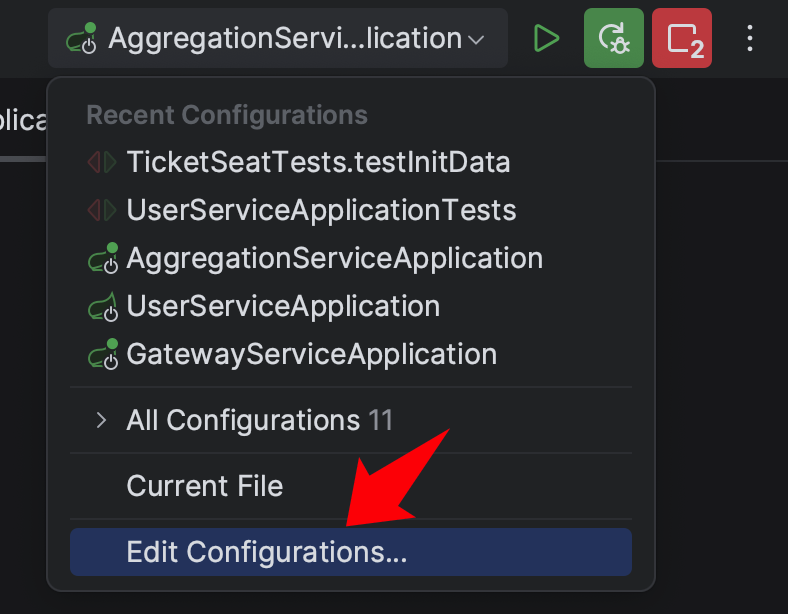
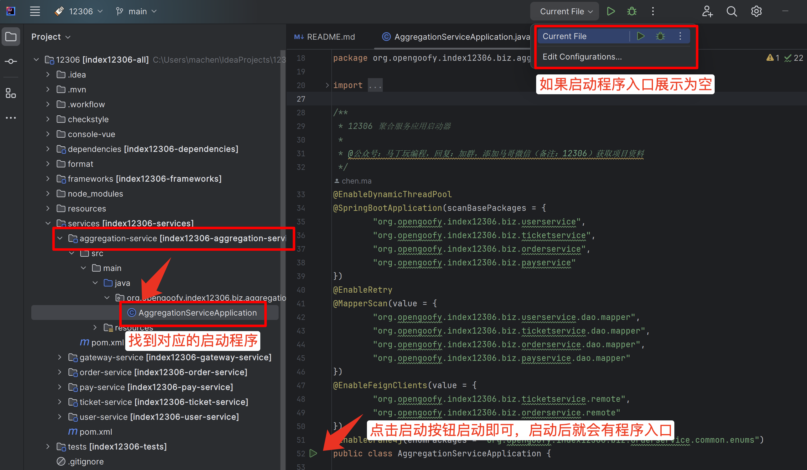
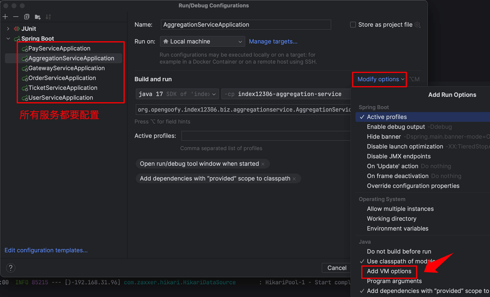
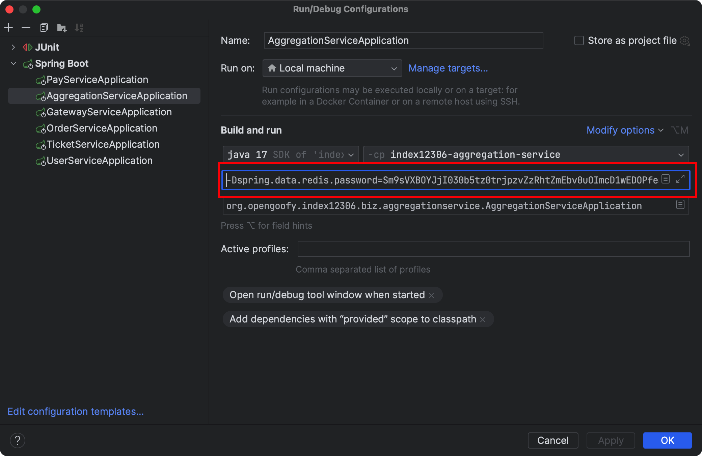
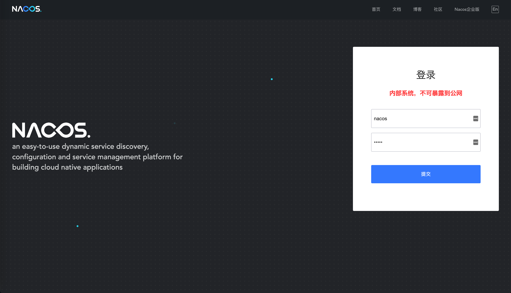
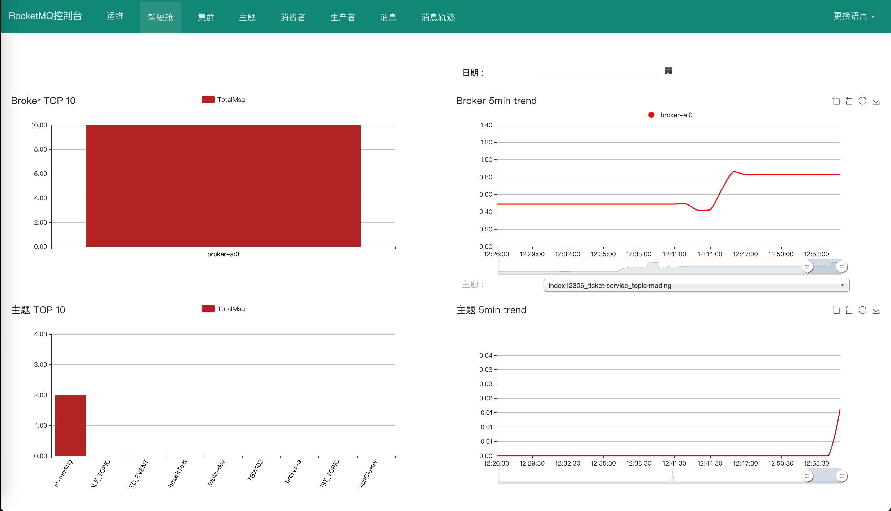

# 安装中间件环境

## 安装依赖环境
项目中依赖 Nacos、Redis、RocketMQ 等中间件依赖，为了让项目顺利启动，需要大家提前在本地安装或使用马哥提供的云中间件环境。

选择本地安装还是云中间件环境？如果本地电脑内存有限并且想省事，可以直接使用 [云中间件环境](#tmjoN) 章节开箱即用。追求稳定或本地已有相关依赖，参考 [本地环境安装](#qa3QI) 章节。

## 云中间件环境
:::color3
**云中间件环境暴露在公网之上，容易遭到“有心人”的攻击，如果大家发现之前服务是好的，但突然连接不到指定的中间件，那就是被攻击了。这种情况，可以微信联系我，我去尝试重启服务器，一段时间后会恢复正常。**

:::

### 获取中间件域名
[https://t.zsxq.com/10kVlK6Ap](https://t.zsxq.com/10kVlK6Ap)

### 添加 VM 启动参数
#### 实例参数
从上述知识星球链接中，获取到 Redis、RocketMQ以及 Nacos 域名，替换到下述文本中。

```shell
-Dspring.data.redis.password=Sm9sVXBOYJjI030b5tz0trjpzvZzRhtZmEbv0uOImcD1wEDOPfeaqNU4PxHob/Wp
-Dspring.data.redis.port=19389
-Dunique-name=-自定义名称，可以切换为自己的名称
-Dframework.cache.redis.prefix=自定义名称，可以切换为自己的名称:
-Dspring.data.redis.host=Redis域名
-Drocketmq.name-server=RocketMQ域名
-Dspring.cloud.nacos.discovery.server-addr=Nacos域名
```

#### 添加 VM 参数
通过 IDEA 打开应用启动列表，将 VM 参数设置到具体应用中。




刚拉下来项目时启动程序入口可能是空的，按照以下方式点击应用程序启动下，就会有了。




选择对应服务进行配置，最终所有服务列表都要添加 VM 参数配置。




真实的 VM 参数：

```shell
-Dspring.data.redis.password=Sm9sVXBOYJjI030b5tz0trjpzvZzRhtZmEbv0uOImcD1wEDOPfeaqNU4PxHob/Wp
-Dspring.data.redis.port=19389
-Dunique-name=-mading
-Dframework.cache.redis.prefix=mading:
-Dspring.data.redis.host=xxx
-Drocketmq.name-server=xxx
-Dspring.cloud.nacos.discovery.server-addr=xxx
```

注意，`-Dunique-name=-mading` 中 mading 前面有个中划线，`-Dframework.cache.redis.prefix` 中 mading 后面有个冒号。

**<font style="color:#DF2A3F;">大家 unique-name 和 framework.cache.redis.prefix 不要再使用 mading，可以替换为自己的名字或代号，不然的话会和其他同学调用混乱。！！！强烈建议加上随机字符，比如 mading0924xxx 等等，避免冲突。</font>**

> 如果实在不清楚如何如何添加 VM 参数，将上述这些配置直接替换服务中的配置文件也可以。
>


将 VM 参数赋值到 VM options 文本框中。



全部配置完成后，点击 OK 启动 SpirngBoot 或者 SpringCloud 模式项目，进行验证。

**<font style="color:#DF2A3F;">如果连接不上或项目启动报错，那就是服务器被攻击了。麻烦通知我下，谢谢。</font>**

### 登录中间件控制台
#### Nacos
[http://common-nacos-dev.magestack.cn:8848/nacos/index.html](http://common-nacos-dev.magestack.cn:8848/nacos/index.html)

用户名/密码：nacos/nacos



#### RocketMQ
[http://common-rocketmq-dev.magestack.cn:8088/#/](http://common-rocketmq-dev.magestack.cn:8088/#/)



## 本地环境安装
### Redis Latest
通过简易版方式安装，主打的就是有问题铲了重装。

```shell
docker run -p 6379:6379 --name redis  -d redis:latest redis-server --requirepass "123456"
```

### RocketMQ 4.5.1

[Docker Desktop(Windows环境)部署RocketMQ _docker desktop rocketmq-CSDN博客](https://blog.csdn.net/qq619982638/article/details/146249836)

**拉取最新RocketMQ镜像**

```
docker pull apache/rocketmq:latest
```

**创建nameServer与每个Broker之间的共享容器网络**

```
docker network create rocketmq
```

**安装 NameServer**

（1）通过一个临时NameServer容器得到runserver.sh 脚本


```shell
docker run -d --privileged=true --name rmqnamesrv_temp apache/rocketmq:latest sh mqnamesrv
docker cp rmqnamesrv_temp:/home/rocketmq/rocketmq-5.4.0/bin/runserver.sh D:\ProgramData\RocketMQ\nameserver\bin\
docker rm -f rmqnamesrv_temp
```

（2）启动**NameServer**容器

```
docker run -d --network rocketmq --privileged=true --restart=always --name rmqnamesrv -p 9876:9876 -v D:\ProgramData\RocketMQ\nameserver\logs:/home/rocketmq/logs -v D:\ProgramData\RocketMQ\nameserver\bin\runserver.sh:/home/rocketmq/rocketmq-5.4.0/bin/runserver.sh apache/rocketmq:latest sh mqnamesrv
```

**安装 Brocker**

（1）在宿主机创建相应文件夹

mkdir D:\rocketmq\broker\store,D:\rocketmq\broker\logs,D:\rocketmq\broker\conf,D:\rocketmq\broker\bin

（2）在D:\ProgramData\RocketMQ\broker\conf\broker.conf写入如下内容

```
namesrvAddr = rmqnamesrv:9876  # 使用容器名代替 IP
brokerClusterName = DefaultCluster
brokerName = broker-a
brokerId = 0
brokerIP1 =  192.168.43.95  # 改为宿主机实际 IP（或容器 IP 若需要外部访问）
brokerRole = ASYNC_MASTER
flushDiskType = ASYNC_FLUSH
deleteWhen = 04
fileReservedTime = 72
autoCreateTopicEnable = true
autoCreateSubscriptionGroup = true
tlsTestModeEnable = false
```

（3）通过一个临时Broker容器得到**runbroker.sh**  脚本

```
docker run -d --name rmqbroker_temp apache/rocketmq:latest sh mqbroker
docker cp rmqbroker_temp:/home/rocketmq/rocketmq-5.4.0/bin/runbroker.sh D:\ProgramData\RocketMQ\broker\bin\
docker rm -f rmqbroker_temp
```

（4）启动Broker容器

```
docker run -d --network rocketmq --name rmqbroker --privileged=true -p 10911:10911 -p 10909:10909 -v D:\ProgramData\RocketMQ\broker\logs:/root/logs -v D:\rocketmq\broker\store:/root/store -v D:\ProgramData\RocketMQ\broker\conf\broker.conf:/home/rocketmq/broker.conf -v D:\ProgramData\RocketMQ\broker\bin\runbroker.sh:/home/rocketmq/rocketmq-5.4.0/bin/runbroker.sh -e "NAMESRV_ADDR=rmqnamesrv:9876" apache/rocketmq:latest sh mqbroker --enable-proxy -c /home/rocketmq/broker.conf
```

**安装 rocketmq 控制台**

docker pull apacherocketmq/rocketmq-dashboard:latest

docker run -d --name rmq-dashboard -p 8088:8080 --network rocketmq -e "JAVA_OPTS=-Xmx256M -Xms256M -Xmn128M -Drocketmq.namesrv.addr=rmqnamesrv:9876 -Dcom.rocketmq.sendMessageWithVIPChannel=false" apacherocketmq/rocketmq-dashboard


1）新建配置目录。

```shell
mkdir -p ${HOME}/docker/software/rocketmq/conf
```

2）新建配置文件 broker.conf。

```shell
brokerClusterName = DefaultCluster
brokerName = broker-a
brokerId = 0
deleteWhen = 04
fileReservedTime = 48
brokerRole = ASYNC_MASTER
flushDiskType = ASYNC_FLUSH
# 此处为本地ip, 如果部署服务器, 需要填写服务器外网ip
brokerIP1 = xx.xx.xx.xx
```

3）创建容器。

```shell
docker run -d \
-p 10911:10911 \
-p 10909:10909 \
--name rmqbroker \
--link rmqnamesrv:namesrv \
-v ${HOME}/docker/software/rocketmq/conf/broker.conf:/etc/rocketmq/broker.conf \
-e "NAMESRV_ADDR=namesrv:9876" \
-e "JAVA_OPTS=-Duser.home=/opt" \
-e "JAVA_OPT_EXT=-server -Xms512m -Xmx512m" \
foxiswho/rocketmq:broker-4.5.1
```

安装 rocketmq 控制台。

```shell
docker pull pangliang/rocketmq-console-ng
docker run -d \
--link rmqnamesrv:namesrv \
-e "JAVA_OPTS=-Drocketmq.config.namesrvAddr=namesrv:9876 -Drocketmq.config.isVIPChannel=false" \
--name rmqconsole \
-p 8088:8080 \
-t pangliang/rocketmq-console-ng
```

运行成功，稍等几秒启动时间，浏览器输入 `localhost:8088` 查看。(没看到)

### Nacos 2.1.2
通过简易版方式安装，主打的就是有问题铲了重装。

```shell
docker run \
-d -p 8848:8848 \
-p 9848:9848 \
--name nacos2 \
-e MODE=standalone \
-e TIME_ZONE='Asia/Shanghai' \
nacos/nacos-server:v2.1.2
```

[Docker单机部署Nacos并配置MySQL实现数据持久化-开发者社区-阿里云](https://developer.aliyun.com/article/1551046)

最后nacos启动命令

docker run -d --name nacos -p 8848:8848 -p 9848:9848 -p 9849:9849 --privileged=true -e JVM_XMS=256m -e JVM_XMX=256m -e MODE=standalone -e SPRING_DATASOURCE_PLATFORM=mysql -e DB_NUM=1 -e "DB_URL_0=jdbc:mysql://host.docker.internal:3306/nacos_config?characterEncoding=utf8&connectTimeout=1000&socketTimeout=30000&autoReconnect=true&useUnicode=true&useSSL=false&serverTimezone=UTC" -e DB_USER=root -e DB_PASSWORD=123abc -e NACOS_AUTH_ENABLE=true -e NACOS_AUTH_TOKEN=SecretKey012345678901234567890123456789012345678901234567890123456789 -e NACOS_AUTH_IDENTITY_KEY=serverIdentity -e NACOS_AUTH_IDENTITY_VALUE=security -v D:\ProgramData\Nacos\logs:/home/nacos/logs -v D:\ProgramData\Nacos\conf:/home/nacos/conf --restart=always nacos/nacos-server:v3.1.1

运行成功，稍等几秒启动时间，浏览器输入 `http://localhost:8848/nacos/index.html` 查看控制台（同样没看到）

另外发现

> 更新: 2024-08-23 10:06:26  
> 原文: <https://www.yuque.com/magestack/12306/gu8d4uvn5cdzuig9>