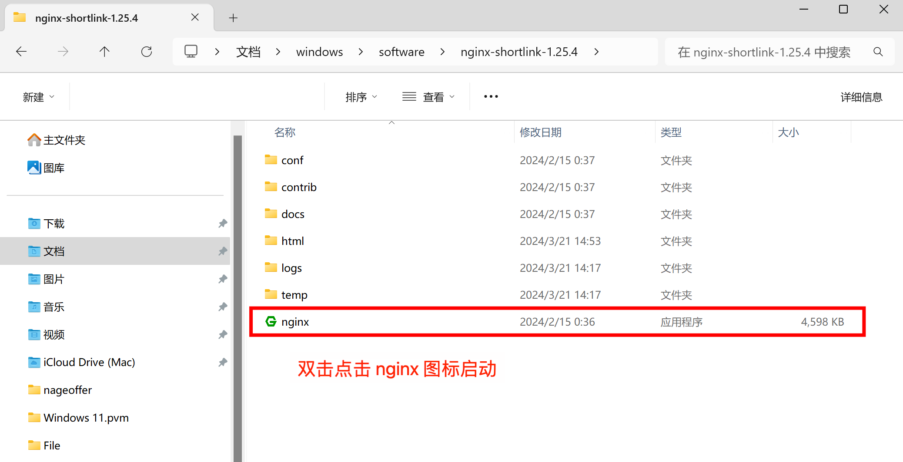
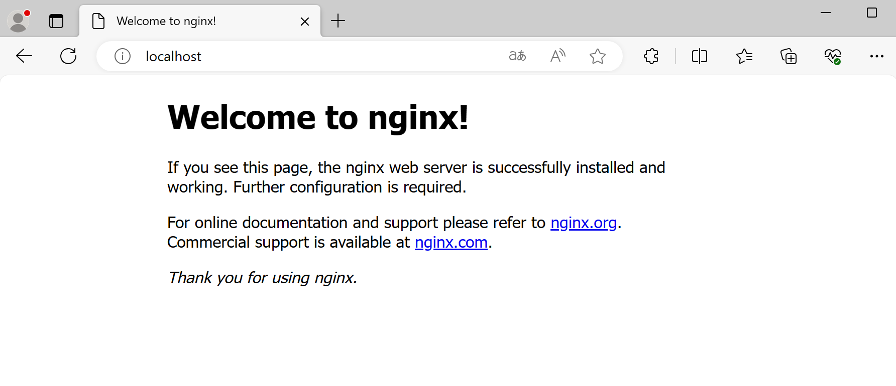
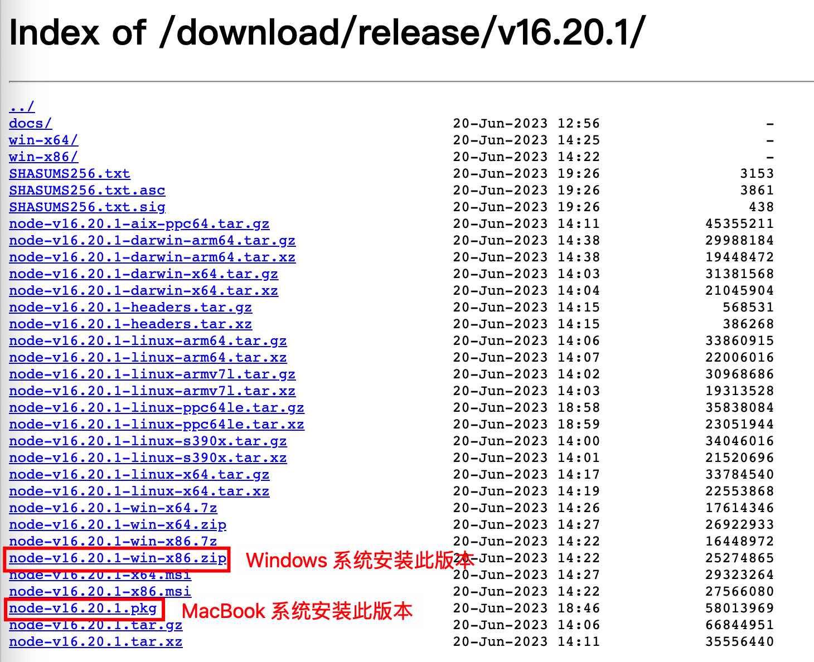
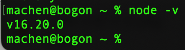
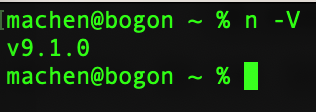
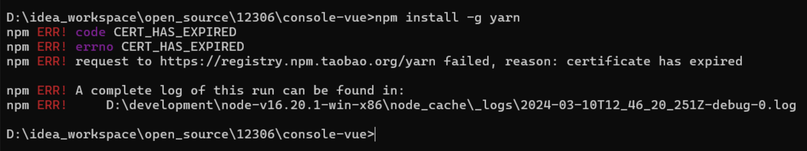
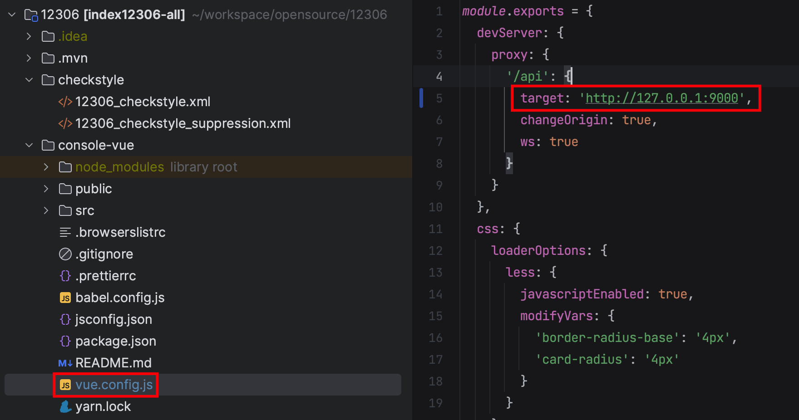
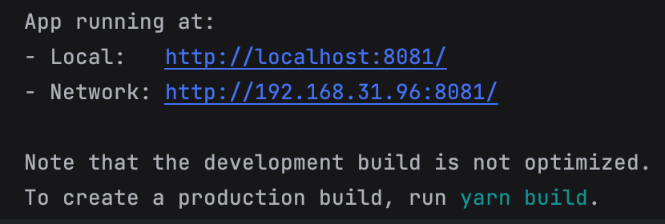
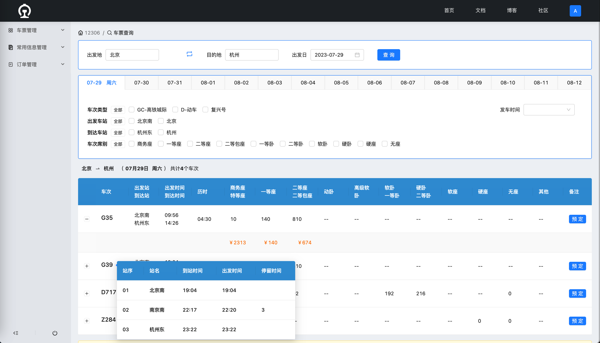
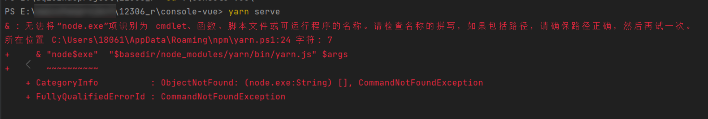

# 快速启动之前端项目

启动前端项目前，首先保证后端工程是已经启动的：[快速启动之后端项目](https://www.yuque.com/magestack/12306/wdgo1olonopir024)，没有启动的话执行下启动逻辑。

## 快速启动
如果你是 Windows 电脑，可以通过 Nginx 快速启动的方式部署短链接前端工程。下载这个 12306 前端压缩包，并解压。

> 链接: [https://pan.baidu.com/s/1IGrr8xjtFc7c-UJSn-pBtg](https://pan.baidu.com/s/1IGrr8xjtFc7c-UJSn-pBtg) 提取码: zzyb
>

然后双击 nginx 图标执行启动逻辑。




浏览器访问 `localhost` 如果返回 nginx 页面，则证明 nginx 启动成功。



浏览器访问 `http://localhost:5175` 跳转 12306 登录页面，既为前端启动成功，可以正常使用系统。

---

:::info
如果想自己本地安装 nodejs 的方式请参考下文。

:::

## 安装 Nodejs
12306 前端建议安装 16.20.0 及以上版本的 Nodejs。

### 电脑中没安装过 Nodejs
> 如果是 Windows 用户，可以参考这个 [超级详细的安装教程](https://blog.csdn.net/WHF__/article/details/129362462)。
>

打开下述链接 🔗 访问 Nodejs 下载页面。

[https://nodejs.org/download/release/v16.20.1/](https://nodejs.org/download/release/v16.20.1/)


根据不同的操作系统下载安装不同的包。下载完成后，双击打开对应的安装软件包，应该就可以通过鼠标点点点的方式进行安装。




安装完成后，终端输入 `node -v` 检查是否安装成功，输入命令返回以下信息表示安装成功。



### 电脑中已有 Nodejs
如果电脑中已经存在 Nodejs 环境，检查版本是否在 16.20.0 或以上，如果不是需要安装 Nodejs 多版本控制组件，下载多个 Nodejs 共存，并通过命令切换。

1）MacOS 苹果电脑教程。

```shell
# 安装 n 组件
npm install -g n

# 安装完成后，查看 n -V
n -V
```

注意，-V 是大写的，出现以下信息代表安装成功。




下载多版本 Nodejs 组件。

```shell
# 安装 16.20.0 版本的 Nodejs
n 16.20.0

# 安装完成后，执行切换
sudo n 16.20.0

# 切换成功后，输入 node -v 查看版本是否正确
node -v
```


2）Windows 电脑教程。

参考链接：[安装多个版本node_windows安装多版本node-CSDN博客](https://blog.csdn.net/qq_38405436/article/details/132279098)

## 启动前端项目
进入到 12306/console-vue 目录后，依次执行下述命令。

> Windows 用户通过 cmd 工具进入 12306/console-vue 目录执行，Mac 用户通过终端工具。
>

### 安装 yarn
```shell
npm install -g yarn
```


这一步可能会出现一个报错，原因是淘宝源失效了，我们切换个源就好：`npm config set registry https://registry.npmjs.org`。



### 下载依赖
```shell
yarn install 
```

### 前端调用本地
检查 vue.config.js 配置文件中 target 是否为：`[http://127.0.0.1:9000](http://127.0.0.1:9000)`，如果不是需要修改。



### 启动项目
```shell
yarn serve
```


启动成功后，会出现以下信息，访问任意一个都可以登录 12306 Web 控制台。




首页查询车次信息是不涉及登录的，但是如果想体验购票，需要用户登录操作。

默认用户名和密码：admin/admin123456



## 常见问题
### 无法将"node,exe"顶识别为 cmdlet、函数、脚本文件或可运行程序的名称


Windows 系统无法在 IDEA 终端运行 Nodejs 命令，可以切换到 CMD 命令窗口下执行。注意，CMD 命令窗口记得需要是 console-vue 目录下。


> 更新: 2024-03-27 23:49:39  
> 原文: <https://www.yuque.com/magestack/12306/ogpbyp3ootg9a2sk>