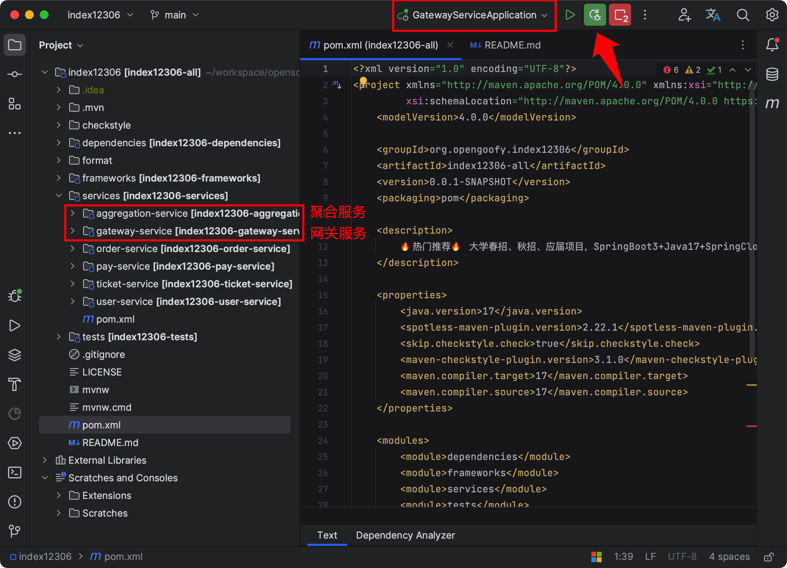
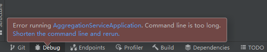

# 快速启动之后端项目

## 安装中间件环境
项目中依赖 Nacos、Redis、RocketMQ 等中间件依赖，为了让项目顺利启动，需要大家提前在本地安装或使用马哥提供的云中间件环境。

[安装中间件环境](https://www.yuque.com/magestack/12306/gu8d4uvn5cdzuig9)

中间件依赖全部安装成功后，正常通过 IDEA 启动后端项目即可。

## 数据库初始化
确保数据库已经初始化。

[手摸手之初始数据库表信息](https://www.yuque.com/magestack/12306/kwtxpe0cbugek9ue)

## 后端项目启动
### 启动聚合模式
当把 JDK 版本、前置中间件环境以及数据库初始化完成后，就可以跟据你的学习想法直接启动对应服务。

建议大家刚开始接触，先通过 SpringBoot 模式启动，**依次启动**聚合服务和网关服务。

启动完成后，接下来开始启动前端项目，并配合前端界面操作 12306 的功能。

### 启动分布式模式
咱们 `service` 目录下一共有六个服务，除去 `aggregation-service` 服务外，其他需要全部启动，注意启动顺序，最后启动网关。另外，在启动网关前，修改以下配置：[为什么分布式模式调用报错？](https://www.yuque.com/magestack/12306/ihwdir1xs985a21m)

## 后端接口文档
引用自知识星球主题：[https://t.zsxq.com/Zplf0](https://t.zsxq.com/Zplf0)

## 常见问题
### 如果你启动的是分布式项目但报错
[为什么分布式模式调用报错？](https://www.yuque.com/magestack/12306/ihwdir1xs985a21m)

### 配置都按照视频填的还是报错
如果你参数配置和启动方式都是根据视频一步一步走下来的，还是出现报错，请尝试两种方式解决：

+ 因为公有云中间件部署在公网，可能网络会有抖动，多尝试几次。
+ 如果多次重试还是不行，尝试将电脑网络切换为个人热点，有不少校园网和家庭宽带会有限制。

### **Command line is too long Shorten the command line and rerun**
Windows 系统电脑在启动聚合服务时会出现以下报错：

解决方案如下所示。

[Windows 系统启动聚合服务报错 Command line is too long Shorten the command line and rerun](https://www.yuque.com/magestack/12306/vrn49fm2afegp0ug)

### IDEA 项目启动编译报错
最新星球小伙伴反馈说项目编译报错，类似于下面这种：

解决方案如下所示。

[Maven编译项目报错](https://www.yuque.com/magestack/12306/kih4ct49avuar70n)

> 更新: 2025-01-20 19:51:15  
> 原文: <https://www.yuque.com/magestack/12306/wdgo1olonopir024>