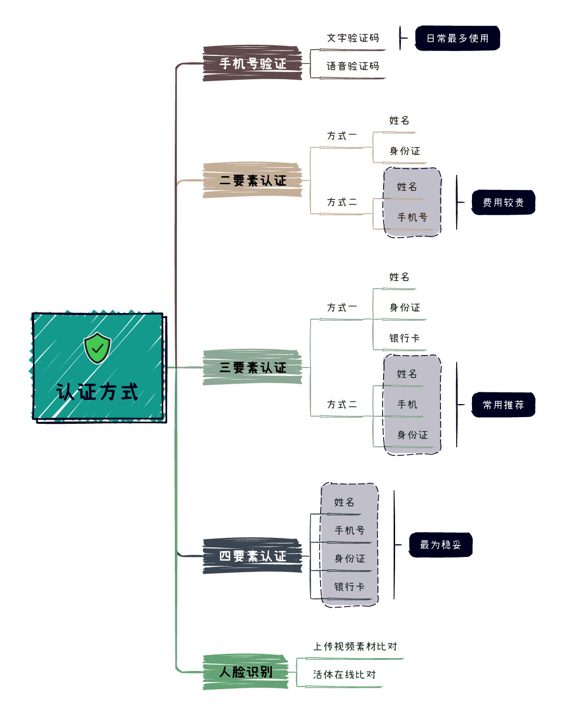
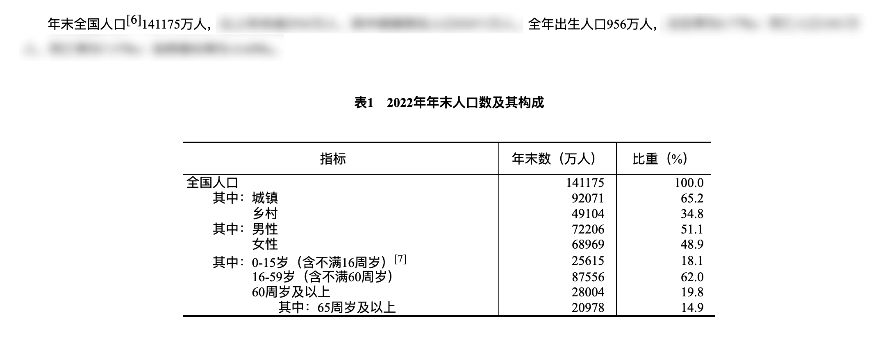
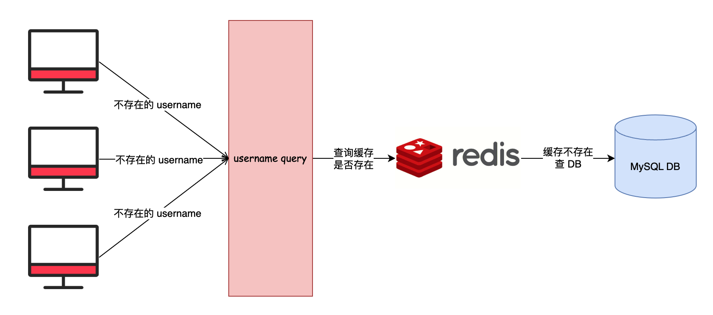

# 用户体系建设概要

## 业务分析

12306 铁路购票系统中，存在两类用户，分别是：会员（即当前账户登录用户）以及乘车人。

### 1. 会员用户

会员支持在系统中自行注册，需要注册者提供用户名、密码、证件类型、证件号、真实姓名、手机号、邮箱以及旅客类型。

其中，用户名和证件号码全局唯一，不允许注册者重复使用。

会员登录系统时，支持用户名/邮箱/手机号码三种登录方式，搭配密码完成系统用户登录行为。

### 2. 乘车人

一个注册会员可以添加多个乘车人。添加乘车人时需要填写真实姓名、身份证、手机号等，新增乘车人需要通过实名认证审核，审核通过方可成功。

会员选择交通工具（火车、高铁等）进行买票时，可以选择多个乘车人进行购票。

会员可以通过已支付订单查看所有订单信息，乘车人也可通过订单标签页中本人车票查看自己或其他会员购买为自己购买的订单信息。

## 业务难点

由于篇幅所限，本文无法详尽解答以下业务难点，但这些问题都会在后续的手摸手教学系列中逐一阐述，并给出较优解决方案。

### 1. 如何确定信息真实

当用户在 12306 网站注册新账号或者为自己的账号添加新的乘车人时，系统需要确保用户提交的各项信息是真实准确的，而不是虚假的。

这其中就涉及到一个很重要的概念——用户信息的认证。对用户提交的信息进行认证,就是要验证信息的真实性，确认这确实是本人自愿提交的真实信息，不是其他人冒充的。

那么如何进行有效的用户信息认证呢？这个问题可以简化为一个核心点：**你需要向系统证明你就是你本人，你提供的信息都是真的。**

举个简单的例子，在注册时，你提交了自己的身份证号码。但是系统怎么确认你提交的身份证号码真的属于你自己，而是通过非法途径获取然后冒充他人的呢？这就需要进行用户认证。

许多云服务提供商开放了收费的身份验证接口，这些接口底层主要调用公安部门的身份核验系统，并在云服务端增加缓存层。

12306 中的信息准确性校验主要包括：

+ 注册会员时，校验用户名、证件号、手机号是否匹配，确保账号信息真实有效。
+ 添加乘车人时，校验乘车人姓名、身份证号是否真实匹配，并校验手机号可用性。

如果 12306 的用户验证依赖收费的云服务或公安接口，为了优化成本和性能，其底层系统很可能采用缓存机制来减少对外部服务的直接调用。

### 2. 数十亿级数据量

根据 2022 年的全国人口统计数据，现有 14 亿多总人口，每年新生人口约 956 万。为便于后续业务数据规模的判断，本文先基于这一人口总量和增长数据进行估算。

根据系统设计的假设，12306 的注册用户规模约为 10 亿，每年新增用户约 500 万。

考虑到会员可添加多名乘车人，且一家多人可能分别拥有账号，估算乘车人数据量大约为注册用户的 2-3 倍，粗略估算约 30 亿左右。

鉴于会员和乘车人数据规模都已超过 10 亿级别，远超出单机 MySQL 数据库的处理能力，所以需使用分库分表或分布式数据库来支撑海量数据。

考虑到分布式数据库普及率较低，分库分表技术仍是大多数公司的选择，所以后续文章关于大数据量的解决方案会以分库分表技术来说明。

如果使用分库分表技术，面试中这些问题都是无法避免会被问到：

+ 选择分库还是分表，还是选择分库分表？基于什么考虑？
+ 选择哪个字段作为分片键？选择单个分片键还是复合分片键？
+ 如何在老业务上平滑上线分库分表？出现问题如何快速回滚？
+ 拆分后出现单表数据量过大，如何继续扩容？扩单表还是整体扩？

### 3. 会员多种登录类型

根据前文对 12306 系统设计的讨论分析，我们已经得知会员表预计会采用分库分表技术来应对大规模的访问压力和海量用户数据。

但是在具体的登录环节，由于系统支持会员使用用户名、手机号以及邮箱等多种方式进行登录，这就存在一个比较棘手的问题：

由于登录时无法确定用户的分片键，使得系统无法直接锁定用户的数据位于哪个数据库或者哪张表中。为了找到用户的数据，只能对全部的数据库和表进行扫描查询，这就造成了所谓的“读请求扩散”问题。

也就是说，原本读请求可以直接定位到某个数据库某张表，现在却要多处查询，无疑大大增加了系统的查询负载。

一旦出现了读请求扩散问题，势必会导致用户的登录请求响应时间变长，严重的话还可能造成登录超时。

### 4. 会员注册缓存穿透

在高并发的会员注册场景下，可能会出现缓存穿透问题。主要原因可能是：

+ 用户注册时，需要验证用户名是否已存在，这通常需要查询数据库。
+ 如果缓存中没有该用户名，就会去数据库查询，如果数据库中也没有，就可以判断该用户名可用。
+ 在高并发的情况下，可能有大量的新用户同时注册，输入的用户名极有可能都不存在于数据库中。这将导致大量的缓存不存在，都去查询数据库，造成数据库压力剧增。
+ 且这些查询数据库的 Key 都不会被缓存，因为数据库中没有，不会写入缓存。那么这些 Key 对应的 Null 值也不会被缓存，造成每次请求都查不到缓存，直接查询数据库。
+ 这样就形成了缓存穿透情况。

而且极端情况下，注册的流程可能时恶意请求访问。注册请求缓存穿透流程图如下：

所以，在用户注册场景下，需要注意防止缓存穿透，常见的处理方式有下述这些：

1. 对不存在的 Key 进行缓存，值设为 Null，并设置短暂过期时间，如 60 秒。
2. 使用布隆过滤器，将所有已注册的用户名存入布隆过滤器，判断时先判断该用户名是否在布隆过滤器中，不在的一定不存在，避免直接查询数据库。
3. 使用确定的数据结构如 Redis 的 Set 集合来存储已注册用户名，判断时检查是否在集合内。
4. 针对高并发注册场景，可以先查询缓存，如果不命中则使用分布式锁来保证只有一个线程访问数据库，避免重复查询。

但是，从真实业务场景来看，上面这些解决方案都存在弊端，不能适用于真实场景。

接下来我带大家一一解析，这些解决思路到底为什么不能用。

1）对不存在的 Key 进行缓存，值设为 Null，并设置短暂过期时间，如 60 秒。

+ 假设用户 A 注册 username 为 magestack，查询 DB 不存在，返回请求成功，并放入 Redis 缓存。但是用户 A 并没有使用该值作为 username。
+ 如果有另一个用户 B 注册 username 为 magestack，将返回失败。也就是说每尝试一次不存在的用户名，该值 60 秒内都不可被注册。

结论：对用户使用体验不友好。此外，如果有大量并发请求查询不存在的用户名，可能会导致数据库短时间内被打挂。

2）使用布隆过滤器，将所有已注册的用户名存入布隆过滤器，判断时先判断该用户名是否在布隆过滤器中，不在的一定不存在，避免直接查询数据库。

+ 这种解决方案算是网上八股说的比较多的一个版本。但是依然不能解决实际场景问题。
+ 如果用户注销了账号，该用户名就可以再次被使用。然而，布隆过滤器由于无法删除元素，因此无法处理这种情况。

结论：布隆过滤器不能删除元素的限制，导致该方案无法正式使用生产。

3）使用确定的数据结构如 Redis 的 Set 集合来存储已注册用户名，判断时检查是否在集合内。

+ 永久存储十几亿的用户信息到 Redis 缓存中显然不太现实，因为这会占用大量的内存资源。
+ 即使是临时存储，如果在缓存中查询不到数据，仍然无法避免查询数据库的场景。
+ 此外，对于这么多的用户信息，是否应该将其存储在一个 Key 中呢？显然是不可行的。即使进行分片，也会增加系统的复杂度。

结论：由于该方案占用内存较多且复杂度较高，因此不适合实际应用。

4）针对高并发注册场景，可以先查询缓存，如果不命中则使用分布式锁来保证只有一个线程访问数据库，避免重复查询。

+ 相对于上述解决方案，该方案在一定程度上可以解决会员注册缓存穿透的问题。
+ 但是，如果在用户注册高峰期，只有一个线程访问数据库，这可能会导致大量用户的注册请求缓慢或超时。

结论：这对用户的使用体验来说并不友好，因此我们不建议使用该方案。

### 5. 敏感信息泄露

在 12306 系统中，存在较多的敏感信息，比如会员或者乘车人的姓名、手机号、邮箱、证件号码以及住址。

在数据库中将手机号或身份证号等敏感个人信息存明文会带来以下安全问题：

+ 明文存储可能会直接泄露用户隐私，一旦数据库被攻击或数据泄露，个人敏感信息就会被完全暴露。
+ 明文存储提高了内部人员滥用数据的风险，恶意查询和使用个人敏感信息的成本很低。

为此，如何选择将用户信息加密存储，以及如何平滑过度转换现有业务中的明文数据为密文，就是个需要考虑的问题。

## 文末总结

本文通过对 12306 铁路购票系统的业务进行分析，提出了几个关键的业务难点：

1. 如何确定用户注册信息的真实性，可能需要调用第三方实名认证服务。
2. 面对亿级用户量，需要使用分库分表技术来支撑海量数据。
3. 支持多种登录方式会造成读请求扩散，需要解决用户定位问题。
4. 高并发场景下缓存穿透问题需要有效解决，避免数据库压力过大。
5. 明文存储用户敏感信息会造成安全隐患，需要对关键数据加密。

这些问题在大型业务系统中普遍存在，需要系统性地考虑技术选型和方案设计，才能构建一个高性能、安全的系统。

本文内容有助于读者对业务难点有更深入的理解，也为后续的技术解决方案铺垫了基础。

> 更新: 2023-07-21 18:43:40  
> 原文: <https://www.yuque.com/magestack/12306/giwo6elgge3h5711>