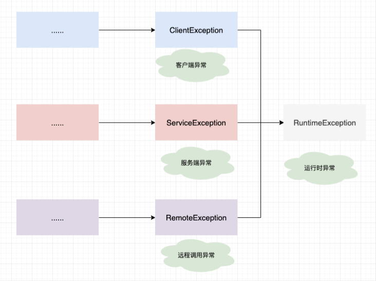
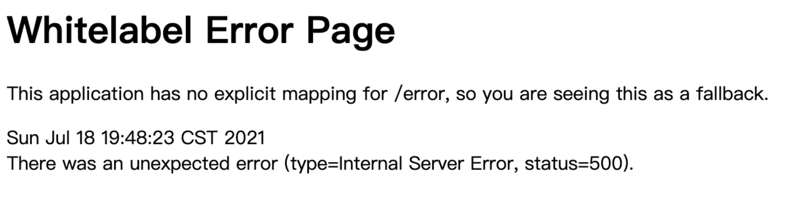

# 只会控制层捕获异常？可以尝试全局拦截

首先，定义统一异常处理的时候，先搞清楚几件事：

+ 什么是异常？
+ 异常如何进行分类？
+ 异常码如何定义？
+ 如何统一处理异常？

## 什么是异常

异常机制是指当程序出现错误后，程序如何处理。具体来说，异常机制提供了程序退出的安全通道。当出现错误后，程序执行的流程发生改变，**程序的控制权转移到异常处理器**。

在 Java 中，所有的异常都有一个共同的祖先 Throwable（可抛出）。Throwable 指定代码中可用异常传播机制通过 Java 应用程序传输的任何问题的共性。  
Throwable： 有两个重要的子类：Exception（异常）和 Error（错误），二者都是 Java 异常处理的重要子类，各自都包含大量子类。异常和错误的区别是：异常能被程序本身可以处理，错误是无法处理。

- Error（错误）:是程序无法处理的错误，表示运行应用程序中较严重问题。大多数错误与代码编写者执行的操作无关，而表示代码运行时 JVM（Java 虚拟机）出现的问题。

- Exception（异常）:是程序本身可以处理的异常。Exception 类有一个重要的子类 RuntimeException。RuntimeException 类及其子类表示“JVM 常用操作”引发的错误。

Error 属于程序无法处理的错误，我们的目标更多是针对 Exception 做些文章。
而其中 RuntimeException 是 Exception 中重要的一个子类，**我们对于异常做的种种处理都是基于 RuntimeException 而来。**

## 自定义异常类

**为什么要自定义异常类呢？**

在应用中，异常大致可以分为两类：

- **系统异常**：如数据库连接失败、文件读写错误、网络超时等。这些通常是不可预料的、与业务逻辑无关的技术问题。
- **业务异常**：如“用户不存在”、“余额不足”、“订单已取消”等。这些是业务逻辑中预期可能发生的、需要告知调用方的错误情况。

如果不自定义业务异常，开发者可能会直接抛出 `RuntimeException` 或其子类（如 `IllegalArgumentException`）。但这样的异常过于通用，无法直接体现“用户不存在”这样的业务语义。在全局异常处理器中，如果只捕获 `Exception`，那么所有业务异常都会被当作系统内部错误处理（返回500），导致前端无法区分是用户输入问题还是服务器问题。

**自定义业务异常可以让业务错误和系统错误在代码层面就分离开来**。

在本项目中自定义如下的异常类体系：

自定义异常类通过错误码和错误描述传递丰富的上下文信息，一些宏观的异常定义可查看`BaseErrorCode`枚举类，而具体业务中的异常定义得在业务代码的异常枚举类中。

```
    public final String errorCode;
    public final String errorMessage;
```



定义了这些自定义异常类后，**在业务代码中**，就可以看到如下异常抛出语句：

```
 throw new ServiceException(OrderCanalErrorCodeEnum.ORDER_STATUS_REVERSAL_ERROR);
```

```
public enum OrderCanalErrorCodeEnum implements IErrorCode {

    ORDER_CANAL_UNKNOWN_ERROR("B006001", "订单不存在，请检查相关订单记录"),

    ORDER_CANAL_STATUS_ERROR("B006002", "订单状态不正确，请检查相关订单记录"),

    ORDER_CANAL_ERROR("B006003", "订单取消失败，请稍后再试"),

    ORDER_CANAL_REPETITION_ERROR("B006004", "订单重复取消，请稍后再试"),

    ORDER_STATUS_REVERSAL_ERROR("B006005", "订单状态反转失败，请稍后再试"),

    ORDER_DELETE_ERROR("B006006", "订单状态反转失败，请稍后再试"),

    ORDER_ITEM_STATUS_REVERSAL_ERROR("B006007", "子订单状态反转失败，请稍后再试");
```

代码位置：

+ `org.opengoofy.index12306.framework.starter.convention.exception`

### 1. 抽象异常

三类异常共同继承 RuntimeException，那么肯定具备很多相似的地方，这里统一抽象一层 `AbstractException`。

```java
package org.opengoofy.congomall.springboot.starter.convention.exception;

import com.google.common.base.Strings;
import lombok.Getter;
import org.opengoofy.congomall.springboot.starter.convention.errorcode.IErrorCode;

import java.util.Optional;

/**
 * 抽象项目中三类异常体系，客户端异常、服务端异常以及远程服务调用异常
 *
 * @author chen.ma
 * @github <a href="https://github.com/opengoofy" />
 * @see ClientException
 * @see ServiceException
 * @see RemoteException
 */
@Getter
public abstract class AbstractException extends RuntimeException {

    public final String errorCode;

    public final String errorMessage;

    public AbstractException(String message, Throwable throwable, IErrorCode errorCode) {
        super(message, throwable);
        this.errorCode = errorCode.code();
        this.errorMessage = Optional.ofNullable(Strings.emptyToNull(message)).orElse(errorCode.message());
    }
}
```

### 2. 客户端异常

客户端相关异常，比如：参数校验失败异常、幂等异常......

```java
package org.opengoofy.congomall.springboot.starter.convention.exception;

import org.opengoofy.congomall.springboot.starter.convention.errorcode.BaseErrorCode;
import org.opengoofy.congomall.springboot.starter.convention.errorcode.IErrorCode;

/**
 * 客户端异常
 *
 * @author chen.ma
 * @github <a href="https://github.com/opengoofy" />
 */
public class ClientException extends AbstractException {

    public ClientException(IErrorCode errorCode) {
        this(null, null, errorCode);
    }

    public ClientException(String message) {
        this(message, null, BaseErrorCode.CLIENT_ERROR);
    }

    public ClientException(String message, IErrorCode errorCode) {
        this(message, null, errorCode);
    }

    public ClientException(String message, Throwable throwable, IErrorCode errorCode) {
        super(message, throwable, errorCode);
    }

    @Override
    public String toString() {
        return "ClientException{" +
                "code='" + errorCode + "'," +
                "message='" + errorMessage + "'" +
                '}';
    }
}
```

### 3. 服务端异常

服务端相关异常，比如：消息模版不合规、消息内容包含关键字......

```java
package org.opengoofy.congomall.springboot.starter.convention.exception;

import org.opengoofy.congomall.springboot.starter.convention.errorcode.BaseErrorCode;
import org.opengoofy.congomall.springboot.starter.convention.errorcode.IErrorCode;

/**
 * 服务端异常
 *
 * @author chen.ma
 * @github <a href="https://github.com/opengoofy" />
 */
public class ServiceException extends AbstractException {

    public ServiceException(String message) {
        this(message, null, BaseErrorCode.SERVICE_ERROR);
    }

    public ServiceException(IErrorCode errorCode) {
        this(null, errorCode);
    }

    public ServiceException(String message, IErrorCode errorCode) {
        this(message, null, errorCode);
    }

    public ServiceException(String message, Throwable throwable, IErrorCode errorCode) {
        super(message, throwable, errorCode);
    }

    @Override
    public String toString() {
        return "ServiceException{" +
                "code='" + errorCode + "'," +
                "message='" + errorMessage + "'" +
                '}';
    }
}
```

### 4. 远程调用异常

服务调用远端异常，比如：短信调用三方服务发送失败、调用 MQ 失败、调用 Redis 失败等......

```java
package org.opengoofy.congomall.springboot.starter.convention.exception;

import org.opengoofy.congomall.springboot.starter.convention.errorcode.IErrorCode;

/**
 * 远程服务调用异常
 *
 * @author chen.ma
 * @github <a href="https://github.com/opengoofy" />
 */
public class RemoteException extends AbstractException {

    public RemoteException(String message, IErrorCode errorCode) {
        this(message, null, errorCode);
    }

    public RemoteException(String message, Throwable throwable, IErrorCode errorCode) {
        super(message, throwable, errorCode);
    }

    @Override
    public String toString() {
        return "RemoteException{" +
                "code='" + errorCode + "'," +
                "message='" + errorMessage + "'" +
                '}';
    }
}
```

## 异常码如何定义

在上一篇文章中，留下一个知识点，异常码如何定义？

业界并没有统一的标准，翻看腾讯、谷歌、阿里、亚马逊以及 FaceBook 等网站，也没有相似之处。

这里我们按照 `Java开发手册（嵩山版）` 中给出的异常码规定方式，确定一版以观后效。我们先看看阿里巴巴开发手册如何规定异常码。

**错误码为字符串类型，共 5 位**。分成两个部分：**错误产生来源 + 四位数字编号**。

错误产生来源分为 **A / B / C**

+ A 表示错误来源于用户，比如参数错误，用户安装版本过低，用户支付超时等问题。
+ B 表示错误来源于当前系统，往往是业务逻辑出错，或程序健壮性差等问题。
+ C 表示错误来源于第三方服务，比如 CDN 服务出错，消息投递超时等问题。

四位数字编号从 0001 到 9999，大类之间的步长间距预留 100。

### 1. 如何定义异常码？

**编号不与公司业务架构，更不与组织架构挂钩**，以先到先得的原则在统一平台上（需要开发）进行，审批生效，编号即被永久固定。

**错误码使用者避免随意定义新的错误码**。尽可能在原有错误码附表中找到语义相同或者相近的错误码在代码中使用即可。

### 2. 异常码示例

| 0     | 一切 ok           | 正确执行后的返回      |
| ----- | --------------- | ------------- |
| A0001 | 用户端错误           | 一级宏观错误码       |
| A0100 | 用户注册错误          | 二级宏观错误码       |
| A0101 | 用户未同意隐私协议       |               |
| A0102 | 注册国家或地区受限       |               |
| A0110 | 用户名校验失败         |               |
| A0111 | 用户名已存在          |               |
| A0112 | 用户名包含敏感词        |               |
| A0113 | 用户名包含特殊字符       |               |
| A0120 | 密码校验失败          |               |
| A0121 | 密码长度不够          |               |
| A0122 | 密码强度不够          |               |
| A0130 | 校验码输入错误         |               |
| A0131 | 短信校验码输入错误       |               |
| A0132 | 邮件校验码输入错误       |               |
| A0133 | 语音校验码输入错误       |               |
| A0140 | 用户证件异常          |               |
| A0141 | 用户证件类型未选择       |               |
| A0142 | 大陆身份证编号校验非法     |               |
| A0143 | 护照编号校验非法        |               |
| A0144 | 军官证编号校验非法       |               |
| A0150 | 用户基本信息校验失败      |               |
| A0151 | 手机格式校验失败        |               |
| A0152 | 地址格式校验失败        |               |
| A0153 | 邮箱格式校验失败        |               |
| A0200 | 用户登录异常          | 二级宏观错误码       |
| A0201 | 用户账户不存在         |               |
| A0202 | 用户账户被冻结         |               |
| A0203 | 用户账户已作废         |               |
| A0210 | 用户密码错误          |               |
| A0211 | 用户输入密码错误次数超限    |               |
| A0220 | 用户身份校验失败        |               |
| A0221 | 用户指纹识别失败        |               |
| A0222 | 用户面容识别失败        |               |
| A0223 | 用户未获得第三方登录授权    |               |
| A0230 | 用户登录已过期         |               |
| A0240 | 用户验证码错误         |               |
| A0241 | 用户验证码尝试次数超限     |               |
| A0300 | 访问权限异常          | 二级宏观错误码       |
| A0301 | 访问未授权           |               |
| A0302 | 正在授权中           |               |
| A0303 | 用户授权申请被拒绝       |               |
| A0310 | 因访问对象隐私设置被拦截    |               |
| A0311 | 授权已过期           |               |
| A0312 | 无权限使用 API       |               |
| A0320 | 用户访问被拦截         |               |
| A0321 | 黑名单用户           |               |
| A0322 | 账号被冻结           |               |
| A0323 | 非法 IP 地址        |               |
| A0324 | 网关访问受限          |               |
| A0325 | 地域黑名单           |               |
| A0330 | 服务已欠费           |               |
| A0340 | 用户签名异常          |               |
| A0341 | RSA 签名错误        |               |
| A0400 | 用户请求参数错误        | 二级宏观错误码       |
| A0401 | 包含非法恶意跳转链接      |               |
| A0402 | 无效的用户输入         |               |
| A0410 | 请求必填参数为空        |               |
| A0411 | 用户订单号为空         |               |
| A0412 | 订购数量为空          |               |
| A0413 | 缺少时间戳参数         |               |
| A0414 | 非法的时间戳参数        |               |
| A0420 | 请求参数值超出允许的范围    |               |
| A0421 | 参数格式不匹配         |               |
| A0422 | 地址不在服务范围        |               |
| A0423 | 时间不在服务范围        |               |
| A0424 | 金额超出限制          |               |
| A0425 | 数量超出限制          |               |
| A0426 | 请求批量处理总个数超出限制   |               |
| A0427 | 请求 JSON 解析失败    |               |
| A0430 | 用户输入内容非法        |               |
| A0431 | 包含违禁敏感词         |               |
| A0432 | 图片包含违禁信息        |               |
| A0433 | 文件侵犯版权          |               |
| A0440 | 用户操作异常          |               |
| A0441 | 用户支付超时          |               |
| A0442 | 确认订单超时          |               |
| A0443 | 订单已关闭           |               |
| A0500 | 用户请求服务异常        | 二级宏观错误码       |
| A0501 | 请求次数超出限制        |               |
| A0502 | 请求并发数超出限制       |               |
| A0503 | 用户操作请等待         |               |
| A0504 | WebSocket 连接异常  |               |
| A0505 | WebSocket 连接断开  |               |
| A0506 | 用户重复请求          |               |
| A0600 | 用户资源异常          | 二级宏观错误码       |
| A0601 | 账户余额不足          |               |
| A0602 | 用户磁盘空间不足        |               |
| A0603 | 用户内存空间不足        |               |
| A0604 | 用户 OSS 容量不足     |               |
| A0605 | 用户配额已用光         | 蚂蚁森林浇水数或每天抽奖数 |
| A0700 | 用户上传文件异常        | 二级宏观错误码       |
| A0701 | 用户上传文件类型不匹配     |               |
| A0702 | 用户上传文件太大        |               |
| A0703 | 用户上传图片太大        |               |
| A0704 | 用户上传视频太大        |               |
| A0705 | 用户上传压缩文件太大      |               |
| A0800 | 用户当前版本异常        | 二级宏观错误码       |
| A0801 | 用户安装版本与系统不匹配    |               |
| A0802 | 用户安装版本过低        |               |
| A0803 | 用户安装版本过高        |               |
| A0804 | 用户安装版本已过期       |               |
| A0805 | 用户 API 请求版本不匹配  |               |
| A0806 | 用户 API 请求版本过高   |               |
| A0807 | 用户 API 请求版本过低   |               |
| A0900 | 用户隐私未授权         | 二级宏观错误码       |
| A0901 | 用户隐私未签署         |               |
| A0902 | 用户摄像头未授权        |               |
| A0903 | 用户相机未授权         |               |
| A0904 | 用户图片库未授权        |               |
| A0905 | 用户文件未授权         |               |
| A0906 | 用户位置信息未授权       |               |
| A0907 | 用户通讯录未授权        |               |
| A1000 | 用户设备异常          | 二级宏观错误码       |
| A1001 | 用户相机异常          |               |
| A1002 | 用户麦克风异常         |               |
| A1003 | 用户听筒异常          |               |
| A1004 | 用户扬声器异常         |               |
| A1005 | 用户 GPS 定位异常     |               |
| B0001 | 系统执行出错          | 一级宏观错误码       |
| B0100 | 系统执行超时          | 二级宏观错误码       |
| B0101 | 系统订单处理超时        |               |
| B0200 | 系统容灾功能被触发       | 二级宏观错误码       |
| B0210 | 系统限流            |               |
| B0220 | 系统功能降级          |               |
| B0300 | 系统资源异常          | 二级宏观错误码       |
| B0310 | 系统资源耗尽          |               |
| B0311 | 系统磁盘空间耗尽        |               |
| B0312 | 系统内存耗尽          |               |
| B0313 | 文件句柄耗尽          |               |
| B0314 | 系统连接池耗尽         |               |
| B0315 | 系统线程池耗尽         |               |
| B0320 | 系统资源访问异常        |               |
| B0321 | 系统读取磁盘文件失败      |               |
| C0001 | 调用第三方服务出错       | 一级宏观错误码       |
| C0100 | 中间件服务出错         | 二级宏观错误码       |
| C0110 | RPC 服务出错        |               |
| C0111 | RPC 服务未找到       |               |
| C0112 | RPC 服务未注册       |               |
| C0113 | 接口不存在           |               |
| C0120 | 消息服务出错          |               |
| C0121 | 消息投递出错          |               |
| C0122 | 消息消费出错          |               |
| C0123 | 消息订阅出错          |               |
| C0124 | 消息分组未查到         |               |
| C0130 | 缓存服务出错          |               |
| C0131 | key 长度超过限制      |               |
| C0132 | value 长度超过限制    |               |
| C0133 | 存储容量已满          |               |
| C0134 | 不支持的数据格式        |               |
| C0140 | 配置服务出错          |               |
| C0150 | 网络资源服务出错        |               |
| C0151 | VPN 服务出错        |               |
| C0152 | CDN 服务出错        |               |
| C0153 | 域名解析服务出错        |               |
| C0154 | 网关服务出错          |               |
| C0200 | 第三方系统执行超时       | 二级宏观错误码       |
| C0210 | RPC 执行超时        |               |
| C0220 | 消息投递超时          |               |
| C0230 | 缓存服务超时          |               |
| C0240 | 配置服务超时          |               |
| C0250 | 数据库服务超时         |               |
| C0300 | 数据库服务出错         | 二级宏观错误码       |
| C0311 | 表不存在            |               |
| C0312 | 列不存在            |               |
| C0321 | 多表关联中存在多个相同名称的列 |               |
| C0331 | 数据库死锁           |               |
| C0341 | 主键冲突            |               |
| C0400 | 第三方容灾系统被触发      | 二级宏观错误码       |
| C0401 | 第三方系统限流         |               |
| C0402 | 第三方功能降级         |               |
| C0500 | 通知服务出错          | 二级宏观错误码       |
| C0501 | 短信提醒服务失败        |               |
| C0502 | 语音提醒服务失败        |               |
| C0503 | 邮件提醒服务失败        |               |

### 3. 异常码小结

阿里巴巴开发手册中的核心思想是规定常用异常码，能复用就复用，实在不行就通过异常码平台去创建，先到先得。

这里我是认可的，不过有一点感觉不是很合适，就是异常码的位数。

阿里巴巴开发手册规定异常码位数 5 位，这对于一个公司项目很多的情况下，我觉得并不适用。所以，在刚果商城中，保留异常码基础概念，但是将 5 位扩展到 7 位。

这样可以有效防止项目过多导致的异常码冲突问题。

## 如何统一处理异常

**先来解释一下“不统一处理异常”是什么样的以及缺点是什么？**

------

如果不使用统一异常处理，那么在每个可能发生异常的地方，都需要手动编写 try-catch 块，并在 catch 中：

- 记录日志（例如使用 `log.error`）。
- 构造一个**错误的响应对象**（例如返回一个 `Result.fail("...")` 给前端）。
- 可能还需要根据异常类型返回不同的 HTTP 状态码（如 400、500 等）

无疑这样的方式进行异常处理会出现：

1. **代码冗余**：每个 Controller 方法都需要重复写 try-catch，如果项目中有几十个甚至上百个接口，代码会变得臃肿。
2. **异常处理不一致**：不同的开发人员可能采用不同的返回格式、状态码、日志级别，导致接口返回的 error 结构五花八门。
3. **维护困难**：如果需要修改错误响应的字段名或日志格式，必须逐个修改所有 Controller 方法，容易遗漏。
4. **容易遗漏异常**：如果某个方法忘记 try-catch，异常会直接抛出到容器，最终可能由 Spring Boot 默认的 `/error` 处理，返回一个不符合约定的错误响应（甚至可能返回一个 HTML 页面）。
5. **混杂业务逻辑**：异常处理代码与业务代码混杂在一起，降低了可读性

**统一异常处理的具体实践是怎么做的？**

------

统一异常处理通常借助 `@ControllerAdvice` + `@ExceptionHandler` 实现。它的核心思想是：

- 在业务代码中，**只抛出特定类型的异常**（自定义异常或系统异常），而不在业务代码中处理异常。
  
  统一异常处理依赖于业务代码主动抛出异常，然后由全局处理器捕获。但这<u>并不意味着业务代码必须用 `throw new XXXException()` 来抛出异常——你也可以让框架抛异常</u>，例如：
  
  - 调用 `userService.findById(id)` 时，如果底层没有处理异常，它可能抛出 `RuntimeException`。
  - 参数校验失败时，Spring MVC 会自动抛出 `MethodArgumentNotValidException`。
  
  这些异常都会被全局处理器捕获。但是，**为了区分不同的业务错误，我们通常会在业务层自定义异常（如 `BusinessException`、`UserNotFoundException` 等），并在合适的时机 `throw` 它们**，这样全局处理器就能根据异常类型返回特定的错误信息。

- 由一个全局的异常处理器**集中捕获所有 Controller 层抛出的异常**，根据异常类型统一包装成固定的响应格式（如 `{code: 500, message: "服务器内部错误"}`），并返回给客户端。

统一异常处理的扩展性和开放性体现在：
如果以后需要**修改**“用户不存在”对应的错误码或消息格式或者**新增**自定义异常类，只需在异常类、异常码枚举类、全局处理器中等位置修改即可，**而不是在所有抛出异常的业务代码去查找并修改**

代码位置：`org.opengoofy.index12306.framework.starter.web.GlobalExceptionHandler`

```java
package org.opengoofy.congomall.springboot.starter.web;

import cn.hutool.core.collection.CollectionUtil;
import cn.hutool.core.util.StrUtil;
import org.opengoofy.congomall.springboot.starter.convention.exception.AbstractException;
import org.opengoofy.congomall.springboot.starter.convention.errorcode.BaseErrorCode;
import org.opengoofy.congomall.springboot.starter.convention.result.Result;
import lombok.SneakyThrows;
import lombok.extern.slf4j.Slf4j;
import org.springframework.util.StringUtils;
import org.springframework.validation.BindingResult;
import org.springframework.validation.FieldError;
import org.springframework.web.bind.MethodArgumentNotValidException;
import org.springframework.web.bind.annotation.ExceptionHandler;
import org.springframework.web.bind.annotation.RestControllerAdvice;

import javax.servlet.http.HttpServletRequest;
import java.util.Optional;

/**
 * 全局异常处理器
 *
 * @author chen.ma
 * @github <a href="https://github.com/opengoofy" />
 */
@Slf4j
@RestControllerAdvice
public class GlobalExceptionHandler {

    /**
     * 拦截参数验证异常
     */
    @SneakyThrows
    @ExceptionHandler(value = MethodArgumentNotValidException.class)
    public Result validExceptionHandler(HttpServletRequest request, MethodArgumentNotValidException ex) {
        BindingResult bindingResult = ex.getBindingResult();
        FieldError firstFieldError = CollectionUtil.getFirst(bindingResult.getFieldErrors());
        String exceptionStr = Optional.ofNullable(firstFieldError)
                .map(FieldError::getDefaultMessage)
                .orElse(StrUtil.EMPTY);
        log.error("[{}] {} [ex] {}", request.getMethod(), getUrl(request), exceptionStr);
        return Results.failure(BaseErrorCode.CLIENT_ERROR.code(), exceptionStr);
    }

    /**
     * 拦截应用内抛出的异常
     */
    @ExceptionHandler(value = {AbstractException.class})
    public Result abstractException(HttpServletRequest request, AbstractException ex) {
        if (ex.getCause() != null) {
            log.error("[{}] {} [ex] {}", request.getMethod(), request.getRequestURL().toString(), ex.toString(), ex.getCause());
            return Results.failure(ex);
        }
        log.error("[{}] {} [ex] {}", request.getMethod(), request.getRequestURL().toString(), ex.toString());
        return Results.failure(ex);
    }

    /**
     * 拦截未捕获异常
     */
    @ExceptionHandler(value = Throwable.class)
    public Result defaultErrorHandler(HttpServletRequest request, Throwable throwable) {
        log.error("[{}] {} ", request.getMethod(), getUrl(request), throwable);
        return Results.failure();
    }

    private String getUrl(HttpServletRequest request) {
        if (StringUtils.isEmpty(request.getQueryString())) {
            return request.getRequestURL().toString();
        }
        return request.getRequestURL().toString() + "?" + request.getQueryString();
    }
}
```

在全局异常拦截中，并没有拦截过多异常，仅对三类异常做出了拦截：

+ MethodArgumentNotValidException：参数异常，这里需要提供合理的报错信息，所以单独拦截。正常来说，可根据项目需求，可拦截可不拦截。
+ **AbstractException：上面有提到，基础组件中封装了三类异常，它们共有一个父类，这里相当于拦截了三种异常。**
+ Throwable：拦截所有异常，属于兜底方案，如果上面异常都没有拦截到，那么这里通过异常父类来做最后处理。

通过这些配置，可以很好避免下述烦人的 500 页面。



> 更新: 2023-07-17 14:15:53  
> 原文: <https://www.yuque.com/magestack/12306/ldzu7zwy3l8vtp06>