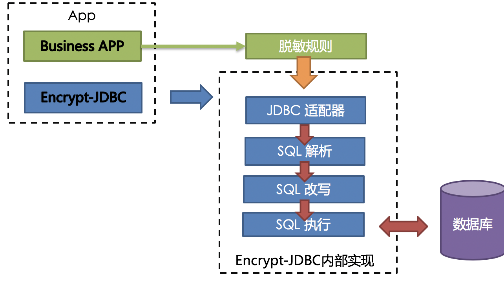
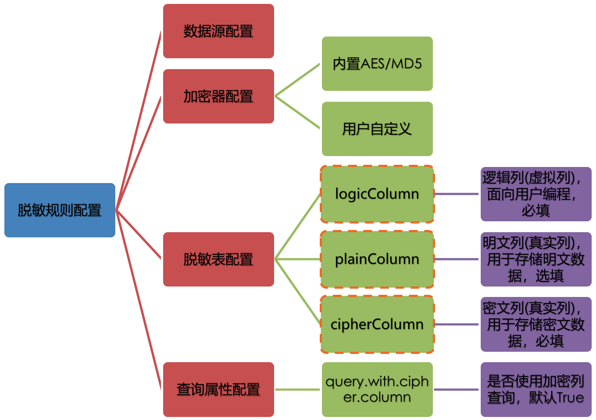
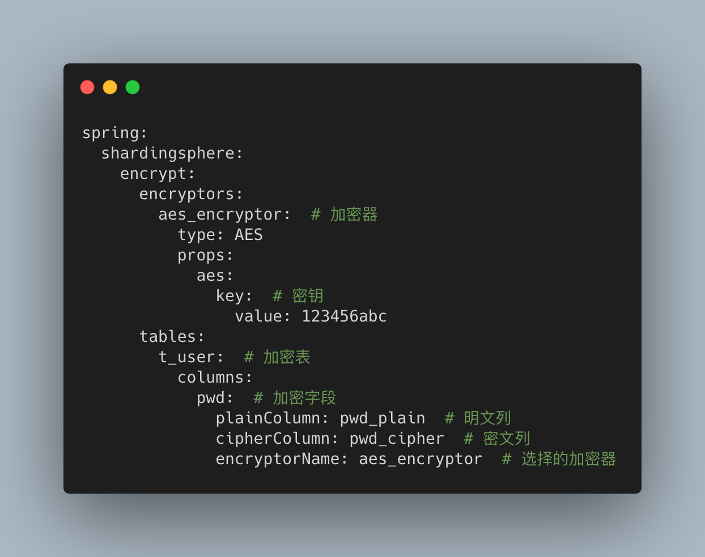
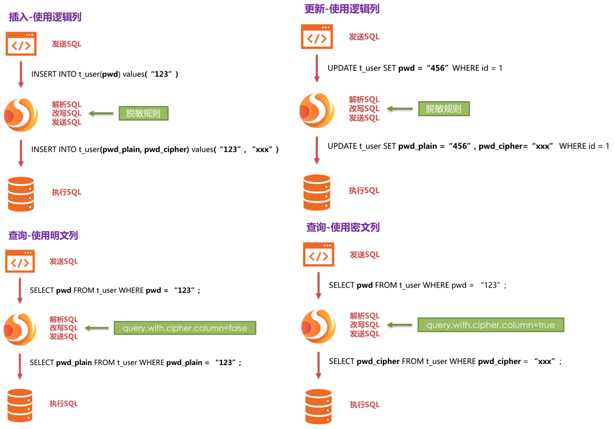
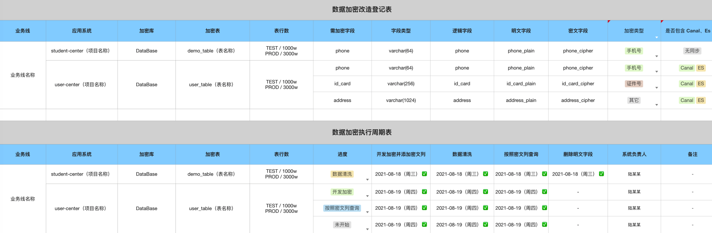
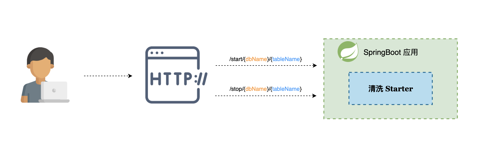
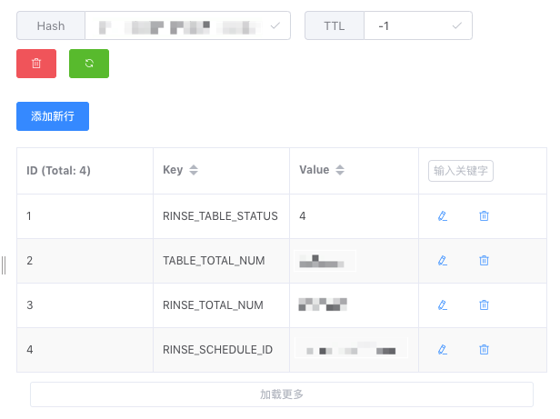
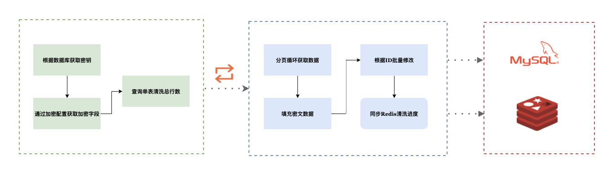
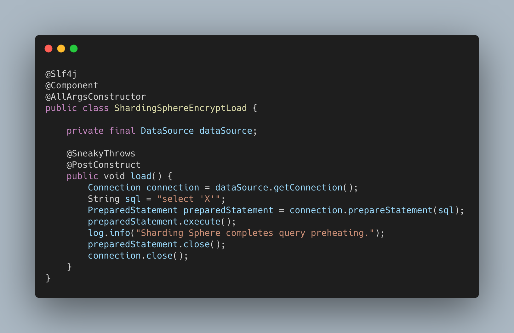
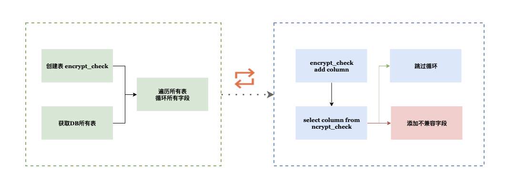

# 如何防止用户敏感数据泄露

<font style="color:rgb(59, 69, 78);">文章以 </font>**<font style="color:rgb(59, 69, 78);">敏感数据安全性存储</font>**<font style="color:rgb(59, 69, 78);"> 为背景，讲述 ShardingSphere 完成数据加密上线，以及后续的业务系统加密改造的过程。</font>

<font style="color:rgb(59, 69, 78);">以下如无特殊说明，ShardingSphere-JDBC Starter 版本为 </font><font style="color:rgb(59, 69, 78);">4.1.1</font><font style="color:rgb(59, 69, 78);">。</font>

## 业务背景

<font style="color:rgb(59, 69, 78);">事情的起因是集团对于敏感数据安全的重视，需要数据库中存在的 </font>**<font style="color:rgb(59, 69, 78);">敏感数据进行加密改造</font>**<font style="color:rgb(59, 69, 78);">，最终效果要达到 </font>**<font style="color:rgb(59, 69, 78);">数据库中不存在敏感明文数据</font>**<font style="color:rgb(59, 69, 78);">。</font>

<font style="color:rgb(59, 69, 78);">不同公司业务差异性，敏感数据的定义不尽相同。不过，基础字段的加密规则大致是相通的。</font>

+ <font style="color:rgb(59, 69, 78);">强制加密：手机号、证件号、邮箱、密码、人脸识别、指纹等。</font>
+ <font style="color:rgb(59, 69, 78);">建议加密：用户姓名、住址、坐标、银行卡等。</font>

## 技术方案选型

<font style="color:rgb(59, 69, 78);">如果要让各业务方快速推进数据加密，</font>**<font style="color:rgb(59, 69, 78);">需要保证效率、通用以及不出错的前提下完成</font>**<font style="color:rgb(59, 69, 78);">。</font>

<font style="color:rgb(59, 69, 78);">进行技术选型阶段时，面临一个问题：选择自己造轮子还是使用比较成熟的开源组件。</font>

### 1. ShardingSphere

<font style="color:rgb(59, 69, 78);">Apache ShardingSphere 是一套开源的分布式数据库解决方案组成的生态圈，它由 JDBC、Proxy 和 Sidecar（规划中）这 3 款既能够独立部署，又支持混合部署配合使用的产品组成。</font>

<font style="color:rgb(59, 69, 78);">其中的 JDBC 组件支持数据分片、分布式事务、读写分离、数据加密等，可以通过配置指定需要使用的功能。</font>

#### 1.1加密原理

**<font style="color:rgb(59, 69, 78);">ShardingSphere 通过重写 JDBC 组件对用户输入的 SQL 进行解析</font>**<font style="color:rgb(59, 69, 78);">，并根据提供的加密规则对 SQL 进行重写，将原文数据（可选）及密文数据存储到数据库表。</font>

<font style="color:rgb(59, 69, 78);">在用户查询数据时，根据自定义配置选择按照明文数据查询或者密文数据查询，但是最终都会将原始数据返回给用户。</font>

<font style="color:rgb(59, 69, 78);">在此查询过程中，</font>**<font style="color:rgb(59, 69, 78);">框架屏蔽了数据的加密处理</font>**<font style="color:rgb(59, 69, 78);">，使用户无感 SQL 解析、数据加密、数据解密等处理过程。</font>



#### 1.2 加密规则

<font style="color:rgb(59, 69, 78);">ShardingSphere 对于数据加密的配置分为四部分，数据源配置，加密算法配置，加密表配置以及查询属性配置，其详情如下图所示：</font>



**<font style="color:rgb(59, 69, 78);">数据源配置：</font>**

<font style="color:rgb(59, 69, 78);">没有使用加密前，项目中数据源比如说 druid 或者 hikari，是直接通过 Spring 加载到 IOC 容器中；使用了数据加密之后，会由 </font>**<font style="color:rgb(59, 69, 78);">ShardingSphere 将配置的数据源包装一层再交给 Spring 管理</font>**<font style="color:rgb(59, 69, 78);">。</font>

**<font style="color:rgb(59, 69, 78);"></font>**

**<font style="color:rgb(59, 69, 78);">加密器配置：</font>**

<font style="color:rgb(59, 69, 78);">指的是 </font>**<font style="color:rgb(59, 69, 78);">需要加密的字段通过什么加密方式进行加密</font>**<font style="color:rgb(59, 69, 78);">。ShardingSphere 中内置了 AES 和 MD5 两种加密算法，另外也可以通过提供的 SPI 机制加载自定义加密器。</font>

**<font style="color:rgb(59, 69, 78);"></font>**

**<font style="color:rgb(59, 69, 78);">脱敏表配置：</font>**

<font style="color:rgb(59, 69, 78);">脱敏表配置实现了用户无感知加密功能，重点包含三个属性，</font><font style="color:rgb(59, 69, 78);">plainColumn</font><font style="color:rgb(59, 69, 78);">（明文列）、</font><font style="color:rgb(59, 69, 78);">cipherColumn</font><font style="color:rgb(59, 69, 78);">（密文列）、</font><font style="color:rgb(59, 69, 78);">logicColumn</font><font style="color:rgb(59, 69, 78);">（逻辑列）。</font>

+ **<font style="color:rgb(59, 69, 78);">plainColumn</font>**<font style="color:rgb(59, 69, 78);">：比如说有一张用户表，里面有个存储原始密码列 pwd_plain。</font>
+ **<font style="color:rgb(59, 69, 78);">cipherColumn</font>**<font style="color:rgb(59, 69, 78);">：用户表里新增原始数据加密后密文列 pwd_cipher。</font>
+ **<font style="color:rgb(59, 69, 78);">logicColumn</font>**<font style="color:rgb(59, 69, 78);">：逻辑列是面向开发者在程序中编写 SQL 的列，和明文以及密文列保持一种映射关系，可以屏蔽底层对明文或者密文数据的加密处理。</font>

**<font style="color:rgb(59, 69, 78);"></font>**

**<font style="color:rgb(59, 69, 78);">查询属性配置：</font>**

<font style="color:rgb(59, 69, 78);">数据库中同时存储了明文列以及密文列时，该属性决定了是查询明文列的数据直接返回，还是查询密文列再通过 ShardingSphere 解密后返回。</font>

#### 1.3 举例说明

<font style="color:rgb(59, 69, 78);">数据库中存在一张 </font><font style="color:rgb(59, 69, 78);">t_user</font><font style="color:rgb(59, 69, 78);"> 表，存在明文列 </font><font style="color:rgb(59, 69, 78);">pwd_plain</font><font style="color:rgb(59, 69, 78);"> 和密文列 </font><font style="color:rgb(59, 69, 78);">pwd_cipher</font><font style="color:rgb(59, 69, 78);">，同时在脱敏配置中设置逻辑列 </font><font style="color:rgb(59, 69, 78);">pwd</font><font style="color:rgb(59, 69, 78);">，配置如下：</font>



<font style="color:rgb(59, 69, 78);"></font>

<font style="color:rgb(59, 69, 78);">假设对 t_user 有新增操作，SQL 语句：INSERT INTO t_user SET pwd = '123'。</font>

<font style="color:rgb(59, 69, 78);">数据表里字段是 </font><font style="color:rgb(59, 69, 78);">pwd_plain</font><font style="color:rgb(59, 69, 78);"> 和 </font><font style="color:rgb(59, 69, 78);">pwd_cipher</font><font style="color:rgb(59, 69, 78);">，通过 ShardingSphere 在底层进行了映射，如下图所示：</font>



<font style="color:rgb(59, 69, 78);"></font>

<font style="color:rgb(59, 69, 78);">总结起来，ShardingSphere 相当于一个转换层，对用户的 SQL 进行解析，遇到需要加密的字段，根据加密规则进行重写 SQL，最终提交重写后的 SQL 到数据库执行。</font>

<font style="color:rgb(59, 69, 78);">优点：</font>

1. <font style="color:rgb(59, 69, 78);">屏蔽用户对于加密的过程，项目除了提供必要的加密配置之外，</font>**<font style="color:rgb(59, 69, 78);">代码基本零改造</font>**<font style="color:rgb(59, 69, 78);">。</font>
2. <font style="color:rgb(59, 69, 78);">内部提供了 AES 和 MD5 两种加密算法以及提供了 </font>**<font style="color:rgb(59, 69, 78);">SPI 自定义加密算法</font>**<font style="color:rgb(59, 69, 78);">。</font>
3. **<font style="color:rgb(59, 69, 78);">支持字段级别的加密算法，灵活切换</font>**<font style="color:rgb(59, 69, 78);">。</font>
4. <font style="color:rgb(59, 69, 78);">支持明文字段、密文字段的切换查询，帮助业务实现 </font>**<font style="color:rgb(59, 69, 78);">安全、透明化的上线迁移</font>**<font style="color:rgb(59, 69, 78);">。</font>

<font style="color:rgb(59, 69, 78);">缺点：</font>

1. <font style="color:rgb(59, 69, 78);">业务 SQL 不能完全兼容子查询操作。</font>
2. <font style="color:rgb(59, 69, 78);">重写的 SQL 解析器遇到 </font><font style="color:rgb(59, 69, 78);">order</font><font style="color:rgb(59, 69, 78);">、</font><font style="color:rgb(59, 69, 78);">over</font><font style="color:rgb(59, 69, 78);"> 等关键字报错。</font>

<font style="color:rgb(59, 69, 78);"></font>

<font style="color:rgb(59, 69, 78);">子查询不兼容和关键字报错可能会在 5.x 版本得到解决，只不过还暂未发布 5.x Release 版本。</font>

### 2. 自定义开发

<font style="color:rgb(59, 69, 78);">如果选择自己造轮子，实现逻辑与 ShardingSphere 的流程基本一致，解析用户的行为并进行修改，实现方式并不固定。</font>

<font style="color:rgb(59, 69, 78);">优点：</font>

1. **<font style="color:rgb(59, 69, 78);">代码实现起来较为简洁</font>**<font style="color:rgb(59, 69, 78);">，减少了开源组件的大量依赖。</font>
2. **<font style="color:rgb(59, 69, 78);">不存在 SQL 兼容问题</font>**<font style="color:rgb(59, 69, 78);">，仅是修改 SQL 中需要加解密的字段，不涉及 SQL 解析器的开发。</font>
3. **<font style="color:rgb(59, 69, 78);">性能良好</font>**<font style="color:rgb(59, 69, 78);">，相对于开源组件的大量封装以及 SQL 解析，拦截器只有加密算法的必要开销。</font>

<font style="color:rgb(59, 69, 78);">缺点：</font>

1. **<font style="color:rgb(59, 69, 78);">对业务侵入性高</font>**<font style="color:rgb(59, 69, 78);">，在加密功能上线切换阶段，需要频繁修改 SQL 语句（取决实现方式）。</font>
2. <font style="color:rgb(59, 69, 78);">从开始进行数据加密，最终数据库全部加密，需要一个 </font>**<font style="color:rgb(59, 69, 78);">很长的开发和测试周期</font>**<font style="color:rgb(59, 69, 78);">。</font>
3. <font style="color:rgb(59, 69, 78);">如果业务有耦合关联，数据库加密可能会出现：</font>**<font style="color:rgb(59, 69, 78);">上线一起上，有问题一起回滚的情况</font>**<font style="color:rgb(59, 69, 78);">。</font>

<font style="color:rgb(59, 69, 78);"></font>

<font style="color:rgb(59, 69, 78);">技术水准和开发时间满足的情况下，也有不少公司选择了自己开发数据加密组件。</font>

<font style="color:rgb(59, 69, 78);">考虑到业务侵入、耦合和开发周期这几点因素，决定放弃自己造轮子，选择使用 ShardingSphere 作为数据加密安全框架。</font>

## 数据加密实施

<font style="color:rgb(59, 69, 78);">ShardingSphere 数据加密结合公司内部的一些流程，分为 </font>**<font style="color:rgb(59, 69, 78);">准备、开发、清洗、切换、最终</font>**<font style="color:rgb(59, 69, 78);"> 几个阶段执行，目的是 </font>**<font style="color:rgb(59, 69, 78);">稳定进行</font>**<font style="color:rgb(59, 69, 78);">，</font>**<font style="color:rgb(59, 69, 78);">把数据加密线上出错的可能性降到最低</font>**<font style="color:rgb(59, 69, 78);">。</font>

<font style="color:rgb(59, 69, 78);">Medbanks 在原 Starter 功能不变的基础上，对 </font><font style="color:rgb(59, 69, 78);">sharding-jdbc-spring-boot-starter</font><font style="color:rgb(59, 69, 78);"> 包装了一层。</font>

1. **<font style="color:rgb(59, 69, 78);">密钥统一管理</font>**<font style="color:rgb(59, 69, 78);">，对加密需要的密钥与应用程序配置分离，密钥根据数据库分配。</font>
2. <font style="color:rgb(59, 69, 78);">提供代码中通过程序调用 </font>**<font style="color:rgb(59, 69, 78);">加解密 Util 包</font>**<font style="color:rgb(59, 69, 78);">，适配一些三方服务。</font>
3. <font style="color:rgb(59, 69, 78);">适配 SpringBoot 项目中 </font>**<font style="color:rgb(59, 69, 78);">连接多个数据源加密</font>**<font style="color:rgb(59, 69, 78);">。</font>
4. **<font style="color:rgb(59, 69, 78);">开发数据清洗程序</font>**<font style="color:rgb(59, 69, 78);">，提供业务方通用且便捷的使用。</font>

<font style="color:rgb(59, 69, 78);"></font>

<font style="color:rgb(59, 69, 78);">新应用和已在线上运行的应用会有所区别，新应用相对来说会简单很多，下面的流程如无说明，默认已上线应用。</font>

<font style="color:rgb(59, 69, 78);">已上线应用数据加密执行流程：</font>

1. <font style="color:rgb(59, 69, 78);">准备阶段：统计数据库表需要 </font>**<font style="color:rgb(59, 69, 78);">加密存储的字段</font>**<font style="color:rgb(59, 69, 78);"> 以及制定 </font>**<font style="color:rgb(59, 69, 78);">加密改造的周期表</font>**<font style="color:rgb(59, 69, 78);">。</font>
2. <font style="color:rgb(59, 69, 78);">开发阶段：</font>**<font style="color:rgb(59, 69, 78);">Starter 引入项目</font>**<font style="color:rgb(59, 69, 78);"> 以及 </font>**<font style="color:rgb(59, 69, 78);">添加明文字段对应的密文字段</font>**<font style="color:rgb(59, 69, 78);">。</font>
3. <font style="color:rgb(59, 69, 78);">清洗阶段：对数据库表中 </font>**<font style="color:rgb(59, 69, 78);">历史明文数据执行清洗流程</font>**<font style="color:rgb(59, 69, 78);">，清洗过程中填充表里所有密文列。</font>
4. <font style="color:rgb(59, 69, 78);">切换阶段：修改配置 </font>**<font style="color:rgb(59, 69, 78);">按照密文列进行查询</font>**<font style="color:rgb(59, 69, 78);">。</font>
5. <font style="color:rgb(59, 69, 78);">最终完成：以上步骤执行完成后，</font>**<font style="color:rgb(59, 69, 78);">删除表中明文字段</font>**<font style="color:rgb(59, 69, 78);">，真正完成数据加密。</font>

### 1. 准备阶段

<font style="color:rgb(59, 69, 78);">统计加密字段信息：业务线、应用系统、数据库、加密表、表行数、需要加密的字段、密文列名称、加密类型、是否包含 Canal、ES、DataX 同步、表中字段是否设置 </font><font style="color:rgb(59, 69, 78);">ON UPDATE CURRENT_TIMESTAMP</font><font style="color:rgb(59, 69, 78);">、其它系统是否存在依赖、系统负责人。</font>



<font style="color:rgb(59, 69, 78);"></font>

<font style="color:rgb(59, 69, 78);">改造周期分为几个阶段：</font>**<font style="color:rgb(59, 69, 78);">开发加密</font>**<font style="color:rgb(59, 69, 78);">、</font>**<font style="color:rgb(59, 69, 78);">数据清洗</font>**<font style="color:rgb(59, 69, 78);">、</font>**<font style="color:rgb(59, 69, 78);">切换密文列</font>**<font style="color:rgb(59, 69, 78);">、</font>**<font style="color:rgb(59, 69, 78);">删除明文字段</font>**<font style="color:rgb(59, 69, 78);">。</font>

### 2. 开发阶段

<font style="color:rgb(59, 69, 78);">ShardingSphere Starter 引入项目以及数据库中添加明文字段对应的密文字段。</font>

<font style="color:rgb(59, 69, 78);">在开发阶段，开发同学需要扫描所有自定义 SQL，着重查看 SQL 中是否包含子查询操作，尽量让测试同学全方面覆盖功能测试。</font>

<font style="color:rgb(59, 69, 78);"></font>

<font style="color:rgb(59, 69, 78);">加密后的数据长度和原始数据长度并不一致，需要根据原始数据长度，推算出密文列的字段长度。</font>

1. <font style="color:rgb(59, 69, 78);">数值 + 英文类型，16 个字符以下（不包括 16 字符），加密后字符串长度 24（数值过少影响加密长度）。</font>
2. <font style="color:rgb(59, 69, 78);">数值 + 英文类型，大于 16 字符小于 32 字符（不包括 32 字符），加密后字符串长度 44 字符。</font>
3. <font style="color:rgb(59, 69, 78);">中文类型，16 个字符以下（不包括 16 字符），加密后字符串长度 64（字符过少影响加密长度）。</font>
4. <font style="color:rgb(59, 69, 78);">中文类型，大于 16 字符小于 32 字符（不包括 32 字符），加密后字符串长度 88 字符。</font>

### 3. 清洗阶段

<font style="color:rgb(59, 69, 78);">对数据库表中 </font>**<font style="color:rgb(59, 69, 78);">历史的明文数据执行清洗流程</font>**<font style="color:rgb(59, 69, 78);">，清洗过程中填充表中所有密文列。</font>

<font style="color:rgb(59, 69, 78);">最初开发数据清洗程序时，有考虑很多的功能特性，比如说：在线清洗、离线清洗、单节点清洗、分片清洗等。</font>

<font style="color:rgb(59, 69, 78);">千里之行始于足下，接着开发了 1.0 版本单节点在线清洗。</font>

<font style="color:rgb(59, 69, 78);"></font>

<font style="color:rgb(59, 69, 78);">清洗 Starter 通过 SpringBoot Web 对外提供了两个 HTTP 接口，启动清洗以及停止清洗，最小的粒度为某个数据库下某张表。</font>



<font style="color:rgb(59, 69, 78);">列下数据加密程序支持的一些功能，方便下面介绍的时候贯彻起来：</font>

1. <font style="color:rgb(59, 69, 78);">业务方引入清洗 Starter，调用启动或者停止接口即可完成表数据清洗。</font>
2. <font style="color:rgb(59, 69, 78);">实时查看当前清洗任务进度以及清洗状态。</font>
3. <font style="color:rgb(59, 69, 78);">支持清洗进度留档，兼容人为停止或者应用重启等操作。</font>

<font style="color:rgb(59, 69, 78);"></font>

<font style="color:rgb(59, 69, 78);">考虑到大表千万级别数据，数据清洗不能很快完成，为了更好监控当前程序的清洗进度，在清洗过程中实时同步清洗运行时状态。</font>



<font style="color:rgb(59, 69, 78);">运行时数据包括：清洗任务状态、需要清洗的总行数、已清洗的行数、当前清洗最大主键值。</font>

<font style="color:rgb(59, 69, 78);">清洗程序主要是以主键 ID 为关键行为，进行分页查询、填充密文列和批量修改操作，具体逻辑如下：</font>

1. <font style="color:rgb(59, 69, 78);">获取需要数据清洗的数据库名称、表名称以及清洗所需要的字段；</font>
2. <font style="color:rgb(59, 69, 78);">查询该表需要清洗的总行数，通过分页循环的形式获取一批数据；</font>
3. <font style="color:rgb(59, 69, 78);">分页获取数据进行填充密文列，主键 ID 为条件进行批量修改；</font>
4. <font style="color:rgb(59, 69, 78);">同步 Redis 数据清洗进度，所有数据清洗完成后结束循环；</font>
5. <font style="color:rgb(59, 69, 78);">过程中如果触发停止操作，保留进度后优雅结束循环。</font>



<font style="color:rgb(59, 69, 78);"></font>

<font style="color:rgb(59, 69, 78);">生产上 2C 容器单线程每分钟清洗数据在 70 - 120 w 上下，具体性能根据单批清洗的数量而定。数据库 4C 8G CPU 负载 20% 左右，JVM 内存分布以及 GC 回收情况正常，不会对业务产生影响。</font>

<font style="color:rgb(59, 69, 78);">事实证明大多数场景下，最简单直接的程序也是最有效的，所以清洗程序 1.0 版本设计是开始也是结束。</font>

### 4. 切换阶段

<font style="color:rgb(59, 69, 78);">查看明文列上是否存在索引，如果存在则需要在切换前为密文列添加索引。</font>

<font style="color:rgb(59, 69, 78);">添加索引时注意表的大小，表数据量百万或者千万级别，会对线上业务有影响，应该在业务无访问量时进行。</font>

<font style="color:rgb(59, 69, 78);"></font>

<font style="color:rgb(59, 69, 78);">接下来设置 spring.shardingsphere.props.query.with.cipher.column 为 true，后续关于加密字段的查询会按照密文 value 查询。</font>

<font style="color:rgb(59, 69, 78);">需要注意的是，</font>**<font style="color:rgb(59, 69, 78);">同一个系统切换密文列查询要保持一致</font>**<font style="color:rgb(59, 69, 78);">。假设项目中包含三张表，切换时要保证全部已将数据清洗完成。</font>

<font style="color:rgb(59, 69, 78);">如果切换到密文列遇到临时突发问题，可以将设置再切换为 false，数据加密再次按照明文列查询。</font>

### 5. 最终完成

<font style="color:rgb(59, 69, 78);">切换到密文列稳定后，执行删除数据库表明文列，达到一个最终完成的效果。</font>

<font style="color:rgb(59, 69, 78);">如果表涉及到 Canal 增量同步或者 DataX 的数据同步，需要修改 Canal 监听客户端代码以及 DataX 脚本，保持字段对齐密文列。</font>

<font style="color:rgb(59, 69, 78);">执行删除操作前，对数据库表进行备份，保持良好的容错习惯。迁移后对线上环境进行验证，确保无问题后该项目加密工作正式完成。</font>

## 问题解决方案

<font style="color:rgb(59, 69, 78);">推行业务方数据加密时，发现了一些不太友好的兼容问题，在这里分享下解决方案。</font>

### 1. SQL 解析器预热

<font style="color:rgb(59, 69, 78);">项目启动后，使用 ShardingSphere 加密数据源执行 SQL，发现前两条执行的时间差异比较大。</font>

<font style="color:rgb(59, 69, 78);">通过源码得知，第一次解析 SQL 时会使用工厂类创建单例对象，第二次解析时不用创建新对象。</font>

<font style="color:rgb(59, 69, 78);">所以可以在项目初始化时实例化相关对象，减少第一次预热时间，节省大概 500 ms 时间。</font>



### 2. 关键字不识别

**<font style="color:rgb(59, 69, 78);">ShardingSphere 对于某些关键字不会识别</font>**<font style="color:rgb(59, 69, 78);">，而且不兼容的关键字并非单个数据库的。如果执行 SQL 包含的话，会抛出错误。</font>

mismatched input 'xxx' expecting {'!', '~', '+', '-', '.', '(', '{', '?', '@', TRUNCATE, POSITION...

<font style="color:rgb(59, 69, 78);"></font>

<font style="color:rgb(59, 69, 78);">因为不明确不支持的字段属于哪个数据库，不能按照单个数据库的关键字扫描。所以在开发的时候用了一种笨方法，解决方案如下：</font>

1. <font style="color:rgb(59, 69, 78);">DB 中创建 </font><font style="color:rgb(59, 69, 78);">encrypt_check</font><font style="color:rgb(59, 69, 78);"> 临时表，字段仅一个主键即可；</font>
2. <font style="color:rgb(59, 69, 78);">查询 DB 下所有表，循环遍历表的所有字段，执行 3、4、5 流程；</font>
3. <font style="color:rgb(59, 69, 78);">将字段插入 </font><font style="color:rgb(59, 69, 78);">encrypt_check</font><font style="color:rgb(59, 69, 78);"> 临时表，执行 </font><font style="color:rgb(59, 69, 78);">select 字段 from encrypt_check</font><font style="color:rgb(59, 69, 78);">；</font>
4. <font style="color:rgb(59, 69, 78);">不报错证明兼容，删除 </font><font style="color:rgb(59, 69, 78);">check</font><font style="color:rgb(59, 69, 78);"> 表该字段继续循环；</font>
5. <font style="color:rgb(59, 69, 78);">报错的话添加到不兼容集合，并删除 </font><font style="color:rgb(59, 69, 78);">check</font><font style="color:rgb(59, 69, 78);"> 表该字段继续循环；</font>
6. <font style="color:rgb(59, 69, 78);">所有表字段循环完成后，返回不兼容集合 </font><font style="color:rgb(59, 69, 78);">Map<表名, List<字段>></font><font style="color:rgb(59, 69, 78);">。</font>

<font style="color:rgb(59, 69, 78);"></font>

<font style="color:rgb(59, 69, 78);">如果扫描 DB 发现有关键字，SQL 语句中使用 `` 修饰，Mybatis-Plus 应用可以在实体对象上添加 @TableField 注解解决。扫描程序流程图如下所示：</font>



### 3. 不兼容项

<font style="color:rgb(59, 69, 78);">ShardingSphere 的 SQL 解析内核并不是针对包含加密字段的 SQL，作用域是整个项目。</font>

<font style="color:rgb(59, 69, 78);">所以项目中如果出现下述的 SQL，需要进行改写。官网上明确说明的比较和计算类操作不再重复举例。</font>

**<font style="color:rgb(59, 69, 78);"></font>**

**<font style="color:rgb(59, 69, 78);">示例一</font>**

<font style="color:rgb(59, 69, 78);">问题描述：不支持查询列中包含子查询，子查询无法查询到值。</font>

<font style="color:rgb(59, 69, 78);">解决方案：将子查询在 SQL 中优化或者代码中查询并替换值。</font>

select t.id, (select ue.email from user_email ue where ue.id = t.id) as email from t_user t

**<font style="color:rgb(59, 69, 78);"></font>**

**<font style="color:rgb(59, 69, 78);">示例二</font>**

<font style="color:rgb(59, 69, 78);">问题描述：不支持返回列中使用 </font><font style="color:rgb(59, 69, 78);">*</font><font style="color:rgb(59, 69, 78);"> 号搭配子查询，查询有记录返回，但是记录无法进行映射，返回到应用里记录全部为 null。</font>

<font style="color:rgb(59, 69, 78);">解决方案：</font><font style="color:rgb(59, 69, 78);">*</font><font style="color:rgb(59, 69, 78);"> 号替换为具体字段。</font>

select t.* from (select id, pwd from t_user) t

**<font style="color:rgb(59, 69, 78);"></font>**

**<font style="color:rgb(59, 69, 78);">示例三</font>**

<font style="color:rgb(59, 69, 78);">问题描述：</font><font style="color:rgb(59, 69, 78);">DISTINCT</font><font style="color:rgb(59, 69, 78);"> 无法搭配 FROM 子查询，报错：</font><font style="color:rgb(59, 69, 78);">Can not find owner from table</font><font style="color:rgb(59, 69, 78);">。</font>

<font style="color:rgb(59, 69, 78);">解决方案：FROM 后子查询替换或者将 </font><font style="color:rgb(59, 69, 78);">DISTINCT</font><font style="color:rgb(59, 69, 78);"> 替换为 </font><font style="color:rgb(59, 69, 78);">GROUP BY</font><font style="color:rgb(59, 69, 78);">。</font>

```plain
select distinct t.id
from
  (select id from t_user where del_flag = 0) t
inner join user_enail ue
on ue.id = t.id
```

**<font style="color:rgb(59, 69, 78);"></font>**

**<font style="color:rgb(59, 69, 78);">示例四</font>**

<font style="color:rgb(59, 69, 78);">问题描述：</font><font style="color:rgb(59, 69, 78);">UNION</font><font style="color:rgb(59, 69, 78);"> 或 </font><font style="color:rgb(59, 69, 78);">UNION ALL</font><font style="color:rgb(59, 69, 78);"> 上下 SQL 结果集不能包含括号。</font>

<font style="color:rgb(59, 69, 78);">解决方案：删除 SQL 结果集的括号。</font>

```plain
( select * from t_user )
union
( select * from t_user )
```

**<font style="color:rgb(59, 69, 78);"></font>**

**<font style="color:rgb(59, 69, 78);">示例五</font>**

<font style="color:rgb(59, 69, 78);">问题描述：Mybatis </font><forech><font style="color:rgb(59, 69, 78);"> 形式拼接字符串批量提交或修改操作，ShardingSphere 无法为密文列赋值。</font>

<font style="color:rgb(59, 69, 78);">解决方案：修改为 Mybatis-Plus 批量提交的形式或者切换 Mybatis 批处理执行器。</font>

**<font style="color:rgb(59, 69, 78);"></font>**

**<font style="color:rgb(59, 69, 78);">示例六</font>**

<font style="color:rgb(59, 69, 78);">问题描述：Mybatis-Plus（ 3.4.2 版本）包含 </font><font style="color:rgb(59, 69, 78);">binary</font><font style="color:rgb(59, 69, 78);"> 关键字执行分页 SQL 报错： java.lang.xxx cannot be cast to java.lang.xxx；</font>

<font style="color:rgb(59, 69, 78);">ShardingSphere 在进行 SQL 解析环节会为分页 SQL 找到 offset 和 limit，而 Mybatis-Plus 在 current 为 1 时，默认不拼接 offset，导致 ShardingSphere 解析出错。</font>

<font style="color:rgb(59, 69, 78);">解决方案：重写分页插件 MySqlDialect，current 为 1 也执行 offset 拼接操作。</font>

select * from t_user where binary user_name = ? LIMIT ?

**<font style="color:rgb(59, 69, 78);"></font>**

**<font style="color:rgb(59, 69, 78);">不支持 SQL 总结</font>**

<font style="color:rgb(59, 69, 78);">上面大部分问题同出一辙，</font>**<font style="color:rgb(59, 69, 78);">ShardingSphere 不能很好兼容子查询结果集</font>**<font style="color:rgb(59, 69, 78);">，其余 SQL 暂时没有发现问题；所以在项目引入加密时，着重注意带子查询的语句。</font>

<font style="color:rgb(59, 69, 78);">如果大家在使用过程中如果遇到不同的兼容性问题，欢迎补充。</font>

## 总结回顾

<font style="color:rgb(59, 69, 78);">选择 ShardingSphere 作为数据加密方案后，在一定程度上提高了业务系统接入加密的效率，节省了人员投入的成本，快节奏且稳定的完成了敏感数据改造的落地。</font>

<font style="color:rgb(59, 69, 78);">这里总结下方案落地的心得：</font>

1. <font style="color:rgb(59, 69, 78);">无论上线任何中间件产品，先去网上 </font>**<font style="color:rgb(59, 69, 78);">搜索不兼容项和缺点</font>**<font style="color:rgb(59, 69, 78);">。如果是 GitHub 开源项目，多看看 Issue，会有很大的帮助。</font>
2. <font style="color:rgb(59, 69, 78);">上线前要做好 </font>**<font style="color:rgb(59, 69, 78);">充分且全面的测试</font>**<font style="color:rgb(59, 69, 78);">，最好能考虑到性能、JVM、兼容性等方面。</font>
3. **<font style="color:rgb(59, 69, 78);">不同业务线项目的上线难度是不一样的</font>**<font style="color:rgb(59, 69, 78);">，负责推广的技术需要在开发、测试阶段将可能出现的问题发现及解决。</font>
4. <font style="color:rgb(59, 69, 78);">要有全局意识，</font>**<font style="color:rgb(59, 69, 78);">难点往往体现在细枝末节的地方</font>**<font style="color:rgb(59, 69, 78);">。拿 ShardingSphere 推广业务方使用来说，负责的项目涉及到 DataX、Canal、ES 适配，考虑不到就会出现问题。</font>

<font style="color:rgb(59, 69, 78);"></font>

<font style="color:rgb(59, 69, 78);">最后，没有任何一款开源软件能做到 “完美无瑕”，尽量在技术方案调研期间把可能出现的问题考虑进去，祝好。</font>

> 更新: 2023-07-17 18:42:43  
> 原文: <https://www.yuque.com/magestack/12306/cd9zbuugg663qsu4>