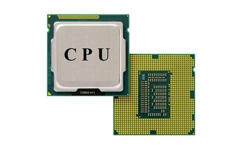
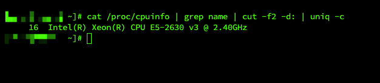
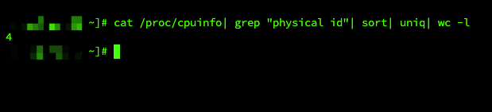
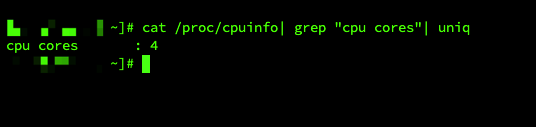
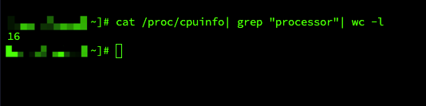

# 程序员必知CPU小知识

## 什么是 CPU
CPU: （Central Processing Unit）也称为中央处理器，主要通过内部总线，建立起芯片内各部件之间的信息传输通路。



## 如何查看 CPU 详细信息
我们平常在操作 Linux 服务器时，如何能够知道服务器的 CPU 的详细信息呢。

```shell
[xxx@xxx ~]# cat /proc/cpuinfo | grep name | cut -f2 -d: | uniq -c
```



+ 16: CPU 核心数；
+ Intel(R): 服务器 CPU 品牌英特尔；
+ Xeon(R): 英特尔微处理器（至强）；
+ E5-2630 v3: 产品详细型号；
+ 2.40GHz: 主频。

## 查看物理 CPU 个数
物理 CPU 指的是购买组装在电脑或者服务器的实体 CPU。

日常我们所说的 CPU 核数指的是物理 CPU 上存在几个核心处理器或者核心处理单元总和（排除超线程技术）。

```shell
[xxx@xxx ~]# cat /proc/cpuinfo| grep "physical id"| sort| uniq| wc -l
```



查看 CPU 详细得知，服务器共有 16个核心，物理 CPU 个数为 4，证明单个物理 CPU 上集成了 4 个核心处理器。

## 单物理 CPU 核数
单个物理 CPU 我们也可以通过命令查看 Core 个数。



```shell
[xxx@xxx ~]# cat /proc/cpuinfo| grep "cpu cores"| uniq
```

## 查看逻辑 CPU 的个数
逻辑 CPU 是指用 超线程技术（HT）将物理核虚拟而成的逻辑处理单元。



```shell
[xxx@xxx ~]# cat /proc/cpuinfo| grep "processor"| wc -l
```

举例的服务器并不支持超线程技术，所以无法看到。


**超线程技术**

超线程技术就是利用特殊的硬件指令，把两个逻辑内核模拟成两个物理芯片，让单个处理器都能使用线程级并行计算，进而兼容多线程操作系统和软件，减少了 CPU 的闲置时间，提高的 CPU 的运行效率。

超线程技术是在 一颗 CPU 同时执行多个程序而共同分享一颗 CPU 内的资源，理论上要像两颗 CPU 一样在同一时间执行两个线程。


虽然采用超线程技术能同时执行两个线程，但它并不象两个真正的 CPU 那样，每个 CPU 都具有独立的资源。

当两个线程都同时需要某一个资源时，其中一个要暂时停止，并让出资源，直到这些资源闲置后才能继续。因此超线程的性能并不等于两颗 CPU 的性能。

对于 CPU 密集型的数值程序，超线程技术可能会导致整体程序性能下降。Linux 内核支持关闭超线程技术。

## 小结
关于物理 CPU 个数、核心 CPU 个数、逻辑 CPU 个数之间总结的公式。

总核心数 = 物理 CPU 个数 * 单物理 CPU 核心数。

逻辑 CPU 数量 = 总核心数 * 超线程数。


> 更新: 2023-07-17 18:30:36  
> 原文: <https://www.yuque.com/magestack/12306/tekgv776kkzqib9n>