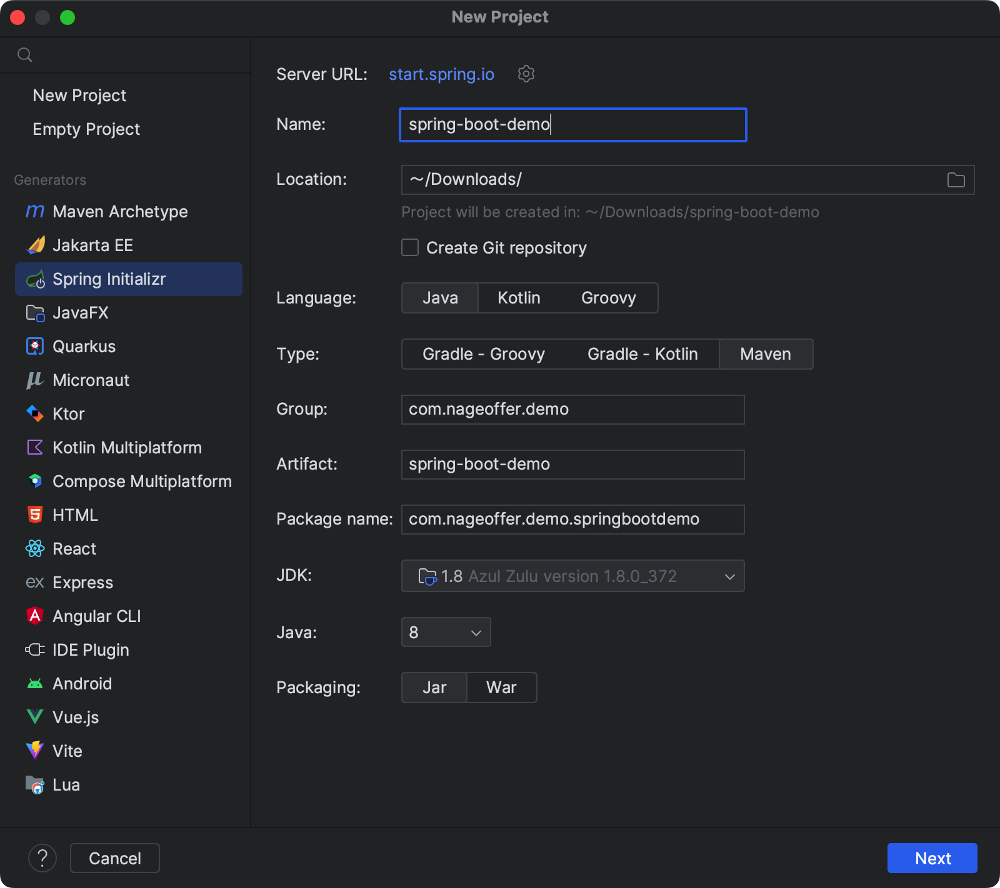
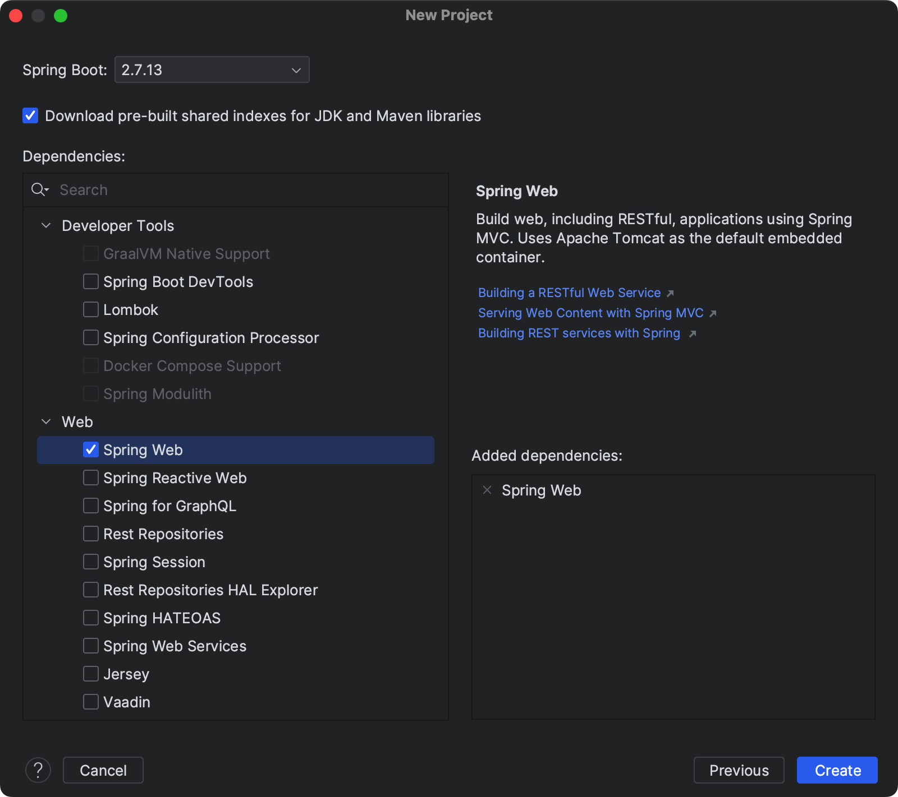
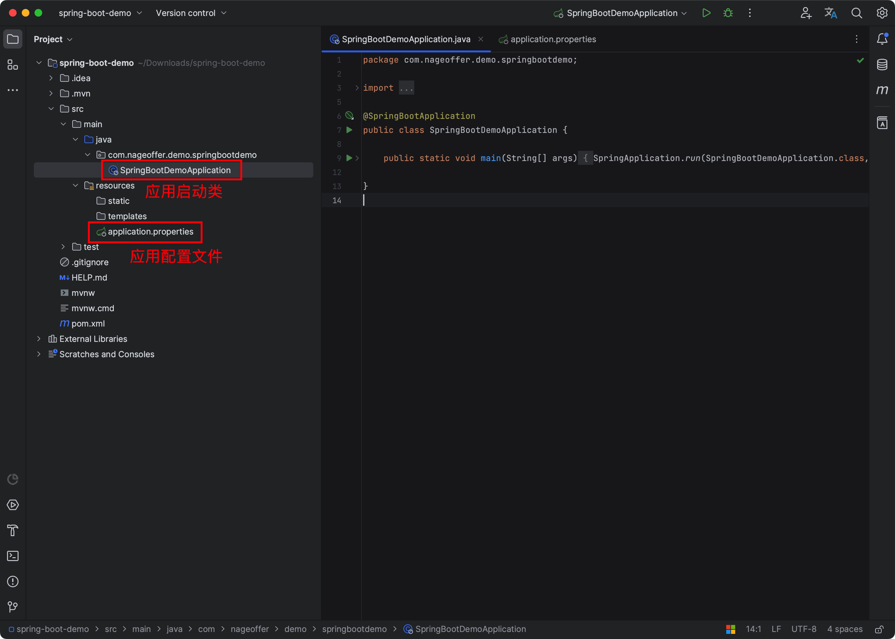

# 手摸手之创建SpringBoot单模块

Spring Boot 致力于简洁，让开发者写更少的配置文件，由于`Springboot 内置了 Servlet 容器`，所以程序不需要像传统的方式，先部署到容器然后再启动容器。只需要打开创建包目录文件下`${项目名}Application.java`文件运行`main`方法即可。

## 搭建Spring boot项目
SpringBoot 项目可以在`https://start.spring.io/`上创建项目进行下载，并在本地运行，也可在`IDEA中`进行构建。本次演示采用`IDEA`的方式。



****

选择合适的 SpringBoot 版本，这里选择 `2.7.13`。



### 1. 结构目录



如上图所示，Spring Boot的基础结构一共是三个文件：

+ `src/main/java`  程序开发以及主程序入口。
+ `src/main/resources`  项目相关配置文件。
+ `src/test/java`  测试程序文件。

### 2. pom.xml文件
可以看到工程中有 Maven 的 Pom 文件，这里默认是依赖了 SpringBoot 的`2.1.4版本`，由于是测试，就不怂有什么问题，可以起到测试效果即可，构建项目不建议使用最新的；可以看到其中的一些依赖 jar 包比较少，因为这些都是`内嵌`到了`SpringBoot 的 Jar 依赖`。

```xml
<?xml version="1.0" encoding="UTF-8"?>
<project xmlns="http://maven.apache.org/POM/4.0.0" xmlns:xsi="http://www.w3.org/2001/XMLSchema-instance"
         xsi:schemaLocation="http://maven.apache.org/POM/4.0.0 https://maven.apache.org/xsd/maven-4.0.0.xsd">
    <modelVersion>4.0.0</modelVersion>
    <parent>
        <groupId>org.springframework.boot</groupId>
        <artifactId>spring-boot-starter-parent</artifactId>
        <version>2.7.13</version>
        <relativePath/> <!-- lookup parent from repository -->
    </parent>
    <groupId>com.nageoffer.demo</groupId>
    <artifactId>spring-boot-demo</artifactId>
    <version>0.0.1-SNAPSHOT</version>
    <name>spring-boot-demo</name>
    <description>spring-boot-demo</description>
    <properties>
        <java.version>1.8</java.version>
    </properties>
    <dependencies>
        <dependency>
            <groupId>org.springframework.boot</groupId>
            <artifactId>spring-boot-starter-web</artifactId>
        </dependency>

        <dependency>
            <groupId>org.springframework.boot</groupId>
            <artifactId>spring-boot-starter-test</artifactId>
            <scope>test</scope>
        </dependency>
    </dependencies>

    <build>
        <plugins>
            <plugin>
                <groupId>org.springframework.boot</groupId>
                <artifactId>spring-boot-maven-plugin</artifactId>
            </plugin>
        </plugins>
    </build>

</project>
```

### 3. Application
其中有一个`Application`类，它就是程序的入口，右键选择Run即可启动该项目（ps：默认端口号为`8080`）。

```java
package com.nageoffer.demo.springbootdemo;

import org.springframework.boot.SpringApplication;
import org.springframework.boot.autoconfigure.SpringBootApplication;

@SpringBootApplication
public class SpringBootDemoApplication {

    public static void main(String[] args) {
        SpringApplication.run(SpringBootDemoApplication.class, args);
    }

}
```


在 `resources` 下面有一个 `application.properties` 配置文件，负责配置项目中的一下配置信息，默认为空；一般是采用 `.yml` 的形式进行配置，可以右键选择此配置文件将其后缀进行修改。

### 4. 编写一个 Controller
```java
/**
 * 等同于 @Controller 加上 @ResponseBody
 */
@RestController
public class HelloController {
    
    /**
     * 访问 /hello 或者 /hi 任何一个地址，都会返回同样的结果
     * @GetMapping 等用于 @RequestMapping(method = RequestMethod.GET)
     */
    @GetMapping(value = {"/hello","/hi"})
    public String say() {
        return "How are you?";
    }
}
```


运行 `SpringbootDemoApplication` 的 `main` 方法就会启动项目，打开浏览器输入网址：`localhost:8080/hi`，就可以在浏览器上看到：`How are you?`。

## 属性配置
在`appliction.yml`文件中添加属性：

```yaml
girl:
  name: 小花
  age: 18
  content: content:${name},age:${age}
```


在 Java 文件中，获取 name 属性，如下：

```java
@Value("${girl.name}")
private String name;


@Value("${girl.age}")
private Integer age;


@Value("${girl.content}")
private String content;
```


也可以通过 `ConfigurationProperties` 注解，将属性可以配置到 `Bean`，通过 `Component` 注解将Bean 注解到 Spring 容器中。

```java
@ConfigurationProperties(prefix="girl")
@Component
public class GirlProperties {

    private String name;

    private int age;

    public String getName() {
        return name;
    }

    public void setName(String name) {
        this.name = name;
    }

    public int getAge() {
        return age;
    }

    public void setAge(int age) {
        this.age = age;
    }
}
```

## 总结
使用 SpringBoot 可以`非常方便`、`快速搭建`项目，Spring 项目就相当于是个光脚大汉，boot…boot 给你双鞋总跑得过光脚的吧。另外 SpringBoot 也是构建`Springcloud 微服务架构`的基础。


> 更新: 2023-07-26 17:01:22  
> 原文: <https://www.yuque.com/magestack/12306/vyyb2fa1lv3pd0xp>