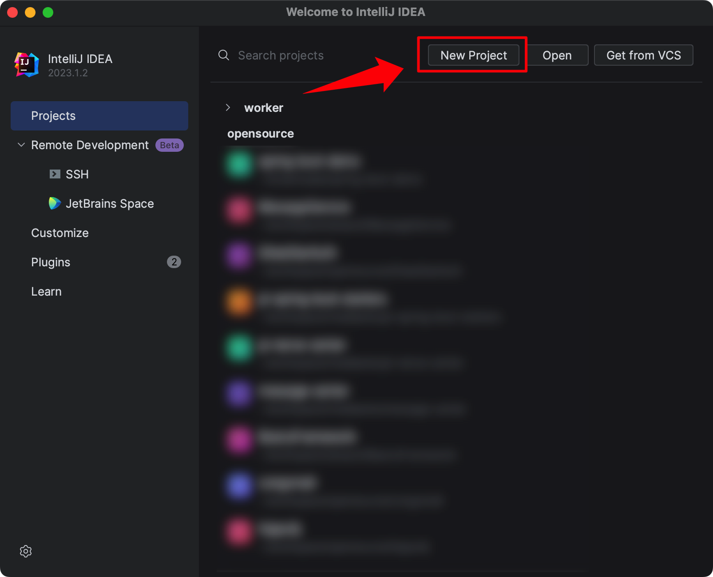
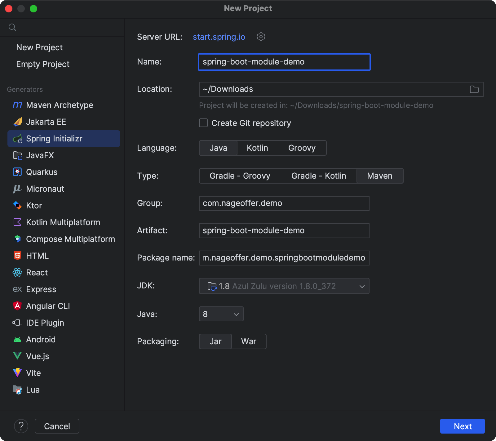
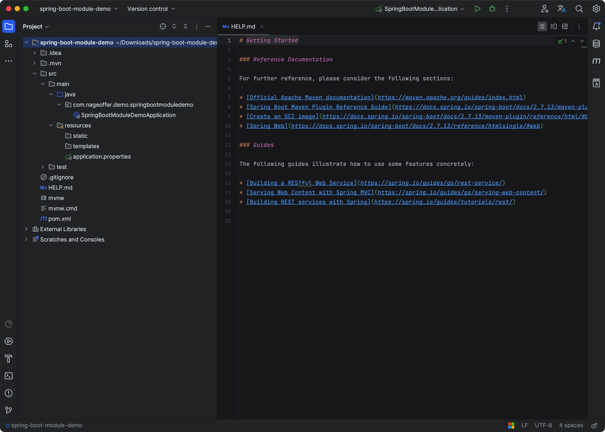
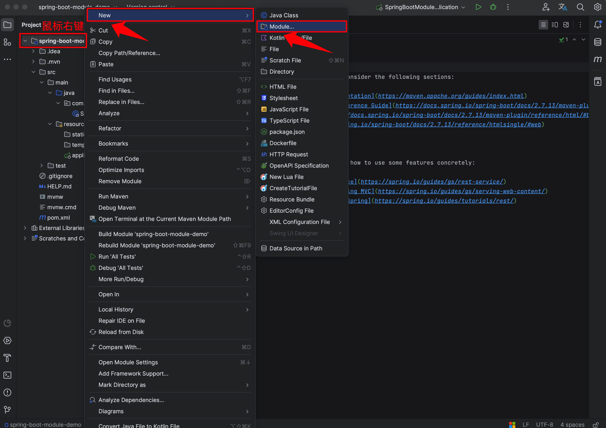
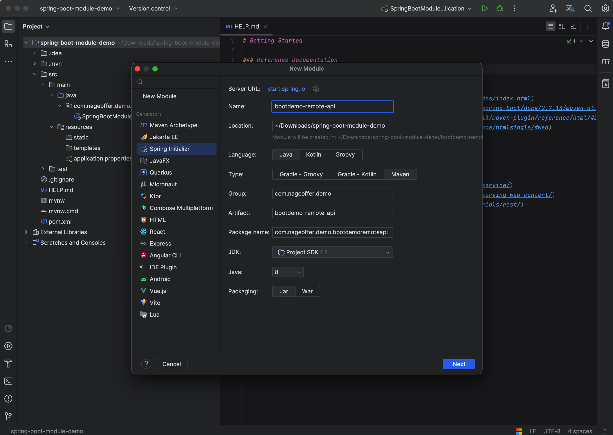
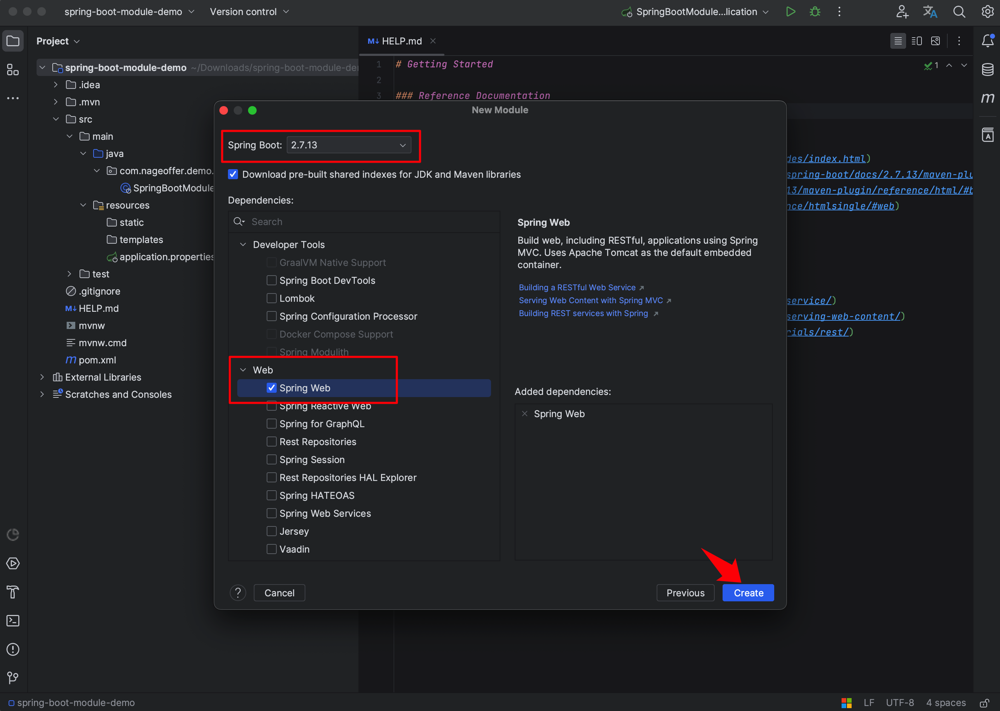
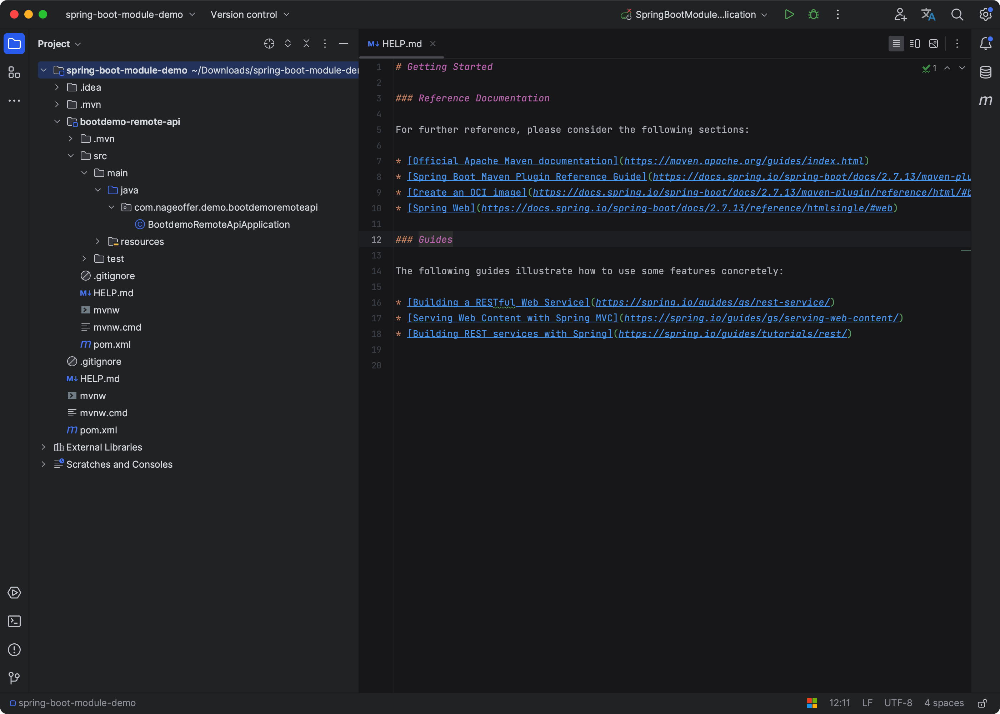
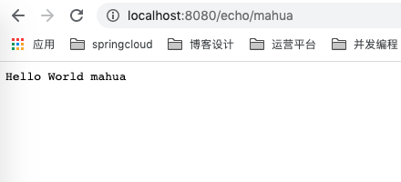

# 手摸手之创建SpringBoot多模块

如果将 SpringBoot 框架用作与单体项目，可能不存在多模块的情况。但是并不代表没有，因为父子模块并不局限于微服务，**单体项目也可以进行明确的职责划分。**

如果是构建微服务项目，基本上会对模块进行明确的划分，比如：

+ 抽象定义公共代码及Util封装进行引用。
+ 业务代码进行单独定义模块。
+ 数据库等 DB 操作相关抽离单独模块。
+ 提供外部平台调取的接口单独定义模块。
+ ...

**上面的拆分也并非绝对**，随着架构师对于项目结构的不同理解，可能会衍生出不同的模块。

比较经典的就是 Dubbo 将接口 API 进行抽离提供生产者接口，打为 Jar 包供消费端调用。

[Spring Boot多模块项目实战与Maven管理经验分享 - zhang1222 - 博客园](https://www.cnblogs.com/Anfioo/p/18969680)

本篇文章也会从零到一创建 SpringBoot 父子模块的项目，**演示聚合、继承的项目特性，并针对不引人注意的知识点进行讲解。**

## 软硬件环境
**电脑：** McaBook Pro

**创建项目工具：** IDEA 2023.1.2

**JDK 版本：** 还能再坚持 20 年的 JDK8（随着 JDK 17 的出现，不一定能坚持 20 年了）

**Maven版本：** 3.5.4

## 创建 SpringBoot 项目
1）首先打开 IDEA 工具，点击 + Create New Project。




2）选择 Spring Initializr（初始化），选择Project SDK 1.8，使用默认的 SpringBoot 脚手架即可。创建项目详细信息，会逐一进行讲解。

最终定义项目选项及配置名称如下，点击 Next 按钮继续进行。




+ **Group：** 项目组织唯一的标识符，实际对应 Java 的包的结构，是 main 目录里 Java 的目录结构。
    - Group 也就是 groupId，分为多个段；一般情况下 **第一段为域，第二段为公司，第三段为项目名称。**
    - 以 Nacos 源码进行举例，Group 为 com.alibaba.nacos。
    - com 为商业组织，alibaba 为公司名称，nacos 就是项目名称。
+ **Artifact：** 项目的唯一的标识符，实际对应项目的名称，就是项目根目录的名称。
    - Artifact 即为 artifactId，还是以 Nacos 举例，因为最近在看它。
    - Nacos 中不同的功能组件的 artifactId 各不相同，比如权限相关的子模块就是 nacos-auth，客户端相关是 nacos-client，具体到了项目功能组件。
+ **Type：** 分为四种不同的类型，日常我们选择默认第一条就行，**也就是 Maven Project。**
+ **Language：** 开发语言的话自然就是默认的 Java。
+ **Packaging：** 打包方式，分为 War 包 和 Jar 包，这里选择 Jar 包。
+ **Java Version：** 选择 Java 的一个版本，再坚持 20 年的 JDK 1.8。
+ **Version：** 当前项目的一个版本，SNAPSHOT 为快照的意思。开发时一般使用此类型，因为对于 Maven 仓库的同步较为友好，有不同纬度的同步选择。
+ **Name：** 定义项目名称。
+ **Description：** 定义项目描述信息，帮助别人更好的了解项目。
+ **Package：** 定义 main.java 目录下的结构。


3）选择 SpringBoot 版本信息以及 Pom.xml 文件依赖组件。

这里选择的 SpringBoot 版本是 **2.7.13**，选择了 **Spring Web**  当作 Maven 依赖项。后续会使用发布 Web 测试项目整体是否成功，接下来点击 Next 继续进行下一步。


4）确认无误后点击 Create，一个标准的 SpringBoot 项目就产生了。




## 构建子 Module
1）顶级项目地址右键** New -> Module**，创建子 Module。



2）这里就是重复上述在创建 SpringBoot 项目时的步骤，Group 与 Parent 项目保持一致即可，Artifact 修改为 子Module 项目作用域名即可，Next 下一步。



3）配置可按照需求进行选择，因为不同的 Module 需要引用不同的 Pom 依赖，后面会与 Parent 保持一个交互。



4）最终结构目录如下，**项目已成功创建，原本根目录下 src 目录删除即可。**后续我们要修改其中的 Pom.xml 使其成为真正的父子项目。



## 建立父子 Module 依赖
如果将建立的 Parent 项目与后面创建的 Module  产生关联，需要改动以下几点：

+ 修改 Parent 项目 Pom.xml 的 packaging 标签打包方式为 pom。
+ 修改 Module 项目 Pom.xml 文件依赖 Parent 项目。
+ 删除不必要文件并梳理 Pom.xml 依赖上下级关。

### 1. 设置根pom.xml
打开 Parent 项目的根 Pom.xml 文件，新增下方代码。

```xml
<packaging>pom</packaging>
<modules>
    <module>bootdemo-remote-api</module>
</modules>
```

（1）`<packaging>`标签 包含三个值 **Jar、War、Pom**，默认 Jar的方式。modules 代表了 Parent 项目下的子 Module，体现了聚合的思想。

+ **Jar：** 内部调用或作为服务进行发布使用。
+ **War：** 需要部署的项目。
+ **Pom：**告诉 Maven，这是一个 **聚合/父项目（Parent/Aggregator）**，**本身不打包可执行代码**，而是 **用于管理子模块** 和 **统一依赖配置**。

（2）**模块聚合**：通过 `<modules>` 标签声名所有子模块，方便一次性编译、打包、测试

（3）**统一依赖管理**：在根 pom 中声明所有模块通用的依赖版本，避免版本冲突。另外说一下 在根pom.xml中使用`<dependencies>` 和 `<dependencyManagement>` 标签的区别：

- `<dependencies>`标签内的依赖默认传递子 Module，不用子 Module 进行显示书写依赖。

- 而`<dependencyManagement>`标签内的依赖不会默认传递子 Module，其作用只是为了统一版本声明。如果子 Module 依赖 Parent 项目中 `<dependencyManagement>` 标签内的 pom 依赖，需要显示在子 Module 的 pom 文件中进行书写。


这里把 Parent 项目的 Pom.xml 配置复制出来，帮助大家后续排查问题。

```xml
<?xml version="1.0" encoding="UTF-8"?>
<project xmlns="http://maven.apache.org/POM/4.0.0" xmlns:xsi="http://www.w3.org/2001/XMLSchema-instance"
         xsi:schemaLocation="http://maven.apache.org/POM/4.0.0 https://maven.apache.org/xsd/maven-4.0.0.xsd">
    <modelVersion>4.0.0</modelVersion>
    <parent>
        <groupId>org.springframework.boot</groupId>
        <artifactId>spring-boot-starter-parent</artifactId>
        <version>2.7.13</version>
        <relativePath/> <!-- lookup parent from repository -->
    </parent>
    <groupId>com.nageoffer.demo</groupId>
    <artifactId>spring-boot-module-demo</artifactId>
    <version>0.0.1-SNAPSHOT</version>
    <name>spring-boot-module-demo</name>
    <description>spring-boot-module-demo</description>
    <!-- 新增开始 -->
    <packaging>pom</packaging>
    <modules>
        <module>bootdemo-remote-api</module>
    </modules>
    <!-- 新增结束 -->
    <properties>
        <java.version>1.8</java.version>
    </properties>
    <dependencies>
        <dependency>
            <groupId>org.springframework.boot</groupId>
            <artifactId>spring-boot-starter-web</artifactId>
        </dependency>

        <dependency>
            <groupId>org.springframework.boot</groupId>
            <artifactId>spring-boot-starter-test</artifactId>
            <scope>test</scope>
        </dependency>
    </dependencies>

    <build>
        <plugins>
            <plugin>
                <groupId>org.springframework.boot</groupId>
                <artifactId>spring-boot-maven-plugin</artifactId>
            </plugin>
        </plugins>
    </build>
</project>
```

其中**spring-boot-maven-plugin** 插件的作用是运行 **mvn package** 时会将项目打包为可运行的 jar 包，**java -jar** 运行即可。如果不加这个 **plugins**，**java -jar xxx.jar** 会报出如下错误。

```java
xxx/target/bootdemo-remote-api-0.0.1-SNAPSHOT.jar中没有主清单属性
```

### 2. 设置子模块pom.xml 信息
创建后的 Module 项目的 Parent 信息是 SpringBoot 配置，修改后如下。

（1)**继承父 pom**：在 Maven 的子模块中，`<parent>` 用于 **声明继承哪个父模块的配置**，自动**继承父模块中的所有公共配置、属性、插件和依赖管理信息**。

  (2)**声明自身依赖**：只需声明本模块特有的依赖。

  (3)⭐⭐**模块间依赖**：如下面《模块间依赖关系和灵活复用》提到的**bootdemo-biz** 依赖bootdemo-remote-api ，可通过 在子模块bootdemo-biz的pom.xml的`<dependency>`标签下 引用即可。

```xml
<?xml version="1.0" encoding="UTF-8"?>
<project xmlns="http://maven.apache.org/POM/4.0.0" xmlns:xsi="http://www.w3.org/2001/XMLSchema-instance"
	xsi:schemaLocation="http://maven.apache.org/POM/4.0.0 https://maven.apache.org/xsd/maven-4.0.0.xsd">
	<modelVersion>4.0.0</modelVersion>
	<parent>
		<groupId>com.nageoffer.demo</groupId>
		<artifactId>spring-boot-module-demo</artifactId>
		<version>0.0.1-SNAPSHOT</version>
	</parent>
	<artifactId>bootdemo-remote-api</artifactId>
	<version>0.0.1-SNAPSHOT</version>
	<name>bootdemo-remote-api</name>
	<description>bootdemo-remote-api</description>
	<properties>
		<java.version>1.8</java.version>
	</properties>
</project>

```


## 模块间依赖关系和灵活复用
我们按照《构建子 Module》章节的内容，再构建出如下所述的另一子 Module：bootdemo-biz。

```xml
<groupId>com.nageoffer.demo</groupId>
<artifactId>bootdemo-biz</artifactId>
<version>0.0.1-SNAPSHOT</version>
<name>bootdemo-biz</name>
```

然后修改 **bootdemo-biz** 子 Module 的 Pom.xml 文件如下。通过继承关系的设置，**bootdemo-remote-api** 中的代码就可以被 **bootdemo-biz** Module 项目进行引用。

```xml
<?xml version="1.0" encoding="UTF-8"?>
<project xmlns="http://maven.apache.org/POM/4.0.0" xmlns:xsi="http://www.w3.org/2001/XMLSchema-instance"
         xsi:schemaLocation="http://maven.apache.org/POM/4.0.0 https://maven.apache.org/xsd/maven-4.0.0.xsd">
    <modelVersion>4.0.0</modelVersion>
    <parent>
        <groupId>com.nageoffer.demo</groupId>
        <artifactId>spring-boot-module-demo</artifactId>
        <version>0.0.1-SNAPSHOT</version>
    </parent>
    <artifactId>bootdemo-biz</artifactId>
    <version>0.0.1-SNAPSHOT</version>
    <name>bootdemo-biz</name>
    <description>bootdemo-biz</description>
    <properties>
        <java.version>1.8</java.version>
    </properties>
    <dependencies>
        <dependency>
            <groupId>${project.groupId}</groupId>
            <artifactId>bootdemo-remote-api</artifactId>
            <version>${project.version}</version>
        </dependency>

        <dependency>
            <groupId>org.springframework.boot</groupId>
            <artifactId>spring-boot-starter-test</artifactId>
            <scope>test</scope>
        </dependency>
    </dependencies>
</project>

```


## 用例说明：发布 WEB 服务
在 Parent 项目 Pom.xml `dependencies` 标签中定义了 **spring-boot-starter-web** 依赖，在其子模块无需再重复引入该依赖，直接使用 web 相关内容即可。

我们在 **bootdemo-biz** 中创建 Controller 控制器。

```java
@RestController
public class DemoController {

    @GetMapping("/echo/{name}")
    public String sayHello(@PathVariable("name") String name) {
        return "Hello World " + name;
    }
}
```


启动后端项目成功后，浏览器输入 [**http://localhost:8080/echo/mahua**](http://localhost:8080/echo/mahua) 请求后端服务。




> 更新: 2023-08-11 10:18:22  
> 原文: <https://www.yuque.com/magestack/12306/fx2og75a98hg5gz9>