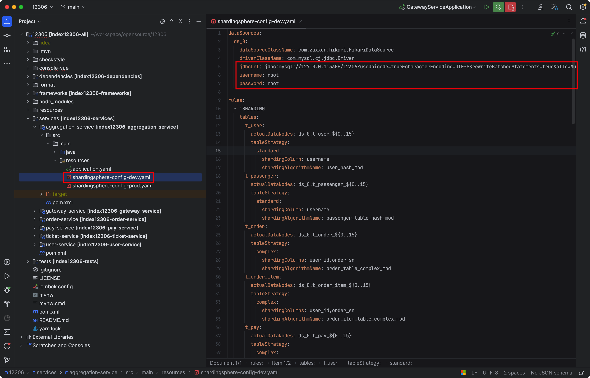
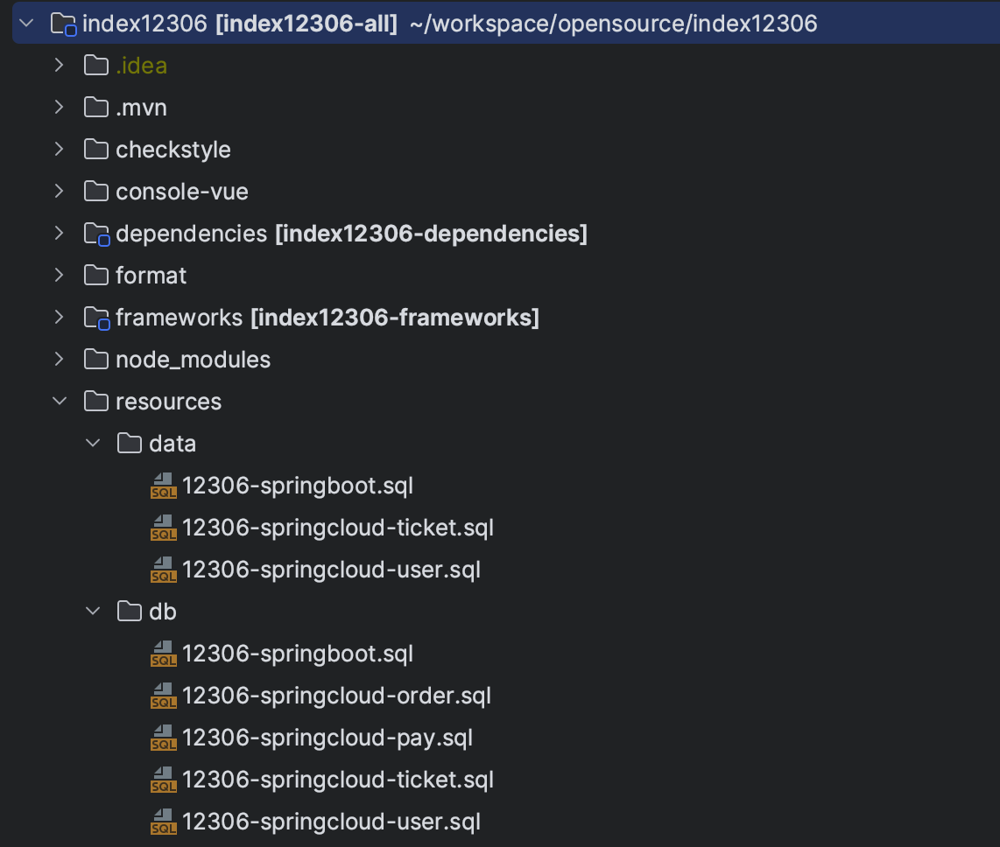
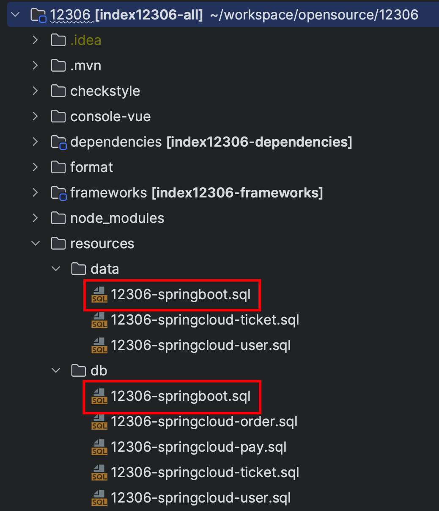

# 手摸手之初始数据库表信息

## 安装 MySQL
考虑到多人使用同一台 MySQL 实例的数据会存在脏数据问题，所以 MySQL 不提供公有云版本，大家按照下述文档在本地进行安装 MySQL 即可。

> 如果本地已经有 MySQL 服务，可以复用本地 MySQL 服务，没有的话才需要安装。
>

Windows、Linux 以及 Mac M1 以下电脑通过以下 Docker 命令启动 MySQL 实例。

```shell
docker run --name mysql \
-p 3306:3306 \
-e MYSQL_ROOT_HOST='%' \
-e MYSQL_ROOT_PASSWORD=root \
-d mysql:5.7.36
```

+ `-d`：以后台的方式运行。
+ `--name mysql`：指定容器的名称为 mysql。
+ `-e MYSQL_ROOT_HOST='%'`：允许 root 用户在任何主机访问。
+ `-p 3306:3306`：将容器的 3306 端口挂载到宿主机的 3306 端口上。
+ `-e MYSQL_ROOT_PASSWORD=root`：指定 root 的密码为 root。


如果你是 Mac M1 及以上电脑，需要执行下述 Docker 语句创建 MySQL。

```shell
docker run --name mysql \
--platform=linux/amd64 \
-p 3306:3306 \
-e MYSQL_ROOT_HOST='%' \
-e MYSQL_ROOT_PASSWORD=root \
-d amd64/mysql:5.7.36
```


创建好本地 MySQL 后，修改对应项目的数据库配置文件，这里以 SpringBoot 单体服务举例。

<font style="background-color:#FBDE28;">如果本地 MySQL 服务中数据库名称、用户名和密码与文档中不一致，记得修改。</font>



## 启动模式
12306 铁路购票模式有两种启动模式，分别是聚合版 SpringBoot 模式以及 SpringCloud 微服务模式。

两种启动模式分别对应不同的数据库表模式：

+ SpringBoot 模式：仅分表，不分库。数据库名称是统一的 12306。
+ SpringCloud 模式：分库又分表。数据库名称是 12306_业务_分库数。

两种模式的分表模式一致。所以说，启动 SpringBoot 模式时，导入 12306 数据库。启动 SpringCloud 时，需要创建与 12306 相关的数据库及表结构。

## 数据库初始化
如上所述，我将 SpringBoot 和 SpringCloud 版本拆分了两个类型，数据库 SQL 语句也是一样。对建表语句 SQL 以及初始化 SQL 语句进行了拆分。



### SpringBoot 聚合模式
（1）MySQL 数据库中创建新的 DB，名称为 12306。

```sql
CREATE DATABASE /*!32312 IF NOT EXISTS*/ `12306` /*!40100 DEFAULT CHARACTER SET utf8mb4 COLLATE utf8mb4_unicode_ci */;
```

（2）创建好数据库后，进入 12306 数据库中，导入项目中下述 SQL 语句。

```shell
use 12306；
resources/db/12306-springboot.sql
resources/data/12306-springboot.sql
```



使用idea将数据库连接上

### SpringCloud 分布式模式

MySQL 数据库中创建多个12306 业务相关 DB。

```sql
CREATE DATABASE /*!32312 IF NOT EXISTS*/ `12306_ticket` /*!40100 DEFAULT CHARACTER SET utf8mb4 COLLATE utf8mb4_unicode_ci */;

CREATE DATABASE /*!32312 IF NOT EXISTS*/ `12306_order_0` /*!40100 DEFAULT CHARACTER SET utf8mb4 COLLATE utf8mb4_unicode_ci */;
CREATE DATABASE /*!32312 IF NOT EXISTS*/ `12306_order_1` /*!40100 DEFAULT CHARACTER SET utf8mb4 COLLATE utf8mb4_unicode_ci */;

CREATE DATABASE /*!32312 IF NOT EXISTS*/ `12306_pay_0` /*!40100 DEFAULT CHARACTER SET utf8mb4 COLLATE utf8mb4_unicode_ci */;
CREATE DATABASE /*!32312 IF NOT EXISTS*/ `12306_pay_1` /*!40100 DEFAULT CHARACTER SET utf8mb4 COLLATE utf8mb4_unicode_ci */;

CREATE DATABASE /*!32312 IF NOT EXISTS*/ `12306_user_0` /*!40100 DEFAULT CHARACTER SET utf8mb4 COLLATE utf8mb4_unicode_ci */;
CREATE DATABASE /*!32312 IF NOT EXISTS*/ `12306_user_1` /*!40100 DEFAULT CHARACTER SET utf8mb4 COLLATE utf8mb4_unicode_ci */;
```


1）12306_ticket 数据库导入项目中下述建表 SQL 语句。

```shell
resources/db/12306-springcloud-ticket.sql
resources/data/12306-springcloud-ticket.sql
```


2）进入 12306_user_0 数据库导入项目中下述建表 SQL 语句，该 SQL 文件包含了 12306_user_0和1 两个数据库的数据。

```shell
resources/db/12306-springcloud-user.sql
resources/data/12306-springcloud-user.sql
```


3）进入 12306_pay_0 数据库导入项目中下述建表 SQL 语句，该 SQL 文件包含了 12306_pay_0和1 两个数据库的数据。

```shell
resources/db/12306-springcloud-pay.sql
```


4）进入 12306_order_0 数据库导入项目中下述建表 SQL 语句，该 SQL 文件包含了 12306_order_0和1 两个数据库的数据。

```shell
resources/db/12306-springcloud-order.sql
```


> 更新: 2023-10-10 14:14:42  
> 原文: <https://www.yuque.com/magestack/12306/kwtxpe0cbugek9ue>