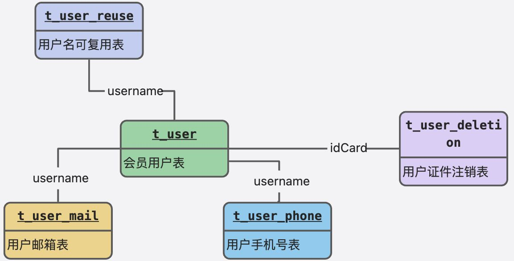
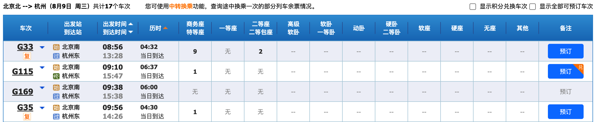
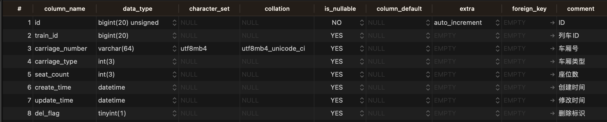
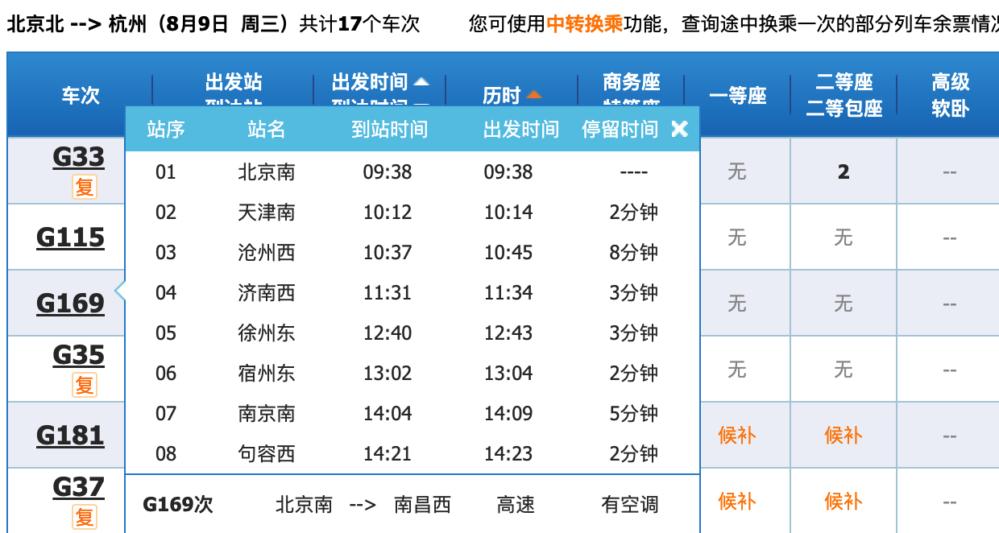
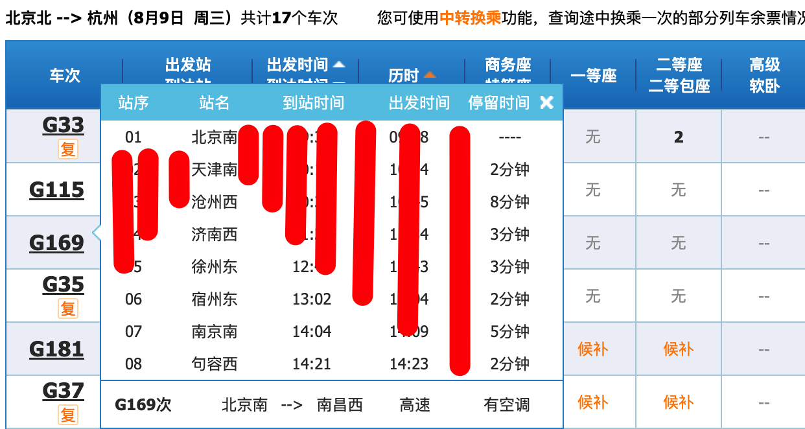
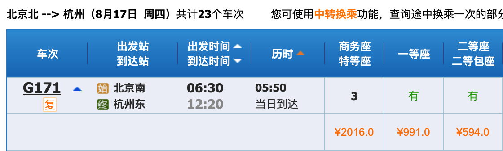
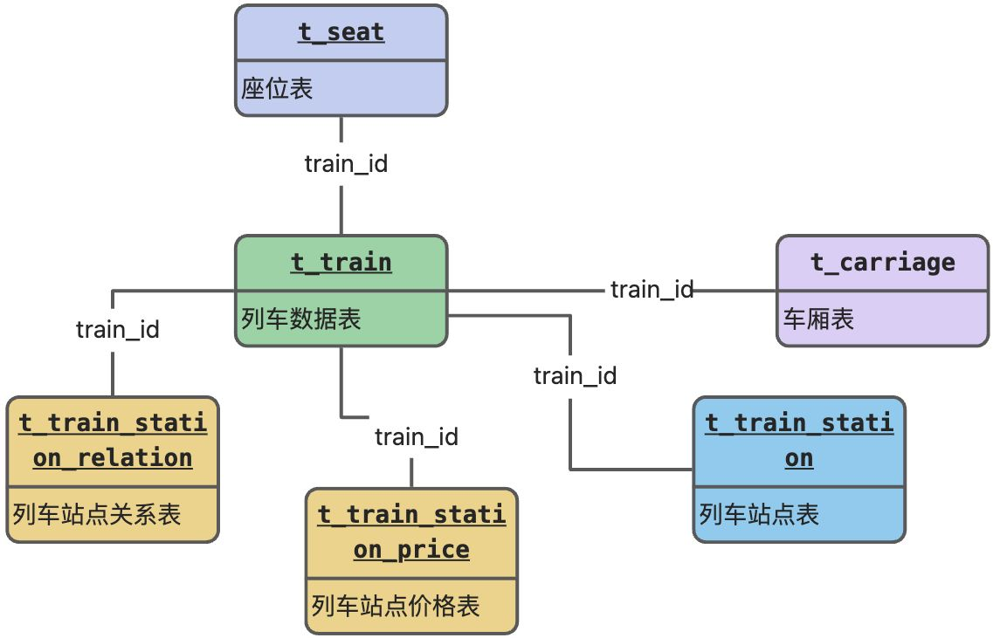
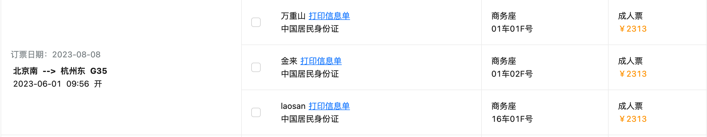
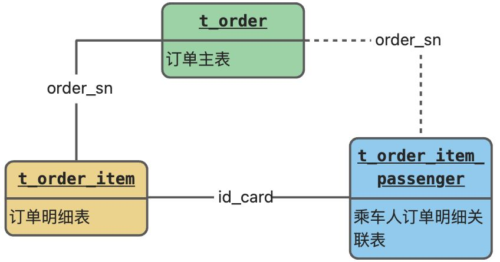
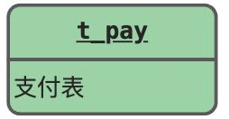

# 手摸手之梳理数据库表关系

## 用户管理
### 会员数据
会员相关核心数据库表如下：

+ t_user 会员数据表：存储会员账号、密码、证件号、邮箱、手机号等信息
+ t_user_mail 会员邮箱数据表：存储会员邮箱和用户名的关系
+ t_user_phone 会员手机号数据表：存储会员手机号和用户名的关系

很多小伙伴比较疑惑，和用户直接相关的三张表之间的关系是什么？手机号和邮箱不是可以在用户表中已经有了么，为什么还要再单独定义？

这是因为，我们对用户表进行了分库分表行为，分片键使用的 username 用户名进行拆分。

当我们执行新增语句时，没有分库分表前的数据长这个样子。

```sql
INSERT INTO `t_user` (`username`, `password`, `real_name`) VALUES ('admin', 'admin123456', '徐万里');
```

通过分库分表中间件 ShardingSphere 修饰后，真正执行的 SQL 语句长这个样子。

```sql
INSERT INTO `t_user_10` (`username`, `password`, `real_name`) VALUES ('admin', 'admin123456', '徐万里');
```

ShardingSphere 会通过分片键 username 用户名来确定数据在哪个库中的哪个表。所以，分库分表后，每次增删改查都需要带上分片键用户名。不然的话，查询会请求所有库的所有用户表，新增、修改和删除会直接报错。


我们以新增不带分片键根据手机号查询用户举例，真实执行的 SQL 如下：

```sql
SELECT  id,username,password,real_name,region,id_type,id_card AS id_card,phone AS phone,telephone,mail AS mail,user_type,verify_status,post_code,address AS address,deletion_time,create_time,update_time,del_flag  FROM t_user_0 
 WHERE  del_flag=0

AND (phone = ?) UNION ALL SELECT  id,username,password,real_name,region,id_type,id_card AS id_card,phone AS phone,telephone,mail AS mail,user_type,verify_status,post_code,address AS address,deletion_time,create_time,update_time,del_flag  FROM t_user_1 
 WHERE  del_flag=0

AND (phone = ?) UNION ALL SELECT  id,username,password,real_name,region,id_type,id_card AS id_card,phone AS phone,telephone,mail AS mail,user_type,verify_status,post_code,address AS address,deletion_time,create_time,update_time,del_flag  FROM t_user_2 
 WHERE  del_flag=0

AND (phone = ?) UNION ALL SELECT  id,username,password,real_name,region,id_type,id_card AS id_card,phone AS phone,telephone,mail AS mail,user_type,verify_status,post_code,address AS address,deletion_time,create_time,update_time,del_flag  FROM t_user_3 
 WHERE  del_flag=0

AND (phone = ?) UNION ALL SELECT  id,username,password,real_name,region,id_type,id_card AS id_card,phone AS phone,telephone,mail AS mail,user_type,verify_status,post_code,address AS address,deletion_time,create_time,update_time,del_flag  FROM t_user_4 
 WHERE  del_flag=0
xxxxxx
```

可以发现，ShardingSphere 通过 `UNION ALL` 的方式查询了所有分表。所以，这种不带分片键的查询在实际业务中，是不被允许的。


那问题来了，12306 支持会员用户登录时根据手机号、邮箱以及用户名三种组合方式登录，手机号和邮箱查询性能岂不是很差，因为要查询所有表。为了解决这个问题，我们通过路由表的方式解决这个问题。

相关技术实现方案查看下述文档的章节。

[手摸手之从创建会员接口开始](https://www.yuque.com/magestack/12306/bhzetv04b8ydt1kg#jCCPS)


用户相关扩展功能表如下：

+ t_user_reuse 用户名可复用表：存储已被注销的可用用户名
+ t_user_deletion：用户证件号注销表：存储被注销过得证件号记录数据

t_user_reuse 用户名可复用表，用来解决布隆过滤器无法删除的问题，具体可查看以下文档的章节。

[手摸手之从创建会员接口开始](https://www.yuque.com/magestack/12306/bhzetv04b8ydt1kg#es7PN)


t_user_deletion 用户证件号注销表，用来解决用户恶意注销 12306 账号的问题。假设，一个用户用一个证件号反复注册并注销，是不是应该把他拉入黑名单。因为用户名每次注册都可以使用新的，所以说我们只能针对证件号当做依据。目前系统的规则是，如果同一个证件号注销超过 5 次，就拉入黑名单不再支持注册。


会员数据整体 UML 图如下所示。



### 乘车人数据
+ t_passenger：乘车人数据表

一个用户可以多名乘车人，可以用来买票时选择多人购票。用户表和乘车人表之间通过用户名进行关联，一对多的关联关系。


### 配套视频
[https://t.zsxq.com/108kS2rZe](https://t.zsxq.com/108kS2rZe)

## 列车管理
### 列车数据表介绍
t_train：列车表，存储每天生成的行驶列车数据。




t_carriage：列车车厢表，存储每趟列车对应的车厢数据，包括车厢类型。




t_train_station：列车站点表，存储列车行驶站点顺序表。




t_train_station_relation：列车站点关联表，存储列车行驶站点关联关系表。

这是一个会把所有车站都会关联起来的数据集合，存储的数据模型如下所示：

+ 北京南->天津西，北京南->沧州西，北京南->xxx，北京南->句容西。
+ 天津西->沧州西，天津西->济南西，天津西->xxx，天津西->句容西。
+ 沧州西->济南西，沧州西->徐州东，沧州西->xxx，天津西->句容西。




t_train_station_price：列车站点价格表，存储列车站点关联关系不同座位价格表。

价格表在 t_train_station_relation 关系表的基础上，加入了两个字段，一个是价格，一个是座位类型。

因为列车行驶路线中，不同的站点间隔费用不一样，而且不同的座位费用也不一样。通过价格表整体区分出来。



### 表关联关系图


### 配套视频
[https://t.zsxq.com/11NLBgw01](https://t.zsxq.com/11NLBgw01)

## 订单管理
### 订单数据表介绍
t_order：订单主表，用户购买的单次车票，就对应一个订单。但是有可能一个订单中会有多个乘车人，所以还会有订单明细表。

t_order_item：订单明细表，一个订单可能有多个乘车人，多个乘车人就对应多个订单明细。




t_order_item_passenger：订单明细乘车人表，因为订单表和订单明细表分库分表规则所致，乘车人无法查看本人车票订单，所以创建了这个关联表。通过证件号关联订单。

Q：为什么通过乘车人证件号关联？

A：因为用户在添加乘车人进行购票时，有可能乘车人是没有注册账号的，所以只能通过证件号进行购票。那如果后来用户注册了账号，也就只能通过证件号去关联自己本人车票订单。



### 配套视频
[https://t.zsxq.com/112oq1bXc](https://t.zsxq.com/112oq1bXc)

## 支付管理
t_pay：订单支付表，存储用户支付车票相关数据。




> 更新: 2023-08-23 14:13:33  
> 原文: <https://www.yuque.com/magestack/12306/ihi1rsmxsl5fq0u4>