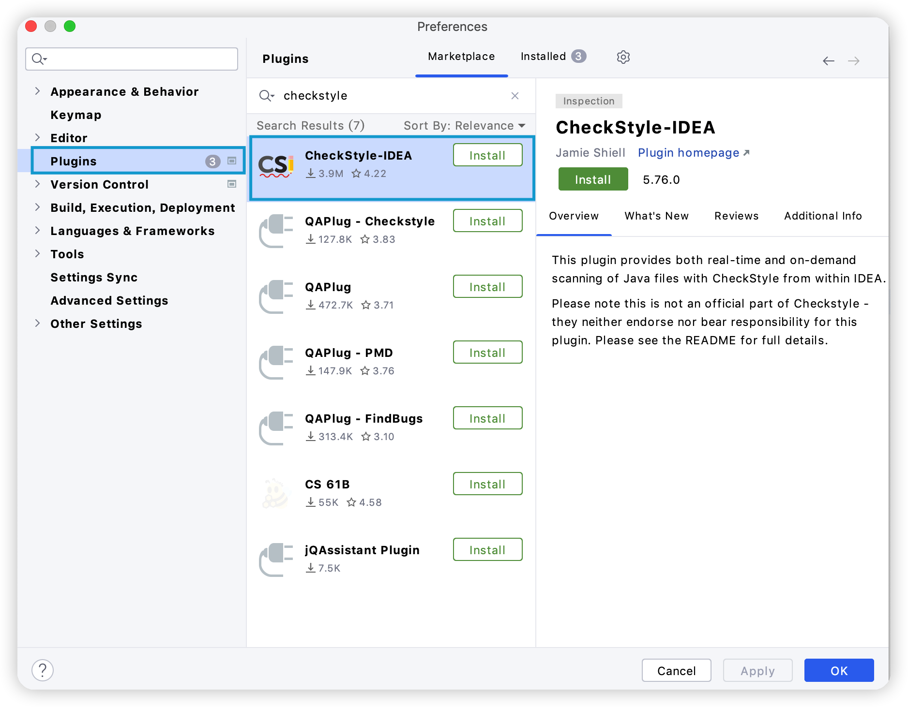
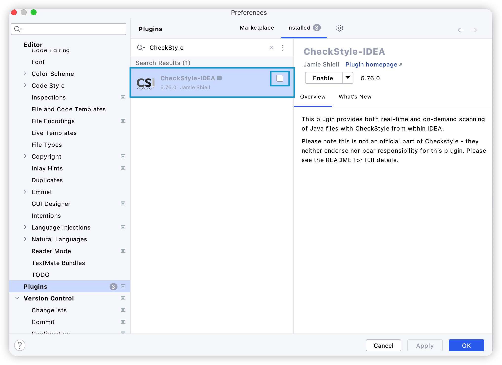
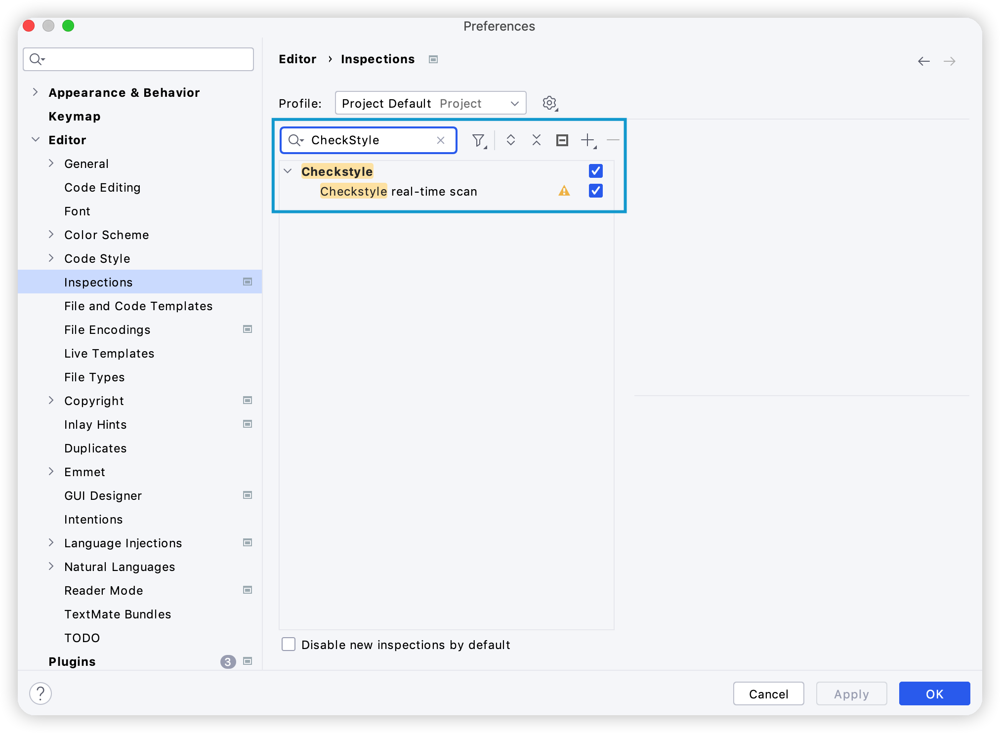
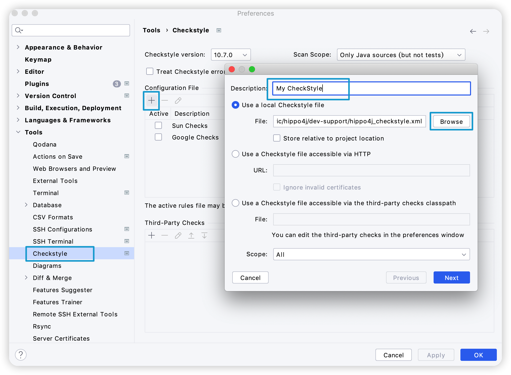
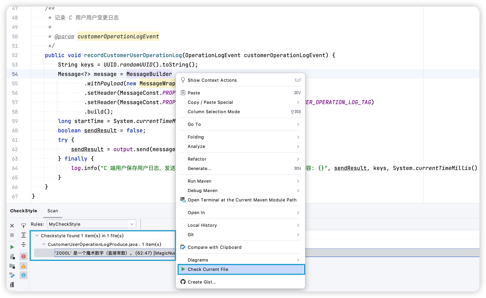
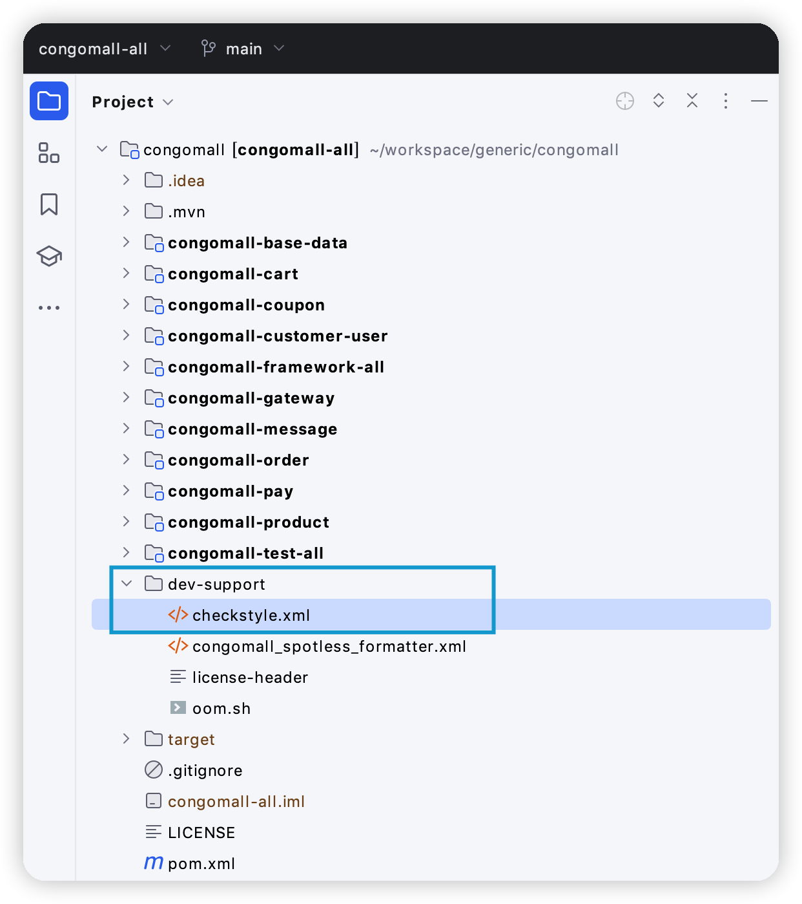

# 手摸手之代码检查很重要

<font style="color:rgb(59, 69, 78);"></font>

<font style="color:rgb(59, 69, 78);">Checkstyle 是一种开发工具，可帮助程序员编写符合编码标准的 Java 代码。它使检查 Java 代码的过程自动化，从而使开发者免于完成这项无聊（但重要）的任务。这使得它非常适合想要强制执行编码标准的项目。</font>

<font style="color:rgb(59, 69, 78);">Checkstyle 可以检查源代码的许多方面。它可以发现类设计问题、方法设计问题。它还能够检查代码布局和格式问题。</font>

## 定义扫描规则
<font style="color:rgb(59, 69, 78);">CheckStyle 有着众多扫描规则，涵盖种类非常之多，容易让人眼花缭乱。这里提供一份开源项目 Hippo4j 正在使用的规则文件，如需个性化可参考官网进行修改。</font>

<font style="color:rgb(59, 69, 78);">创建自定义 </font><font style="color:rgb(59, 69, 78);">checkstyle.xml</font><font style="color:rgb(59, 69, 78);"> 文件：</font>

```xml
<!DOCTYPE module PUBLIC
"-//Puppy Crawl//DTD Check Configuration 1.3//EN"
"http://www.puppycrawl.com/dtds/configuration_1_3.dtd">
<module name="Checker">
  <module name="NewlineAtEndOfFile"/>
  <module name="RegexpSingleline">
    <property name="format" value="printStackTrace"/>
    <property name="message" value="Prohibit invoking printStackTrace in source code !"/>
  </module>
  <module name="TreeWalker">
    <module name="AvoidStarImport">
      <property name="excludes" value="java.io,java.net,java.lang.Math"/>
      <property name="allowClassImports" value="false"/>
      <property name="allowStaticMemberImports" value="true"/>
    </module>
    <module name="IllegalImport"/>
    <module name="RedundantImport"/>
    <module name="UnusedImports"/>
    <module name="JavadocType">
      <property name="allowUnknownTags" value="true"/>
      <property name="allowMissingParamTags" value="true"/>
      <message key="javadoc.missing" value="Class Comments: Missing Javadoc Comments"/>
    </module>
    <!-- Do not scan method annotations for now -->
    <!--<module name="JavadocMethod">
    <property name="tokens" value="METHOD_DEF"/>
    <property name="allowMissingPropertyJavadoc" value="true"/>
    <message key="javadoc.missing" value="Method Comments: Missing Javadoc Comments"/>
  </module>-->
    <module name="LocalFinalVariableName"/>
    <module name="LocalVariableName"/>
    <module name="PackageName">
      <property name="format" value="^[a-z]+(\.[a-z][a-z0-9]*)*$" />
    </module>
    <module name="StaticVariableName"/>
    <module name="TypeName"/>
    <module name="MemberName"/>
    <module name="MethodName"/>
    <module name="ParameterName "/>
    <module name="ConstantName"/>
    <module name="ArrayTypeStyle"/>
    <module name="UpperEll"/>
    <module name="LineLength">
      <property name="max" value="200"/>
    </module>
    <module name="MethodLength">
      <property name="tokens" value="METHOD_DEF"/>
      <property name="max" value="150"/>
    </module>
    <module name="ParameterNumber">
      <property name="max" value="5"/>
      <property name="ignoreOverriddenMethods" value="true"/>
      <property name="tokens" value="METHOD_DEF"/>
    </module>
    <module name="MethodParamPad"/>
    <module name="TypecastParenPad"/>
    <module name="NoWhitespaceAfter"/>
    <module name="NoWhitespaceBefore"/>
    <module name="OperatorWrap"/>
    <module name="ParenPad"/>
    <module name="WhitespaceAfter"/>
    <module name="WhitespaceAround"/>
    <module name="ModifierOrder"/>
    <module name="RedundantModifier"/>
    <module name="AvoidNestedBlocks"/>
    <module name="EmptyBlock"/>
    <module name="LeftCurly"/>
    <module name="NeedBraces"/>
      <module name="RightCurly"/>
      <module name="EmptyStatement"/>
      <module name="EqualsHashCode"/>
      <module name="IllegalInstantiation"/>
      <module name="InnerAssignment"/>
      <module name="MagicNumber">
      <property name="ignoreNumbers" value="0, 1, 2"/>
      <property name="ignoreAnnotation" value="true"/>
      <property name="ignoreHashCodeMethod" value="true"/>
      <property name="ignoreFieldDeclaration" value="true"/>
      </module>
      <module name="MissingSwitchDefault"/>
      <module name="SimplifyBooleanExpression"/>
      <module name="SimplifyBooleanReturn"/>
      <module name="FinalClass"/>
      <module name="InterfaceIsType"/>
      <module name="VisibilityModifier">
      <property name="packageAllowed" value="true"/>
      <property name="protectedAllowed" value="true"/>
      </module>
      <module name="StringLiteralEquality"/>
      <module name="NestedForDepth">
      <property name="max" value="3"/>
      </module>
      <module name="NestedIfDepth">
      <property name="max" value="4"/>
      </module>
      <module name="UncommentedMain">
      <property name="excludedClasses" value=".*Application$"/>
      </module>
      <module name="Regexp">
      <property name="format" value="System\.out\.println"/>
      <property name="illegalPattern" value="true"/>
      </module>
      <module name="ReturnCount">
      <property name="max" value="4"/>
      </module>
      <module name="NestedTryDepth ">
      <property name="max" value="4"/>
      </module>
      <module name="SuperFinalize"/>
      <module name="SuperClone"/>
      </module>
      </module>
```

## 如何使用
<font style="color:rgb(59, 69, 78);">CheckStyle 在日常生活中有两种常用的使用方式，分别是通过代码编辑器 IDEA 和 Maven 配合使用。</font>

### 1. IDEA 插件
<font style="color:rgb(59, 69, 78);">首先打开 IDEA 菜单栏的 Settings 配置中的 Plugins，搜索 CheckStyle-IDEA 并安装：</font>



<font style="color:rgb(59, 69, 78);"></font>

<font style="color:rgb(59, 69, 78);">安装后，查看 Enable 是否开启，如果没有开启，将该框打勾并重启 IDEA。</font>



<font style="color:rgb(59, 69, 78);"></font>

<font style="color:rgb(59, 69, 78);">安装重启 IDEA 之后，Settings 下搜索 Inspections，再查询 CheckStyle，如果能查询到内容，说明安装成功：</font>



<font style="color:rgb(59, 69, 78);"></font>

<font style="color:rgb(59, 69, 78);">在 Settings 中搜索 CheckStyle，按下图导入上一步骤新建的 checkstyle.xml 文件：</font>



<font style="color:rgb(59, 69, 78);"></font>

<font style="color:rgb(59, 69, 78);">通过下述代码扫描 CheckStyle 代码规则，看是否需要需要变更：</font>

```java
/**
* 记录 C 用户用户变更日志
*
* @param customerOperationLogEvent
*/
public void recordCustomerUserOperationLog(OperationLogEvent customerOperationLogEvent) {
    String keys = UUID.randomUUID().toString();
Message<?> message = MessageBuilder
    .withPayload(new MessageWrapper(keys, customerOperationLogEvent))
    .setHeader(MessageConst.PROPERTY_KEYS, keys)
    .setHeader(MessageConst.PROPERTY_TAGS, RocketMQConstants.CUSTOMER_USER_OPERATION_LOG_TAG)
    .build();
long startTime = System.currentTimeMillis();
boolean sendResult = false;
try {
    sendResult = output.send(message, 2000L);
} finally {
    log.info("C 端用户保存用户日志，发送状态: {}, Keys: {}, 执行时间: {} ms, 消息内容: {}", sendResult, keys, System.currentTimeMillis() - startTime, JSON.toJSONString(customerOperationLogEvent));
}
}
```

<font style="color:rgb(59, 69, 78);"></font>

<font style="color:rgb(59, 69, 78);">通过控制台，可以看到该代码段有以下不规范的操作，双击提示，可以一步一步去解决规范的问题：</font>



### 2. Maven 插件
<font style="color:rgb(59, 69, 78);">在项目根目录新建一个 </font><font style="color:rgb(59, 69, 78);">dev-support</font><font style="color:rgb(59, 69, 78);"> 文件夹，将代码规约配置文件放到此路径下，当然你也可以根据自己的需求去自行定义。</font>



<font style="color:rgb(59, 69, 78);"></font>

<font style="color:rgb(59, 69, 78);">在 Maven 中一个名为 maven-checkstyle-plugin 的插件，用于执行 </font>[CheckStyle](http://checkstyle.sourceforge.net/)<font style="color:rgb(59, 69, 78);"> 任务。下面是一个简单的配置。在 Maven 工程中的 pom.xml 文件，添加内容如下：</font>

```xml
<plugins>
  <plugin>
    <artifactId>maven-checkstyle-plugin</artifactId>
    <version>3.1.0</version>
    <configuration>
      <configLocation>${maven.multiModuleProjectDirectory}/dev-support/checkstyle.xml</configLocation>
      <includeTestSourceDirectory>true</includeTestSourceDirectory>
      <excludes>**/autogen/**/*</excludes>
    </configuration>
    <executions>
      <execution>
        <id>validate</id>
        <goals>
          <goal>check</goal>
        </goals>
        <phase>validate</phase>
      </execution>
    </executions>
  </plugin>
</plugins>
```

<font style="color:rgb(59, 69, 78);"></font>

<font style="color:rgb(59, 69, 78);">修改 pom.xml 之后，就可运行 CheckStyle 检查：</font>

```shell
mvn checkstyle:check
```

<font style="color:rgb(59, 69, 78);">IDEA 和 Maven 插件可结合使用。</font>

## 开源地址
[CheckStyle Site](https://checkstyle.org/)

[CheckStyle GitHub](https://github.com/checkstyle/checkstyle)


> 更新: 2023-07-17 17:50:57  
> 原文: <https://www.yuque.com/magestack/12306/wcywqog0izzxa1h5>