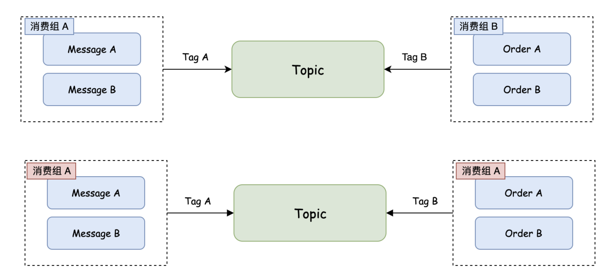

# 手摸手之消息队列正确使用姿势

## 命名规范
RocketMQ 相关命名强制使用英文小写。

1）【强制】Topic 命名：业务线_项目名_topic。业务线或项目包含多个单词，使用 - 分割，例如：`common_message-center_topic`。

2）【强制】Tag 命名：业务线_项目_业务_tag，例如：`common_message-center_send-message_tag`。

3）【强制】生产者组命名：业务线_项目___业务_pg，例如：`common_message-center_send-message_pg`。

4）【强制】消费者组命名：业务线_项目___业务_cg，例如：`common_message-center_send-message_cg`。

## 申请规范
创建 Topic 需要走线上申请，申请时补充下述信息。

---

申请人：马丁

Topic：`common_message-center_topic`


Produce：

| | 生产应用 | 生产者组 | Tag | 备注 |
| --- | --- | --- | --- | --- |
| 1 | message-center | common_message-center_send-message_pg | common_message-center_send-message_tag | 流量削峰 |
| 2 | message-center | common_message-center_send-message_pg | insurance_trading-order_send-message-fail_tag | 微信模板消息发送失败通知保险项目 |


Consume：

| | 消费应用 | 消费者组 | Tag | 消费模型 | 备注 |
| --- | --- | --- | --- | --- | --- |
| 1 | message-center | common_message-center_send-message_cg | common_message-center_send-message_tag | 集群模式 | 发送微信模板、短信、小程序等消息 |
| 2 | trading-order | insurance_trading-order_send-message-fail_cg | insurance_trading-order_send-message-fail_tag | 集群模式 | 微信模板消息发送失败通知保险项目 |


## 使用规范
### 1. 消息发送
1）【强制】消息生产者创建时，必须指定生产者组。

2）【强制】一个系统对应一个 Topic，系统下的不同业务根据 Tag 区分，参考申请规范-消费应用 Tag。

3）【强制】发送消息时，需设置 KEYS。KEYS 建议定义为业务唯一标识，比如订单 ID。

4）【强制】发送消息不管发送成功或失败，需打印 KEYS、Payload、执行时间以及 SendResult

5）【强制】发送消息时，需设置超时时间，避免应用被拖垮；建议超时时间设置为 2000ms 内。

6）【建议】针对可靠性较高的消息，发送失败后可以存储到 DB，开启定时任务扫描，并重新投递。

### 2. 消息消费
1）【强制】消费端创建时，必须指定消费者组。

2）【强制】消费端需要保证数据幂等。

3）【强制】消费消息不管成功或失败，需打印 KEYS、MsgId、执行时间以及 Message。

4）【强制】不同的应用集群应使用不同的消费者组，如果不同的应用集群需要订阅同一消费者组，需保证 Topic Tag 订阅关系一致。




5）【强制】引入 `easymall-rocketmq-spring-boot-starter` 打印消息消费日志。

```java
log.info("Execute result: {}, Keys: {}, Dispatch time: {} ms, Execute time: {} ms, Message: {}", ...);
```


6）【建议】消费时尽量不设置重试，大部分情况下，执行失败的消息重试后会再次失败，反而会影响消费进度。开发者应该针对特定场景在代码中设置重试逻辑。

7）【建议】消费者并发消费数量默认为 1，即串行化，应该基于不同系统场景来设置并发数，同时要考虑消费过程中其它组件的压力。

+ 系统 CPU 任务少：`_CPU 核数 / (1 - 阻塞系数 0.8)_`_ 。_
+ 系统 CPU 任务较多，建议 `CPU 核数 + 1` 即可。


> 更新: 2024-08-10 00:48:38  
> 原文: <https://www.yuque.com/magestack/12306/dhm3lr598gtt23od>