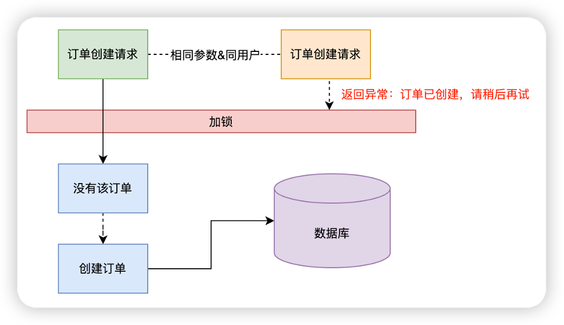
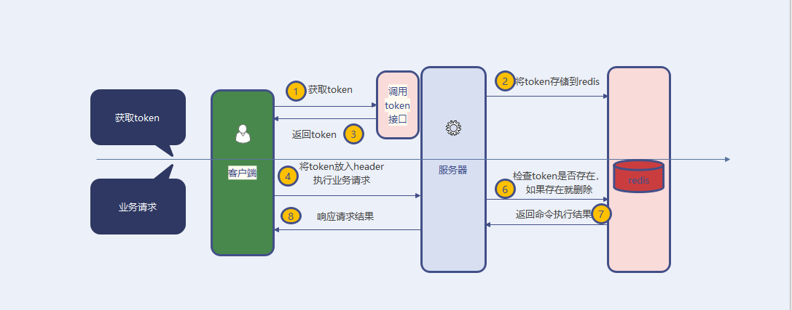
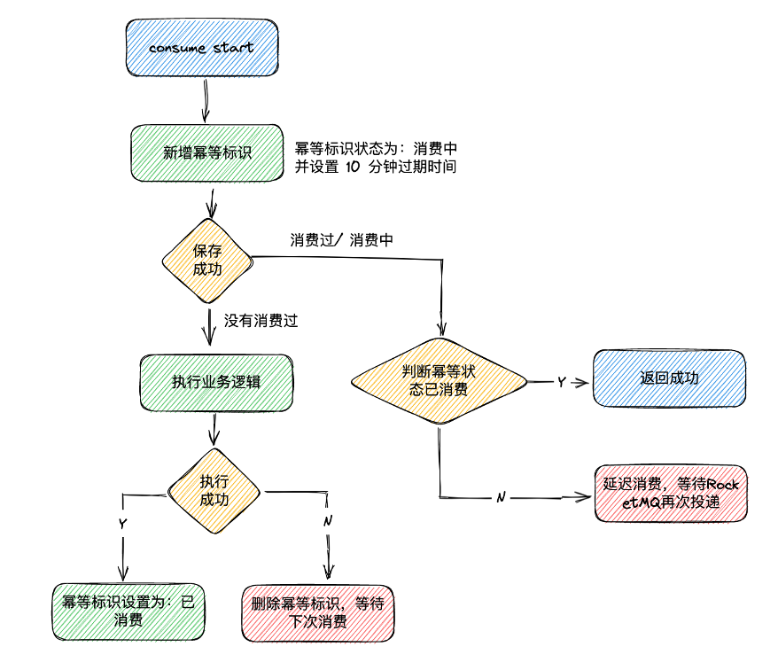
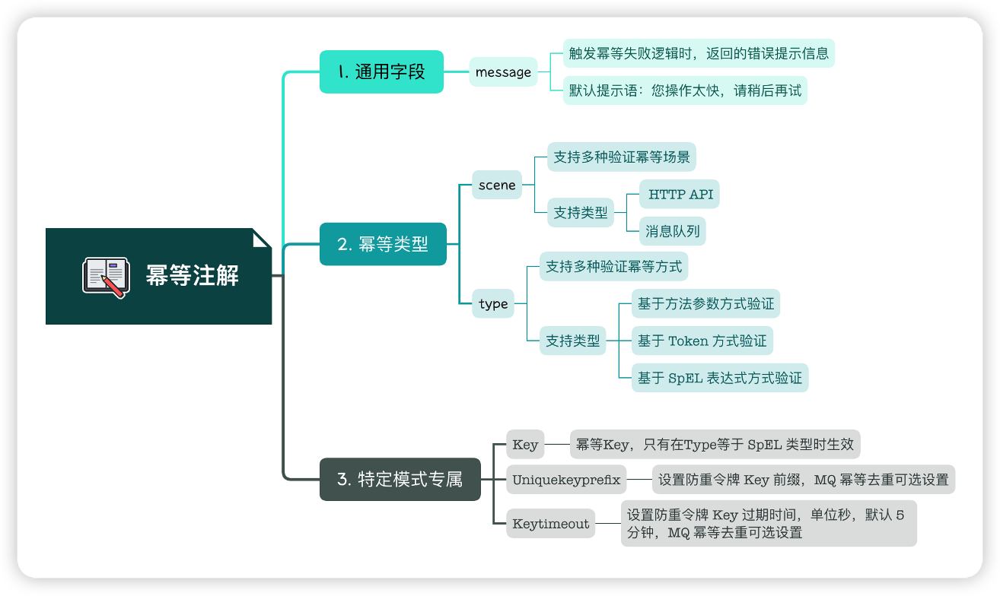
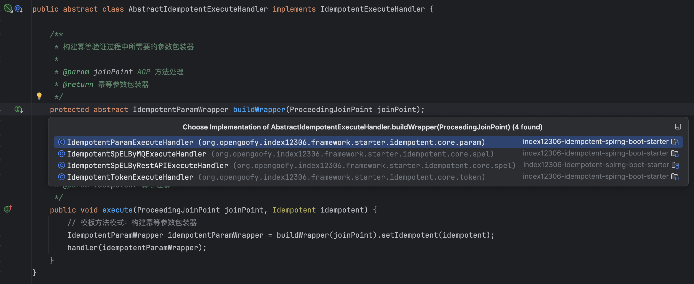
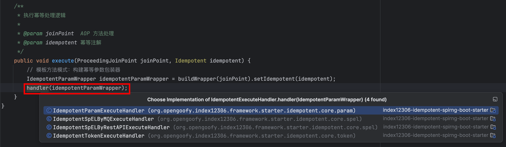
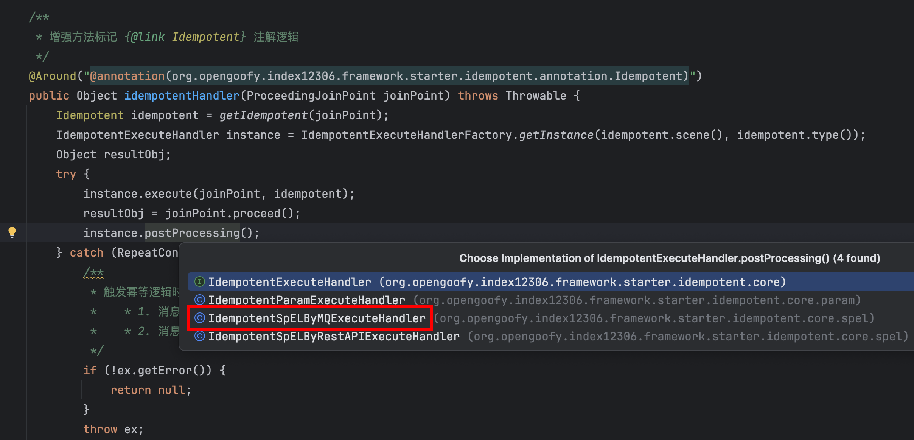

# 手摸手实现幂等组件库

## 组件地址
```xml
<dependency>
  <groupId>org.opengoofy.index12306</groupId>
  <artifactId>index12306-idempotent-spring-boot-starter</artifactId>
  <version>${project.version}</version>
</dependency>
```

## 组件概述
+ 实现消息队列 RocketMQ、Kafka、ActiveMQ、RabbitMQ 等客户端消费幂等。

## 什么是幂等问题？
先说下什么是幂等，幂等性是数学和计算机科学中的概念，用于描述操作无论执行多少次，都产生相同结果的特性。在软件行业中，广泛应用该概念。当我们说一个接口支持幂等性时，无论调用多少次，系统的结果都保持一致。

一般我们在系统中，幂等可能存在两种类型的问题：

+ 接口幂等：常说的接口防重复提交。
+ 消息队列幂等：如何保障消息队列客户端对相同的消息仅消费一次。

如果不做防重复提交或者幂等，可能会导致以下问题：

1. 数据重复处理：如果用户在某个操作还在处理中时重复提交请求，可能会导致相同的数据被处理多次，造成数据的重复操作和处理逻辑的错误。
2. 重复写入：在某些场景下，请求可能触发对数据库或其他存储系统的写入操作。如果请求被重复提交，可能会导致相同的数据被重复写入，破坏数据的一致性。
3. 资源浪费：重复提交请求可能会导致服务器资源的浪费。如果请求处理的时间较长，重复提交会占用服务器的处理能力，增加服务器的负载，降低系统的性能和吞吐量。
4. 业务逻辑错误：在某些业务场景下，重复提交可能会导致业务逻辑错误。例如，如果用户在生成订单的过程中重复提交订单请求，可能会导致生成多个相同的订单，引发订单的混乱和错误。

### 接口防重复提交
举个例子，你在淘宝上下单某个商品，然后提交订单时由于你快速点击多次，或者网络波动提交服务端多次请求，如果淘宝服务端没有做相关防重复提交处理，那么就有可能生成多笔相同的订单。

如果做了幂等处理，除了第一次正常请求外，第二次乃至更多次应该返回错误，比如说提示语“重复提交失败”等；再或者返回“提交成功”，但是真正保存数据库的只有一次请求。具体使用哪一种需要看程序设计以及产品逻辑。

### 消息队列消费幂等
消息队列在消息传递过程中，由于网络延迟、系统故障或其他异常情况，可能会导致消息被重复消费的问题。造成消息重复消费的问题比较多，我们就不细分析了，知道有这种场景就好。

通常情况下，我们认为消息中间件是一个可靠的组件。这里的可靠性指的是，只要消息被成功投递到了消息中间件，它就不会丢失，至少能够被消费者成功消费一次。这是消息中间件最基本的特性之一，也就是我们通常所说的 “AT LEAST ONCE”，即消息至少会被成功消费一遍。

这也就说明，如果服务端出现了客户端是否消费成功的疑问时，会让客户端再次消费。

造成的问题也比较明显，如果订单支付消息被重复消费，可能会导致业务逻辑的错误执行。例如，系统可能会多次发放优惠券、赠品或其他奖励，使得商家承担不必要的成本或资源浪费。

## 如何解决幂等问题？
说幂等底层代码设计前，先把各自问题场景的解决方案说说，主要涵盖分布式锁、Token 令牌以及去重表。

分布式锁和 Token 令牌应用于防重复提交，去重表应对于消息重复防重复消费场景。

### 分布式锁
当用户提交请求时，服务器端可以生成一个唯一的标识（使用全部参数+用户标识进行MD5），或者从用户提交参数里提取一个唯一标识都可以。

在处理用户请求之前，服务器尝试获取一个分布式锁。如果成功获取到分布式锁，那么则执行接下来的正常业务逻辑流程。因为锁已经被获取，这样可以确保其他请求无法使用相同的标识，避免重复处理。在请求处理完成后，服务器需要释放分布式锁。



### Token 令牌
为了防止重复操作，客户端在第一次调用业务请求之前会发送一个获取 Token 的请求。服务端会生成一个全局唯一的 ID 作为 Token，并将其保存在 Redis 中，同时将该 ID 返回给客户端。

在客户端进行第二次业务请求时，必须携带这个 Token。

服务端会验证这个 Token，如果验证成功，则执行业务逻辑并从 Redis 中删除该 Token。

如果验证失败，说明 Redis 中已经没有对应的 Token，表示重复操作，服务端会直接返回指定的结果给客户端。



星球里有同学针对 Token 方案做了提问，这里补充下：[https://t.zsxq.com/BeB9D](https://t.zsxq.com/BeB9D)

### 去重表
去重表是指在使用 Redis 或者 MySQL 作为存储时，为了实现幂等性而用于记录已经处理过的请求或操作，以防止重复执行。大部分场景下，大家会使用 Redis 作为去重组件实现。

> 去重表只是一个说法，存储到 Redis 的话，其实就是一个 String 的 Key 而已。
>

具体来说，当客户端发送请求时，服务端会先查询 Redis 去重表来检查该请求是否已经被处理过。如果在存在对应的记录，表示请求已经执行过，服务端可以直接返回之，而不再执行重复操作。如果在不存在对应的记录，表示请求是新的，服务端会执行相应的业务逻辑，并在处理完成后将请求的唯一标识（如请求 ID 或标识）添加到 Redis 去重表中，以便后续的重复请求可以被正确识别和处理。

另外，如果消息已经在消费中，抛出异常，消息会触发延迟消费，在消息队列消费失败的场景下即发送到重试队列 `RETRY TOPIC`。



## 幂等组件如何设计？
上面说了多种解决方案，那我们一起看下幂等组件是怎么实现的吧。既然是组件化设计，自然需要用到 SpringBoot Starter，通过自动装配的机制完成整体运行。然后通过注解和 AOP 的形式进行实现。

### 幂等注解
幂等设计可能存在通用的代码，为此，我们可以通过注解形式进行抽象。

```java
package org.opengoofy.index12306.framework.starter.idempotent.annotation;

import org.opengoofy.index12306.framework.starter.idempotent.enums.IdempotentSceneEnum;
import org.opengoofy.index12306.framework.starter.idempotent.enums.IdempotentTypeEnum;

import java.lang.annotation.Documented;
import java.lang.annotation.ElementType;
import java.lang.annotation.Retention;
import java.lang.annotation.RetentionPolicy;
import java.lang.annotation.Target;

/**
 * 幂等注解
 *
 * @公众号：马丁玩编程，回复：加群，添加马哥微信（备注：12306）获取项目资料
 */
@Target({ElementType.TYPE, ElementType.METHOD})
@Retention(RetentionPolicy.RUNTIME)
@Documented
public @interface Idempotent {

    /**
     * 幂等Key，只有在 {@link Idempotent#type()} 为 {@link IdempotentTypeEnum#SPEL} 时生效
     */
    String key() default "";

    /**
     * 触发幂等失败逻辑时，返回的错误提示信息
     */
    String message() default "您操作太快，请稍后再试";

    /**
     * 验证幂等场景，支持多种 {@link IdempotentSceneEnum}
     */
    IdempotentSceneEnum scene() default IdempotentSceneEnum.RESTAPI;

    /**
     * 验证幂等类型，支持多种幂等方式
     * RestAPI 建议使用 {@link IdempotentTypeEnum#TOKEN} 或 {@link IdempotentTypeEnum#PARAM}
     * 其它类型幂等验证，使用 {@link IdempotentTypeEnum#SPEL}
     */
    IdempotentTypeEnum type() default IdempotentTypeEnum.PARAM;

    /**
     * 设置防重令牌 Key 前缀，MQ 幂等去重可选设置
     * {@link IdempotentSceneEnum#MQ} and {@link IdempotentTypeEnum#SPEL} 时生效
     */
    String uniqueKeyPrefix() default "";

    /**
     * 设置防重令牌 Key 过期时间，单位秒，默认 1 小时，MQ 幂等去重可选设置
     * {@link IdempotentSceneEnum#MQ} and {@link IdempotentTypeEnum#SPEL} 时生效
     */
    long keyTimeout() default 3600L;
}

```

上文中说到了三种幂等解决方案，最终全部浓缩到一个注解上，所以注解上的内容有点多，为此我做了简单梳理，大家可以参考下，下面也会针对重要字段做一个讲解。



重要的字段有两个，`scene` 和 `type`。先说场景 `scene` 字段，该字段代表了是接口的防重复提交还是消息队列的防重复消费，通过一个枚举标识。

```java
package org.opengoofy.index12306.framework.starter.idempotent.enums;

/**
 * 幂等验证场景枚举
 *
 * @公众号：马丁玩编程，回复：加群，添加马哥微信（备注：12306）获取项目资料
 */
public enum IdempotentSceneEnum {
    
    /**
     * 基于 RestAPI 场景验证
     */
    RESTAPI,
    
    /**
     * 基于 MQ 场景验证
     */
    MQ
}
```

然后就是 type 字段，记录了使用什么方式实现幂等，其中 TOKEN 和 PARAM 以及 SPEL 都可以应用于接口防重复提交，SPEL 应用于消息队列防重复消费。

然后从分布式锁、Token 令牌以及去重表实现上来说，有个对应关系：

+ 分布式锁：PARAM 和 SPEL。
+ Token 令牌：TOKEN。
+ 去重表：SPEL。

```java
package org.opengoofy.index12306.framework.starter.idempotent.enums;

/**
 * 幂等验证类型枚举
 *
 * @公众号：马丁玩编程，回复：加群，添加马哥微信（备注：12306）获取项目资料
 */
public enum IdempotentTypeEnum {
    
    /**
     * 基于 Token 方式验证
     */
    TOKEN,
    
    /**
     * 基于方法参数方式验证
     */
    PARAM,
    
    /**
     * 基于 SpEL 表达式方式验证
     */
    SPEL
}
```

### 幂等 AOP
我们使用 AOP 技术为方法增强提供了通用的幂等性保证，只需要在需要保证幂等性的方法上添加 `@Idempotent` 注解，`Aspect` 就会对该方法进行增强。

简单来说，就是先获取到方法上的幂等注解，然后获取到对应的幂等处理实现类。通过实现类进行幂等前置逻辑，执行完后操作具体被注解修饰的方法，最终执行释放资源的后置逻辑。

```java
package org.opengoofy.index12306.framework.starter.idempotent.core;

import org.aspectj.lang.ProceedingJoinPoint;
import org.aspectj.lang.annotation.Around;
import org.aspectj.lang.annotation.Aspect;
import org.aspectj.lang.reflect.MethodSignature;
import org.opengoofy.index12306.framework.starter.idempotent.annotation.Idempotent;

import java.lang.reflect.Method;

/**
 * 幂等注解 AOP 拦截器
 *
 * @公众号：马丁玩编程，回复：加群，添加马哥微信（备注：12306）获取项目资料
 */
@Aspect
public final class IdempotentAspect {

    /**
     * 增强方法标记 {@link Idempotent} 注解逻辑
     */
    @Around("@annotation(org.opengoofy.index12306.framework.starter.idempotent.annotation.Idempotent)")
    public Object idempotentHandler(ProceedingJoinPoint joinPoint) throws Throwable {
        // 获取到方法上的幂等注解实际数据
        Idempotent idempotent = getIdempotent(joinPoint);
        // 通过幂等场景以及幂等类型，获取幂等执行处理器
        IdempotentExecuteHandler instance = IdempotentExecuteHandlerFactory.getInstance(idempotent.scene(), idempotent.type());
        Object resultObj;
        try {
            // 执行幂等处理逻辑
            instance.execute(joinPoint, idempotent);
            // 如果幂等处理逻辑没有抛异常，处理中间业务
            resultObj = joinPoint.proceed();
            // 处理幂等后置逻辑，比如释放资源或者锁之类的
            instance.postProcessing();
        } catch (RepeatConsumptionException ex) {
            /**
             * 该异常为消息队列防重复提交独有，触发幂等逻辑时可能有两种情况：
             *    * 1. 消息还在处理，但是不确定是否执行成功，那么需要返回错误，方便 RocketMQ 再次通过重试队列投递
             *    * 2. 消息处理成功了，该消息直接返回成功即可
             */
            if (!ex.getError()) {
                return null;
            }
            throw ex;
        } catch (Throwable ex) {
            // 客户端消费存在异常，需要删除幂等标识方便下次 RocketMQ 再次通过重试队列投递
            instance.exceptionProcessing();
            throw ex;
        } finally {
            // 清理幂等容器上下文
            IdempotentContext.clean();
        }
        return resultObj;
    }

    public static Idempotent getIdempotent(ProceedingJoinPoint joinPoint) throws NoSuchMethodException {
        MethodSignature methodSignature = (MethodSignature) joinPoint.getSignature();
        Method targetMethod = joinPoint.getTarget().getClass().getDeclaredMethod(methodSignature.getName(), methodSignature.getMethod().getParameterTypes());
        return targetMethod.getAnnotation(Idempotent.class);
    }
}
```

#### 获取幂等处理器
针对不同幂等验证场景以及幂等处理类型拆分为了一个个策略模式处理器，帮助我们实现高内聚低耦合。

```java
package org.opengoofy.index12306.framework.starter.idempotent.core;

import org.opengoofy.index12306.framework.starter.bases.ApplicationContextHolder;
import org.opengoofy.index12306.framework.starter.idempotent.core.param.IdempotentParamService;
import org.opengoofy.index12306.framework.starter.idempotent.core.spel.IdempotentSpELByMQExecuteHandler;
import org.opengoofy.index12306.framework.starter.idempotent.core.spel.IdempotentSpELByRestAPIExecuteHandler;
import org.opengoofy.index12306.framework.starter.idempotent.core.token.IdempotentTokenService;
import org.opengoofy.index12306.framework.starter.idempotent.enums.IdempotentSceneEnum;
import org.opengoofy.index12306.framework.starter.idempotent.enums.IdempotentTypeEnum;

/**
 * 幂等执行处理器工厂
 * <p>
 * Q：可能会有同学有疑问：这里为什么要采用简单工厂模式？策略模式不行么？
 * A：策略模式同样可以达到获取真正幂等处理器功能。但是简单工厂的语意更适合这个场景，所以选择了简单工厂
 *
 * @公众号：马丁玩编程，回复：加群，添加马哥微信（备注：12306）获取项目资料
 */
public final class IdempotentExecuteHandlerFactory {

    /**
     * 获取幂等执行处理器
     *
     * @param scene 指定幂等验证场景类型
     * @param type  指定幂等处理类型
     * @return 幂等执行处理器
     */
    public static IdempotentExecuteHandler getInstance(IdempotentSceneEnum scene, IdempotentTypeEnum type) {
        IdempotentExecuteHandler result = null;
        switch (scene) {
            case RESTAPI -> {
                switch (type) {
                    case PARAM -> result = ApplicationContextHolder.getBean(IdempotentParamService.class);
                    case TOKEN -> result = ApplicationContextHolder.getBean(IdempotentTokenService.class);
                    case SPEL -> result = ApplicationContextHolder.getBean(IdempotentSpELByRestAPIExecuteHandler.class);
                    default -> {
                    }
                }
            }
            case MQ -> result = ApplicationContextHolder.getBean(IdempotentSpELByMQExecuteHandler.class);
            default -> {
            }
        }
        return result;
    }
}

```

#### 执行幂等逻辑
获取到对应的幂等处理器后，我们就开始处理幂等的真实处理逻辑。

```java
package org.opengoofy.index12306.framework.starter.idempotent.core;

import org.aspectj.lang.ProceedingJoinPoint;
import org.opengoofy.index12306.framework.starter.idempotent.annotation.Idempotent;

/**
 * 抽象幂等执行处理器
 *
 * @公众号：马丁玩编程，回复：加群，添加马哥微信（备注：12306）获取项目资料
 */
public abstract class AbstractIdempotentExecuteHandler implements IdempotentExecuteHandler {

    /**
     * 构建幂等验证过程中所需要的参数包装器
     *
     * @param joinPoint AOP 方法处理
     * @return 幂等参数包装器
     */
    protected abstract IdempotentParamWrapper buildWrapper(ProceedingJoinPoint joinPoint);

    /**
     * 执行幂等处理逻辑
     *
     * @param joinPoint  AOP 方法处理
     * @param idempotent 幂等注解
     */
    public void execute(ProceedingJoinPoint joinPoint, Idempotent idempotent) {
        // 模板方法模式：构建幂等参数包装器  通过各策略实现类获取 IdempotentParamWrapper 参数
        IdempotentParamWrapper idempotentParamWrapper = buildWrapper(joinPoint).setIdempotent(idempotent);
        handler(idempotentParamWrapper);
    }
}
```

不同的策略实现类都会自定义实现幂等处理逻辑，比如 `buildWrapper` 方法，这里使用了模版方法模式进行了一个封装，让具体的实现细节下沉到实现类中。



获取到 `IdempotentParamWrapper` 参数后调用 handler 具体执行幂等逻辑的方法。



#### 释放幂等相关资源
方法的最后，通过 `instance.postProcessing();` 调用幂等释放资源方法，进行分布式锁的解锁等行为，同样是各个幂等策略实现类自定义，有的需要释放资源，有的不需要。不需要释放的，空实现即可。

以分布式解锁为参考：

```java
@Override
public void postProcessing() {
    RLock lock = null;
    try {
        lock = (RLock) IdempotentContext.getKey(LOCK);
    } finally {
        if (lock != null) {
            lock.unlock();
        }
    }
}
```

### 消息中心防重复消费
接口防重复提交比较简单，大家看看很快就能理解，重点在于消息防重复提交这块，可能有点复杂，这里重点讲解下。

这张图是关键，整个代码的运行轨迹都是按照图里的逻辑运行的，大家可以先梳理逻辑再看代码。


我们以支付结果回调订单消费者举例，业务很简单，就是用户支付成功，需要进行订单状态反转等逻辑操作。

```java
package org.opengoofy.index12306.biz.orderservice.mq.consumer;

import lombok.RequiredArgsConstructor;
import lombok.extern.slf4j.Slf4j;
import org.apache.rocketmq.spring.annotation.RocketMQMessageListener;
import org.apache.rocketmq.spring.core.RocketMQListener;
import org.opengoofy.index12306.biz.orderservice.common.constant.OrderRocketMQConstant;
import org.opengoofy.index12306.biz.orderservice.common.enums.OrderItemStatusEnum;
import org.opengoofy.index12306.biz.orderservice.common.enums.OrderStatusEnum;
import org.opengoofy.index12306.biz.orderservice.dto.domain.OrderStatusReversalDTO;
import org.opengoofy.index12306.biz.orderservice.mq.domain.MessageWrapper;
import org.opengoofy.index12306.biz.orderservice.mq.event.PayResultCallbackOrderEvent;
import org.opengoofy.index12306.biz.orderservice.service.OrderService;
import org.opengoofy.index12306.framework.starter.idempotent.annotation.Idempotent;
import org.opengoofy.index12306.framework.starter.idempotent.enums.IdempotentSceneEnum;
import org.opengoofy.index12306.framework.starter.idempotent.enums.IdempotentTypeEnum;
import org.springframework.stereotype.Component;
import org.springframework.transaction.annotation.Transactional;

/**
 * 支付结果回调订单消费者
 *
 * @公众号：马丁玩编程，回复：加群，添加马哥微信（备注：12306）获取项目资料
 */
@Slf4j
@Component
@RequiredArgsConstructor
@RocketMQMessageListener(
        topic = OrderRocketMQConstant.PAY_GLOBAL_TOPIC_KEY,
        selectorExpression = OrderRocketMQConstant.PAY_RESULT_CALLBACK_TAG_KEY,
        consumerGroup = OrderRocketMQConstant.PAY_RESULT_CALLBACK_ORDER_CG_KEY
)
public class PayResultCallbackOrderConsumer implements RocketMQListener<MessageWrapper<PayResultCallbackOrderEvent>> {

    private final OrderService orderService;

    @Idempotent(
            uniqueKeyPrefix = "index12306-order:pay_result_callback:",
            key = "#message.getKeys()+'_'+#message.hashCode()",
            type = IdempotentTypeEnum.SPEL,
            scene = IdempotentSceneEnum.MQ,
            keyTimeout = 7200L
    )
    @Transactional(rollbackFor = Exception.class)
    @Override
    public void onMessage(MessageWrapper<PayResultCallbackOrderEvent> message) {
        // ......
    }
}
```

#### SpEL 表达式
相信很多同学看到 key 里面的那个参数是不清楚是什么的，这个就是 SpEL 表达式，Spring 提供的自然语言表达式。

SpEL（Spring Expression Language）是 Spring 框架提供的一种表达式语言，用于在运行时评估表达式。它支持在 Spring 应用程序中进行动态求值和访问对象的属性、方法调用、运算符操作等。

SpEL表达式的语法类似于其他编程语言的表达式语言，具有以下特点：

1. 属性访问：可以使用点号（.）来访问对象的属性，例如 person.name。
2. 方法调用：可以通过在表达式中使用方法名和参数来调用对象的方法，例如 person.getName()。
3. 运算符操作：支持常见的算术运算符（如加减乘除）、逻辑运算符（如与、或、非）和比较运算符（如等于、大于、小于等）。
4. 条件表达式：支持条件表达式，例如三元运算符 condition ? value1 : value2。
5. ......

我们分步骤解析这个 SpEL 表达式最终运行结果是什么？

```java
1. #message.getKeys() 2. +'_'+ 3. #message.hashCode()
```

共分为三部分，第一部分，通过请求入参 message 对象，获取属性 keys 值，然后再获取 message 对象的 hashCode 值，通过 _ 的方式拼接在一起，就得到了本次请求的唯一幂等 Key。

#### 幂等处理逻辑
```java
package org.opengoofy.index12306.framework.starter.idempotent.core.spel;

import lombok.RequiredArgsConstructor;
import lombok.SneakyThrows;
import org.aspectj.lang.ProceedingJoinPoint;
import org.aspectj.lang.reflect.MethodSignature;
import org.opengoofy.index12306.framework.starter.cache.DistributedCache;
import org.opengoofy.index12306.framework.starter.idempotent.annotation.Idempotent;
import org.opengoofy.index12306.framework.starter.idempotent.core.AbstractIdempotentExecuteHandler;
import org.opengoofy.index12306.framework.starter.idempotent.core.IdempotentAspect;
import org.opengoofy.index12306.framework.starter.idempotent.core.IdempotentContext;
import org.opengoofy.index12306.framework.starter.idempotent.core.IdempotentParamWrapper;
import org.opengoofy.index12306.framework.starter.idempotent.core.RepeatConsumptionException;
import org.opengoofy.index12306.framework.starter.idempotent.enums.IdempotentMQConsumeStatusEnum;
import org.opengoofy.index12306.framework.starter.idempotent.toolkit.LogUtil;
import org.opengoofy.index12306.framework.starter.idempotent.toolkit.SpELUtil;
import org.springframework.data.redis.core.StringRedisTemplate;

import java.util.concurrent.TimeUnit;

/**
 * 基于 SpEL 方法验证请求幂等性，适用于 MQ 场景
 *
 * @公众号：马丁玩编程，回复：加群，添加马哥微信（备注：12306）获取项目资料
 */
@RequiredArgsConstructor
public final class IdempotentSpELByMQExecuteHandler extends AbstractIdempotentExecuteHandler implements IdempotentSpELService {

    private final DistributedCache distributedCache;

    private final static int TIMEOUT = 600;
    private final static String WRAPPER = "wrapper:spEL:MQ";

    @SneakyThrows
    @Override
    protected IdempotentParamWrapper buildWrapper(ProceedingJoinPoint joinPoint) {
        Idempotent idempotent = IdempotentAspect.getIdempotent(joinPoint);
        // 通过执行 SpEL 表达式获取值
        String key = (String) SpELUtil.parseKey(idempotent.key(), ((MethodSignature) joinPoint.getSignature()).getMethod(), joinPoint.getArgs());
        return IdempotentParamWrapper.builder().lockKey(key).joinPoint(joinPoint).build();
    }

    @Override
    public void handler(IdempotentParamWrapper wrapper) {
        // 拼接前缀和 SpEL 表达式对应的 Key 生成最终放到 Redis 中的唯一标识
        String uniqueKey = wrapper.getIdempotent().uniqueKeyPrefix() + wrapper.getLockKey();
        // 向 Redis 触发命令，如果值不存在则存储返回 True，值存在返回 False
        Boolean setIfAbsent = ((StringRedisTemplate) distributedCache.getInstance())
                .opsForValue()
                .setIfAbsent(uniqueKey, IdempotentMQConsumeStatusEnum.CONSUMING.getCode(), TIMEOUT, TimeUnit.SECONDS);
        // 如果值为 False，那么就代表要么消息已经执行完成了或者执行中，两个不同的状态需要执行不同的逻辑
        // 为此，需要再进行判断
        if (setIfAbsent != null && !setIfAbsent) {
            // 获取幂等标识对应的值，判断是否为已执行成功
            String consumeStatus = distributedCache.get(uniqueKey, String.class);
            // 如果已经执行成功了，那么 error 为 false；执行中 error 为 true
            boolean error = IdempotentMQConsumeStatusEnum.isError(consumeStatus);
            LogUtil.getLog(wrapper.getJoinPoint()).warn("[{}] MQ repeated consumption, {}.", uniqueKey, error ? "Wait for the client to delay consumption" : "Status is completed");
            // 将异常抛出到上层
            throw new RepeatConsumptionException(error);
        }
        IdempotentContext.put(WRAPPER, wrapper);
    }

    // ......
}
```

这个异常很关键，决定了是抛出异常让 RocketMQ 重试，还是将该消息吞掉，不执行具体的消费流程。

```java
package org.opengoofy.index12306.framework.starter.idempotent.core;

import org.aspectj.lang.ProceedingJoinPoint;
import org.aspectj.lang.annotation.Around;
import org.aspectj.lang.annotation.Aspect;
import org.aspectj.lang.reflect.MethodSignature;
import org.opengoofy.index12306.framework.starter.idempotent.annotation.Idempotent;

import java.lang.reflect.Method;

/**
 * 幂等注解 AOP 拦截器
 *
 * @公众号：马丁玩编程，回复：加群，添加马哥微信（备注：12306）获取项目资料
 */
@Aspect
public final class IdempotentAspect {

    /**
     * 增强方法标记 {@link Idempotent} 注解逻辑
     */
    @Around("@annotation(org.opengoofy.index12306.framework.starter.idempotent.annotation.Idempotent)")
    public Object idempotentHandler(ProceedingJoinPoint joinPoint) throws Throwable {
        Idempotent idempotent = getIdempotent(joinPoint);
        IdempotentExecuteHandler instance = IdempotentExecuteHandlerFactory.getInstance(idempotent.scene(), idempotent.type());
        Object resultObj;
        try {
            instance.execute(joinPoint, idempotent);
            resultObj = joinPoint.proceed();
            instance.postProcessing();
        } catch (  ex) {
            /**
             * 触发幂等逻辑时可能有两种情况，分别对应 error 为 true 还是 false
             *    * 1. 消息还在处理，但是不确定是否执行成功，那么需要返回错误，方便 RocketMQ 再次通过重试队列投递
             *    * 2. 消息处理成功了，该消息直接返回成功即可
             */
            if (!ex.getError()) {
                return null;
            }
            throw ex;
        } catch (Throwable ex) {
            // 客户端消费存在异常，需要删除幂等标识方便下次 RocketMQ 再次通过重试队列投递
            instance.exceptionProcessing();
            throw ex;
        } finally {
            IdempotentContext.clean();
        }
        return resultObj;
    }

    public static Idempotent getIdempotent(ProceedingJoinPoint joinPoint) throws NoSuchMethodException {
        MethodSignature methodSignature = (MethodSignature) joinPoint.getSignature();
        Method targetMethod = joinPoint.getTarget().getClass().getDeclaredMethod(methodSignature.getName(), methodSignature.getMethod().getParameterTypes());
        return targetMethod.getAnnotation(Idempotent.class);
    }
}
```

通过捕获 `RepeatConsumptionException` 异常，获取里面 error 变量为 true 或者 false：

+ 如果 error 为 true，代表需要抛异常让 RocketMQ 重试。
+ 如果 error 为 false，代表消息已经消费过了，不执行业务逻辑，将异常吞掉返回 RocketMQ 消费成功即可。

#### 能保障永久幂等么？
不能保障永久幂等，因为 Redis 内存资源比较珍贵，如果长时间保存幂等 Key，会造成 Redis 内存占用增加。

业务需要评估自己的消息队列消费情况，如果队列消费量级很高，keyTimeout 不能设置过长时间。设置 keyTimeout 时间过长，这意味着幂等 Key 将会长时间占用 Redis 内存。 

#### 设置状态为已完成
如果获取到了幂等标识，然后正常业务逻辑也执行成功了，会调用 `instance.postProcessing();` 将幂等标识的完成状态设置为已完成。



获取唯一标识幂等 Key，并设置幂等 Key 的状态为已完成，流程结束。

```java
@Override
public void postProcessing() {
    IdempotentParamWrapper wrapper = (IdempotentParamWrapper) IdempotentContext.getKey(WRAPPER);
    if (wrapper != null) {
        Idempotent idempotent = wrapper.getIdempotent();
        String uniqueKey = idempotent.uniqueKeyPrefix() + wrapper.getLockKey();
        try {
            distributedCache.put(uniqueKey, IdempotentMQConsumeStatusEnum.CONSUMED.getCode(), idempotent.keyTimeout(), TimeUnit.SECONDS);
        } catch (Throwable ex) {
            LogUtil.getLog(wrapper.getJoinPoint()).error("[{}] Failed to set MQ anti-heavy token.", uniqueKey);
        }
    }
}
```

## 问题答疑
### 为什么要使用 IdempotentContext？
幂等组件中把一部分内容放到幂等上下文类，并在不同方法中进行使用，为什么这么使用？

因为如果不这么用，会有大量的参数需要在方法传参中声明以及传递，使用上下文形式可以很好规避该问题，编码较为优雅。


> 更新: 2025-10-08 23:02:52  
> 原文: <https://www.yuque.com/magestack/12306/xoea6i2yluci1w0q>