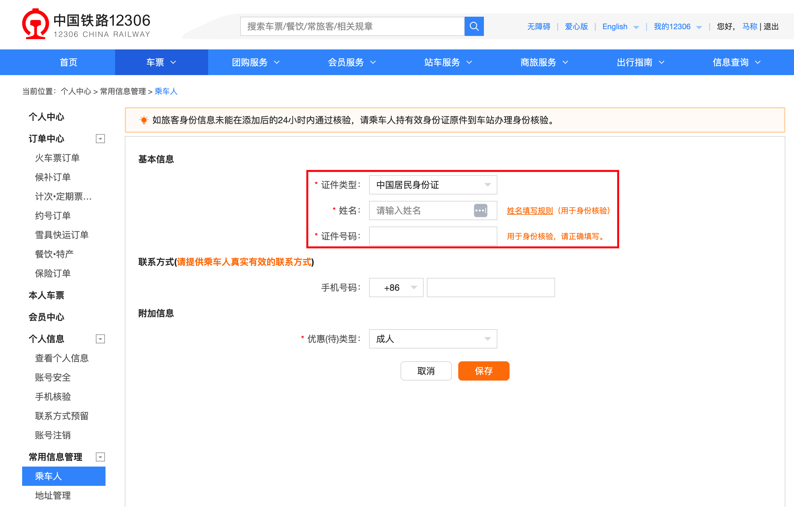
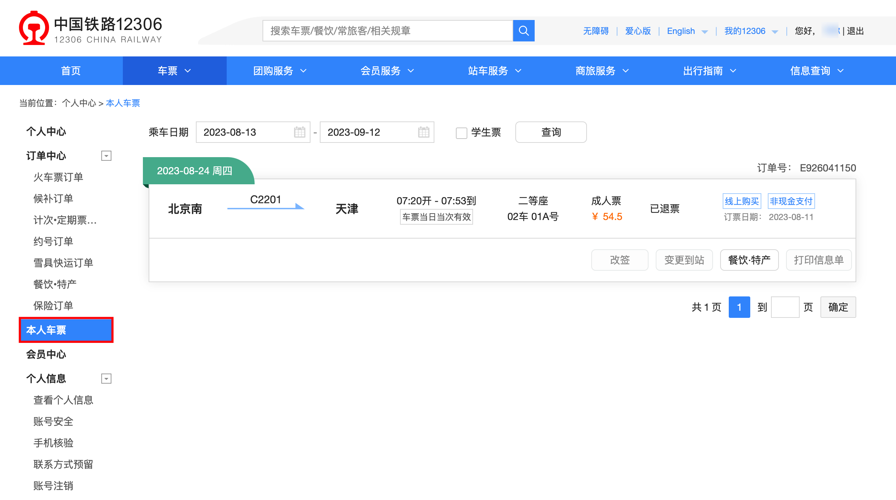
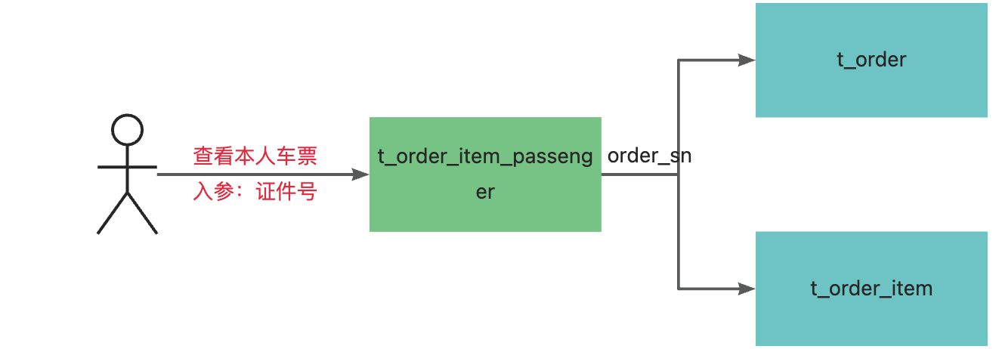

# 手摸手之乘车人本人车票订单查看

## 业务背景
在 12306 购票时，可以添加乘车人进行购票，也就是说，如果一家人出去玩，可以通过一个人的账号购买全家人出去玩的车票。并且，添加乘车人时，可以允许乘车人没有 12306 账号。




看到新增乘车人时，只有证件类型、名称、证件号码和优惠类型是必填的之外，没有其他的信息了。

但是在 PC 端和手机端有个本人车票功能，这个功能的具体逻辑是如何实现的？




假设一家人出去玩，你在自己账号通过添加乘车人购买了车票，注意这个时候家里人还没有注册 12306。

购买票后，家里人注册了 12306 账号，这个时候要通过查看本人车票能看到出行的车票数据记录。

回顾一下，咱们订单和订单明细表是按照用户 ID 后六位进行分库分表的，如果是购票用户查看自己的本人车票，通过用户 ID 就能查询。但是，购票时乘车人可能是没有账号的，这个怎么解决？

## 创建路由表
因为乘车人数据中唯一能起到标识作用的也就是证件号，而注册用户证件号也是必须的，通过证件号进行数据关联。如果要实现这个需求，只能在订单表中按照证件号和订单进行关联。

为了满足查看本人车票订单的功能，咱们可以通过添加路由表的方式完成这个查询。

```sql
CREATE TABLE `t_order_item_passenger` (
  `id` bigint(20) NOT NULL AUTO_INCREMENT COMMENT 'ID',
  `order_sn` varchar(64) COLLATE utf8mb4_unicode_ci DEFAULT NULL COMMENT '订单号',
  `id_type` int(3) DEFAULT NULL COMMENT '证件类型',
  `id_card` varchar(256) COLLATE utf8mb4_unicode_ci DEFAULT NULL COMMENT '证件号',
  `create_time` datetime DEFAULT NULL COMMENT '创建时间',
  `update_time` datetime DEFAULT NULL COMMENT '修改时间',
  `del_flag` tinyint(1) DEFAULT NULL COMMENT '删除标识',
  PRIMARY KEY (`id`),
  KEY `idx_id_card` (`id_card`) USING BTREE
) ENGINE=InnoDB AUTO_INCREMENT=1689882048350732289 DEFAULT CHARSET=utf8mb4 COLLATE=utf8mb4_unicode_ci COMMENT='乘车人订单关系表';
```


路由表中通过证件号绑定订单号，再关联订单表和订单明细表，就能查看到乘车人购票的本人车票了。



## 路由表分库分表
订单明细乘车人表 `t_order_item_passenger`，也就是咱们证件号和订单号关联的这张表，数据量是等同于订单明细表 `t_order_item`，所以分库分表的数量直接同订单明细表即可。

但是咱们这张路由表的分库分表规则不能和订单明细表一致。订单明细表是通过用户 ID 后六位查询的，但是路由表是按照证件号查询，所以路由表的分库分表规则就按照证件号进行 HASH_MOD 方式分库分表即可。

```yaml
dataSources:
  ds_0:
    dataSourceClassName: com.zaxxer.hikari.HikariDataSource
    driverClassName: com.mysql.cj.jdbc.Driver
    jdbcUrl: jdbc:mysql://127.0.0.1:3306/12306_order_0?useUnicode=true&characterEncoding=UTF-8&rewriteBatchedStatements=true&allowMultiQueries=true&serverTimezone=Asia/Shanghai
    username: root
    password: root

  ds_1:
    dataSourceClassName: com.zaxxer.hikari.HikariDataSource
    driverClassName: com.mysql.cj.jdbc.Driver
    jdbcUrl: jdbc:mysql://127.0.0.1:3306/12306_order_1?useUnicode=true&characterEncoding=UTF-8&rewriteBatchedStatements=true&allowMultiQueries=true&serverTimezone=Asia/Shanghai
    username: root
    password: root

rules:
  - !SHARDING
    tables:
      t_order_item_passenger:
        actualDataNodes: ds_${0..1}.t_order_item_passenger_${0..15}
        databaseStrategy:
          standard:
            shardingColumn: id_card
            shardingAlgorithmName: order_passenger_relation_database_mod
        tableStrategy:
          standard:
            shardingColumn: id_card
            shardingAlgorithmName: order_passenger_relation_table_mod
    shardingAlgorithms:
      order_passenger_relation_database_mod:
        type: HASH_MOD
        props:
          sharding-count: 2
      order_passenger_relation_table_mod:
        type: HASH_MOD
        props:
          sharding-count: 16
props:
  sql-show: true
```


> 更新: 2023-08-13 20:27:51  
> 原文: <https://www.yuque.com/magestack/12306/uonb6m6pgx1okebs>