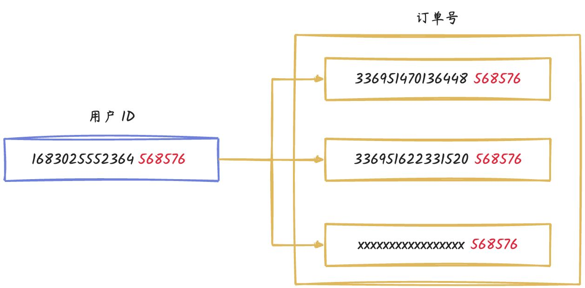
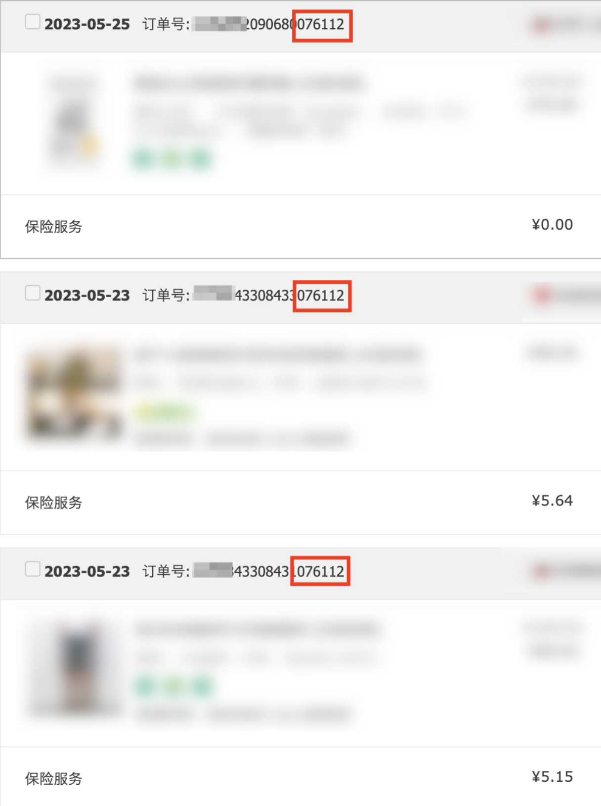
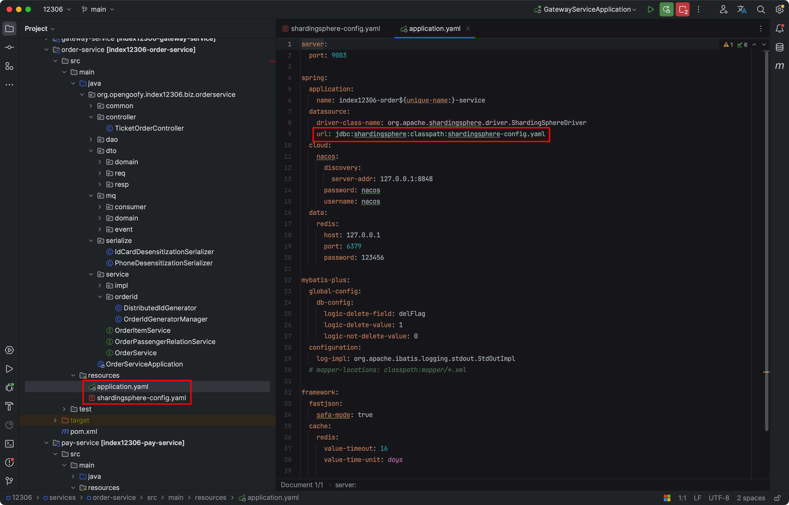

# 手摸手之订单如何分库分表

## 分库分表模型
假设我们考虑 12306 单个假期的人流量为 2 亿人次，这一估算基于每年的三个主要假期：五一、国庆和春节。这些假期通常都有来回的流动，因此数据存储与计算的公式变为：2 * (3*2) = 12 亿，即每年的假期总人次达到了 12 亿。

考虑到假期订单数据以及日常购票数据的累积，随着多年的积累，数据量将会变得相当庞大。但我们需要再次审视一个关键问题：这些订单数据是否需要一直保留在数据库中呢？

经过详细分析 12306 车票订单购买查看逻辑，我们发现用户账号只能查看最近一个月内的订单购买记录。这一时间范围最多涵盖一个节假日周期，考虑往返车票等情况，大致数据量约为 4 亿。这样的数据规模相较之前大幅减少，有效降低了整体的存储压力。


上述的这种数据存储技术叫做冷热数据的架构方案，那什么叫做冷数据？什么又是热数据？

+ 热数据通常指经常被访问和使用的数据，如最近的交易记录或最新的新闻文章等。这些数据需要快速的读写速度和响应时间，因此通常存储在快速存储介质（如内存或快速固态硬盘）中，以便快速访问和处理。
+ 冷数据则指很少被访问和使用的数据，如过去的交易记录或旧的新闻文章等。这些数据访问频率较低，但需要长期保存，因此存储在较慢的存储介质（如磁盘或云存储）中，以便节省成本和存储空间。


如何实现这种冷热数据存储架构？比较简单的方案就是，我们每天有个定时任务，把一个月前的数据从当前的数据库迁移到冷数据库中。

这时需要注意一件事情，就是我们迁移到冷数据库不意味着不查询这些数据。如果遇到查询历史数据的需求，我们还是要能支持，比如支付宝的交易数据查询。


## 订单分片键选择
每每说到分库分表，最头疼的是莫过于如何选择分片键，用户名？订单号？还是创建时间？

先说我们的业务基本诉求，订单分库分表的基本查询条件是用户要能查看自己的订单，另外，也要支持订单号精准查询。

这样的话，我们就需要按照两个字段当做分片键，这也就意味着每次查询时需要带着用户和订单两个字段，非常的不方便。能不能通过一个字段分库分表，但是查询时两个字段任意传一个就能精准查询，而不导致读扩散问题？

### 基因法
这就需要用到咱们项目中使用的基因算法。那什么是分库分表基因算法？

说的通俗易懂点，就是我们通过把用户的后六位数据冗余到订单号里。这样的话，我们就可以按照用户 ID 后六位进行分库分表，并且将分片键定义为用户 ID 和订单号，只要查询中携带这两个字段，我们就取用户 ID 后六位进行查找分片表的位置。

这样我们就可以很好支持分库分表需求了，同时能满足用户和订单号两种查询逻辑，这也是大家热衷于使用基因算法的原因。



### 订单号生成
为了保证订单号生成递增，我们参考雪花算法自定义了一个 `DistributedIdGenerator`，生成后的分布式 ID 再拼接上用户的后六位。

```java
@Component
@RequiredArgsConstructor
public final class OrderIdGeneratorManager implements InitializingBean {

    private static DistributedIdGenerator DISTRIBUTED_ID_GENERATOR;

    /**
     * 生成订单全局唯一 ID
     *
     * @param userId 用户名
     * @return 订单 ID
     */
    public static String generateId(long userId) {
        return DISTRIBUTED_ID_GENERATOR.generateId() + String.valueOf(userId % 1000000);
    }
}
```


这种将用户 ID 后六位拼接订单号后面的技术方案，是参考了淘宝的订单号设计。



## 订单分库分表代码实战
如果你没有使用过 ShardingSphere 分库分表操作，可以查看官网进行一些前置条件理解。

[数据分片 :: ShardingSphere](https://shardingsphere.apache.org/document/5.3.2/cn/features/sharding/)

### <font style="color:rgb(51, 51, 51);">引入 ShardingSphere 依赖</font>
```xml
<dependency>
    <groupId>org.apache.shardingsphere</groupId>
    <artifactId>shardingsphere-jdbc-core</artifactId>
    <version>5.3.2</version>
</dependency>
```

### 定义分片规则
```yaml
spring:
  datasource:
  	# ShardingSphere 对 Driver 自定义，实现分库分表等隐藏逻辑
    driver-class-name: org.apache.shardingsphere.driver.ShardingSphereDriver
    # ShardingSphere 配置文件路径
    url: jdbc:shardingsphere:classpath:shardingsphere-config.yaml
```


配置文件地址信息如下：



### 订单分片配置
因为 12306 更多的是向大家演示分库分表，为了避免繁琐，所以分 2 个库以及对应业务 16 张表。

<font style="color:rgb(51, 51, 51);">shardingsphere-config.yaml</font>

```yaml
# 数据源集合，也就是咱们刚才说的分两个库
dataSources:
  ds_0:
    dataSourceClassName: com.zaxxer.hikari.HikariDataSource
    driverClassName: com.mysql.cj.jdbc.Driver
    jdbcUrl: jdbc:mysql://127.0.0.1:3306/12306_order_0?useUnicode=true&characterEncoding=UTF-8&rewriteBatchedStatements=true&allowMultiQueries=true&serverTimezone=Asia/Shanghai
    username: root
    password: root

  ds_1:
    dataSourceClassName: com.zaxxer.hikari.HikariDataSource
    driverClassName: com.mysql.cj.jdbc.Driver
    jdbcUrl: jdbc:mysql://127.0.0.1:3306/12306_order_1?useUnicode=true&characterEncoding=UTF-8&rewriteBatchedStatements=true&allowMultiQueries=true&serverTimezone=Asia/Shanghai
    username: root
    password: root

rules:
  	# 分片规则
    - !SHARDING
    # 分片表
    tables:
      # 订单表
      t_order:
        # 真实的数据节点，也对应着在数据库中存储的真实表
        actualDataNodes: ds_${0..1}.t_order_${0..15}
        # 分库策略
        databaseStrategy:
          # 复合分库策略（多个分片键）
          complex:
            # 用户 ID 和订单号
            shardingColumns: user_id,order_sn
            # 搜索 order_database_complex_mod 下方会有分库算法
            shardingAlgorithmName: order_database_complex_mod
        # 分表策略
        tableStrategy:
          # 复合分表策略（多个分片键）
          complex:
            # 用户 ID 和订单号
            shardingColumns: user_id,order_sn
            # 搜索 order_table_complex_mod 下方会有分表算法
            shardingAlgorithmName: order_table_complex_mod
      # 订单明细表，规则同订单表
      t_order_item:
        actualDataNodes: ds_${0..1}.t_order_item_${0..15}
        databaseStrategy:
          complex:
            shardingColumns: user_id,order_sn
            shardingAlgorithmName: order_item_database_complex_mod
        tableStrategy:
          complex:
            shardingColumns: user_id,order_sn
            shardingAlgorithmName: order_item_table_complex_mod
    # 分片算法
    shardingAlgorithms:
      # 订单分库算法
      order_database_complex_mod:
        # 通过加载全限定名类实现分片算法，相当于分片逻辑都在 algorithmClassName 对应的类中
        type: CLASS_BASED
        props:
          algorithmClassName: org.opengoofy.index12306.biz.orderservice.dao.algorithm.OrderCommonDataBaseComplexAlgorithm
          # 分库数量
          sharding-count: 2
          # 复合（多分片键）分库策略
          strategy: complex
      # 订单分表算法
      order_table_complex_mod:
        # 通过加载全限定名类实现分片算法，相当于分片逻辑都在 algorithmClassName 对应的类中
        type: CLASS_BASED
        props:
          algorithmClassName: org.opengoofy.index12306.biz.orderservice.dao.algorithm.OrderCommonTableComplexAlgorithm
          # 分表数量
          sharding-count: 16
          # 复合（多分片键）分表策略
          strategy: complex
      order_item_database_complex_mod:
        type: CLASS_BASED
        props:
          algorithmClassName: org.opengoofy.index12306.biz.orderservice.dao.algorithm.OrderCommonDataBaseComplexAlgorithm
          sharding-count: 2
          strategy: complex
      order_item_table_complex_mod:
        type: CLASS_BASED
        props:
          algorithmClassName: org.opengoofy.index12306.biz.orderservice.dao.algorithm.OrderCommonTableComplexAlgorithm
          sharding-count: 16
          strategy: complex
props:
  sql-show: true
```

### 分片算法解析
大家一定要多多 Debug 调试！根据文档讲解以及真实调试，保证能理解分库分表用法以及加深分库分表的理解。

> 调试的话可以分为两种，一种是创建订单，一种是查看订单，控制台都有现成的功能，Debug 到分片算法方法上就可以。
>

因为订单和订单明细表都是按照用户和订单号进行的分片，分片算法规则一致，所以就进行了复用。

订单分库分片算法代码如下：

```java
package org.opengoofy.index12306.biz.orderservice.dao.algorithm;

import cn.hutool.core.collection.CollUtil;
import com.google.common.base.Preconditions;
import lombok.Getter;
import org.apache.shardingsphere.sharding.api.sharding.complex.ComplexKeysShardingAlgorithm;
import org.apache.shardingsphere.sharding.api.sharding.complex.ComplexKeysShardingValue;

import java.util.Collection;
import java.util.LinkedHashSet;
import java.util.Map;
import java.util.Properties;

/**
 * 订单数据库复合分片算法配置
 * ComplexKeysShardingAlgorithm 是 ShardingSphere 预留出来的可扩展分片算法接口
 * 注意：不同版本的 ShardingSphere 可能包路径、类名或者方法名不一致
 *
 * @公众号：马丁玩编程，回复：加群，添加马哥微信（备注：12306）获取项目资料
 */
public class OrderCommonDataBaseComplexAlgorithm implements ComplexKeysShardingAlgorithm {

    @Getter
    private Properties props;

    // 分库数量，读取的配置中定义的分库数量
    private int shardingCount;

    private static final String SHARDING_COUNT_KEY = "sharding-count";

    @Override
    public Collection<String> doSharding(Collection availableTargetNames, ComplexKeysShardingValue shardingValue) {
        Map<String, Collection<Comparable<Long>>> columnNameAndShardingValuesMap = shardingValue.getColumnNameAndShardingValuesMap();
        Collection<String> result = new LinkedHashSet<>(availableTargetNames.size());
        if (CollUtil.isNotEmpty(columnNameAndShardingValuesMap)) {
            String userId = "user_id";
            // 首先判断 SQL 是否包含用户 ID，如果包含直接取用户 ID 后六位
            Collection<Comparable<Long>> customerUserIdCollection = columnNameAndShardingValuesMap.get(userId);
            if (CollUtil.isNotEmpty(customerUserIdCollection)) {
                // 获取到 SQL 中包含的用户 ID 对应值
                Comparable<?> comparable = customerUserIdCollection.stream().findFirst().get();
                // 如果使用 MybatisPlus 因为传入时没有强类型判断，所以有可能用户 ID 是字符串，也可能是 Long 等数值
                // 比如传入的用户 ID 可能是 1683025552364568576 也可能是 '1683025552364568576'
                // 根据不同的值类型，做出不同的获取后六位判断。字符串直接截取后六位，Long 类型直接通过 % 运算获取后六位
                if (comparable instanceof String) {
                    String actualOrderSn = comparable.toString();
                    // 获取真实数据库的方法其实还是通过 HASH_MOD 方式取模的，shardingCount 就是咱们配置中的分库数量
                    result.add("ds_" + hashShardingValue(actualOrderSn.substring(Math.max(actualOrderSn.length() - 6, 0))) % shardingCount);
                } else {
                    String dbSuffix = String.valueOf(hashShardingValue((Long) comparable % 1000000) % shardingCount);
                    result.add("ds_" + dbSuffix);
                }
            } else {
                // 如果对订单中的 SQL 语句不包含用户 ID 那么就要从订单号中获取后六位，也就是用户 ID 后六位
                // 流程同用户 ID 获取流程
                String orderSn = "order_sn";
                Collection<Comparable<Long>> orderSnCollection = columnNameAndShardingValuesMap.get(orderSn);
                Comparable<?> comparable = orderSnCollection.stream().findFirst().get();
                if (comparable instanceof String) {
                    String actualOrderSn = comparable.toString();
                    result.add("ds_" + hashShardingValue(actualOrderSn.substring(Math.max(actualOrderSn.length() - 6, 0))) % shardingCount);
                } else {
                    result.add("ds_" + hashShardingValue((Long) comparable % 1000000) % shardingCount);
                }
            }
        }
        // 返回的是表名，
        return result;
    }

    @Override
    public void init(Properties props) {
        this.props = props;
        shardingCount = getShardingCount(props);
    }

    private int getShardingCount(final Properties props) {
        Preconditions.checkArgument(props.containsKey(SHARDING_COUNT_KEY), "Sharding count cannot be null.");
        return Integer.parseInt(props.getProperty(SHARDING_COUNT_KEY));
    }

    private long hashShardingValue(final Comparable<?> shardingValue) {
        return Math.abs((long) shardingValue.hashCode());
    }
}
```


订单分表算法逻辑基本与订单分库算法一致，大家查看代码也基本上都能清楚，就不再过多赘述。

订单分表算法代码如下：

```java
package org.opengoofy.index12306.biz.orderservice.dao.algorithm;

import cn.hutool.core.collection.CollUtil;
import com.google.common.base.Preconditions;
import lombok.Getter;
import org.apache.shardingsphere.sharding.api.sharding.complex.ComplexKeysShardingAlgorithm;
import org.apache.shardingsphere.sharding.api.sharding.complex.ComplexKeysShardingValue;

import java.util.Collection;
import java.util.LinkedHashSet;
import java.util.Map;
import java.util.Properties;

/**
 * 订单表相关复合分片算法配置
 *
 * @公众号：马丁玩编程，回复：加群，添加马哥微信（备注：12306）获取项目资料
 */
public class OrderCommonTableComplexAlgorithm implements ComplexKeysShardingAlgorithm {

    @Getter
    private Properties props;

    private int shardingCount;

    private static final String SHARDING_COUNT_KEY = "sharding-count";

    @Override
    public Collection<String> doSharding(Collection availableTargetNames, ComplexKeysShardingValue shardingValue) {
        Map<String, Collection<Comparable<?>>> columnNameAndShardingValuesMap = shardingValue.getColumnNameAndShardingValuesMap();
        Collection<String> result = new LinkedHashSet<>(availableTargetNames.size());
        if (CollUtil.isNotEmpty(columnNameAndShardingValuesMap)) {
            String userId = "user_id";
            Collection<Comparable<?>> customerUserIdCollection = columnNameAndShardingValuesMap.get(userId);
            if (CollUtil.isNotEmpty(customerUserIdCollection)) {
                Comparable<?> comparable = customerUserIdCollection.stream().findFirst().get();
                if (comparable instanceof String) {
                    String actualOrderSn = comparable.toString();
                    result.add(shardingValue.getLogicTableName() + "_" + hashShardingValue(actualOrderSn.substring(Math.max(actualOrderSn.length() - 6, 0))) % shardingCount);
                } else {
                    String dbSuffix = String.valueOf(hashShardingValue((Long) comparable % 1000000) % shardingCount);
                    result.add(shardingValue.getLogicTableName() + "_" + dbSuffix);
                }
            } else {
                String orderSn = "order_sn";
                Collection<Comparable<?>> orderSnCollection = columnNameAndShardingValuesMap.get(orderSn);
                Comparable<?> comparable = orderSnCollection.stream().findFirst().get();
                if (comparable instanceof String) {
                    String actualOrderSn = comparable.toString();
                    result.add(shardingValue.getLogicTableName() + "_" + hashShardingValue(actualOrderSn.substring(Math.max(actualOrderSn.length() - 6, 0))) % shardingCount);
                } else {
                    String dbSuffix = String.valueOf(hashShardingValue((Long) comparable % 1000000) % shardingCount);
                    result.add(shardingValue.getLogicTableName() + "_" + dbSuffix);
                }
            }
        }
        return result;
    }

    @Override
    public void init(Properties props) {
        this.props = props;
        shardingCount = getShardingCount(props);
    }

    private int getShardingCount(final Properties props) {
        Preconditions.checkArgument(props.containsKey(SHARDING_COUNT_KEY), "Sharding count cannot be null.");
        return Integer.parseInt(props.getProperty(SHARDING_COUNT_KEY));
    }

    private long hashShardingValue(final Comparable<?> shardingValue) {
        return Math.abs((long) shardingValue.hashCode());
    }
}
```


> 更新: 2023-11-28 16:18:04  
> 原文: <https://www.yuque.com/magestack/12306/dyr1d4r3me19gg7l>