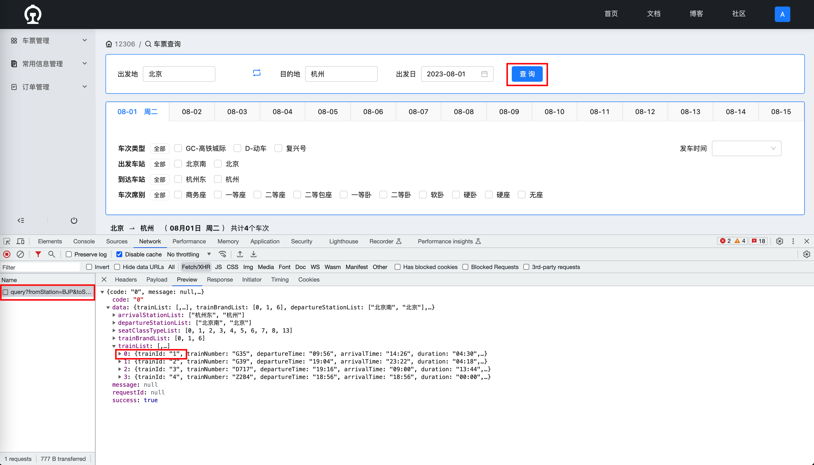

# 视频教学之如何重置列车余票数据

## 视频地址
[https://t.zsxq.com/10wkMo3Xi](https://t.zsxq.com/10wkMo3Xi)

## 文档教学
### 获取列车 ID

### 调用接口重置列车车票余量
请求方式：Post

请求接口：[http://127.0.0.1:9000/api/ticket-service/temp/seat/reset?trainId=1](http://127.0.0.1:9000/api/ticket-service/temp/seat/reset?trainId=1)

请求成功后，刷新车票列表，查看余量是否已变更为初始状态。

> 更新: 2023-08-01 08:46:42  
> 原文: <https://www.yuque.com/magestack/12306/on455hhf6x1upmhq>