# 云服务器部署如何12306项目？

## 准备云服务器
部署 12306 项目前，需要准备一个可被公网访问的云服务器。在这里我推荐阿里云或者腾讯云的轻量云服务器，新用户购买个2C4G的配置，一年大概 300 多元。

咱们这里以阿里云为例。

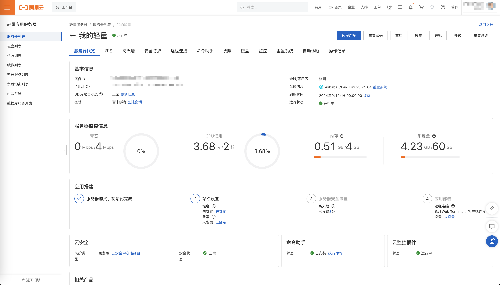


如果没有云服务器用户，可以选择购买阿里云服务器，购买轻量云服务器地址：[返利地址购买](https://www.aliyun.com/daily-act/ecs/ecs_trial_benefits?userCode=udy9oev2)。**<font style="color:#DF2A3F;">因为我是老用户，新用户通过我这个地址购买会给我返利，你购买后告诉我一声，返利的钱如数奉还。</font>**

## 开放防火墙端口
需要保证云服务器的 80、3306、9000 端口对所有地址开放，因为我们会使用这些端口进行转发访问相关资源。

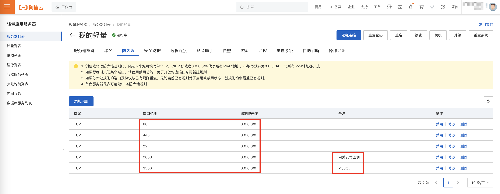

## 云服务器环境安装
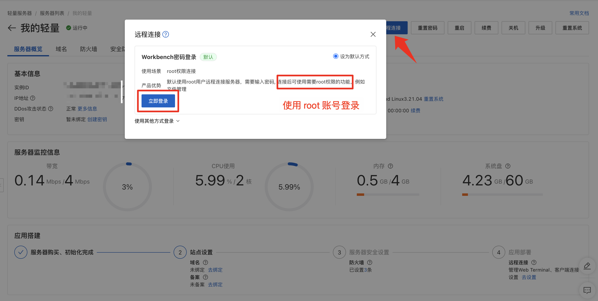

### JDK 环境
使用夸克网盘下载 JDK17，并上传到云服务器，链接：[https://pan.quark.cn/s/944c4a4d373f](https://pan.quark.cn/s/944c4a4d373f)。

进入 `/usr/local` 目录，创建 java 文件夹。并将 JDK17 上传到 java 目录下。

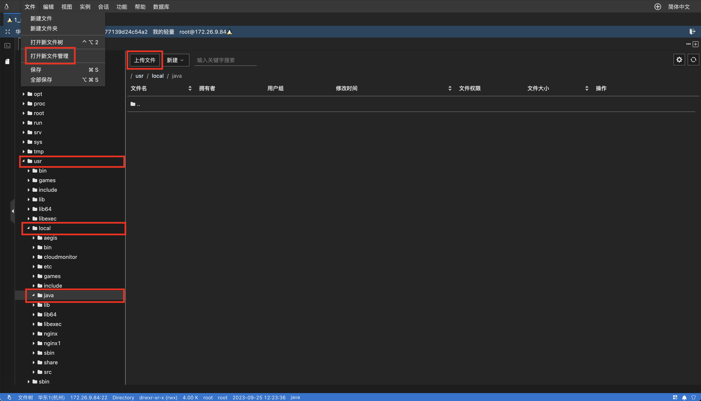

上传成功后，解压 JDK17 压缩包，命令 `unzip zulu17.44.53-ca-jdk17.0.8.1-linux_x64.zip`。

> 如果报错说 unzip 命令不存在，安装该命令：`yum install -y unzip zip`。
>

解压后的目录如下：

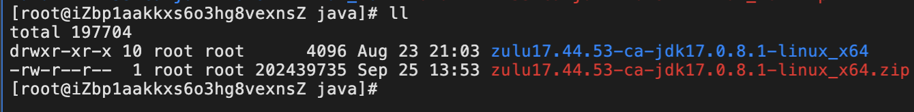

为了简单，就不配置环境变量了，直接拿实际引用执行 Java 相关命令。

### Nginx 软件
更新系统软件包列表。

```shell
sudo yum update
```

安装 Nginx 命令。

```shell
sudo yum install nginx
```

安装完成后，可以使用以下命令启动 Nginx。

```shell
sudo systemctl start nginx
```

同时还需要设置 Nginx 开机自启。

```shell
sudo systemctl enable nginx
```

## 项目打包上传
### 聚合&网关项目
Maven 执行 clean install 逻辑，将 SpringBoot 可执行 Jar 生成。

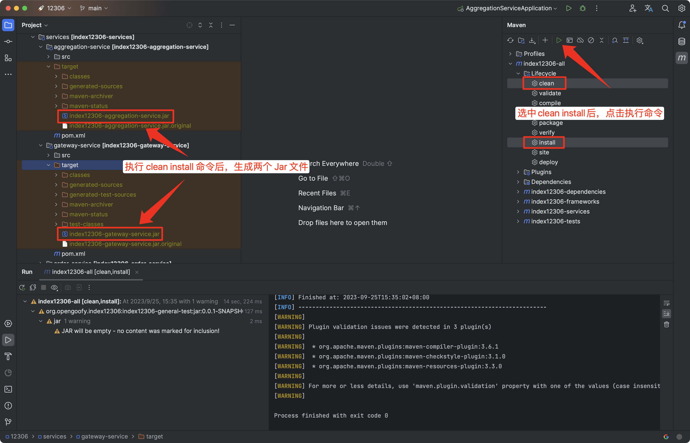

通过命令创建 /home/12306 文件夹。

```shell
mkdir -p /home/12306
```

将 `index12306-aggregation-service.jar`、`index12306-gateway-service.jar` 上传到云服务器 `/home/12306` 文件夹下。

上传后的目录如下：

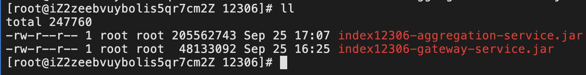

### 前端项目
进入到 `console-vue` 目录下，执行 `yarn build` 命令。如果是 Windows 系统用户，记得去 CMD 命令行里执行。

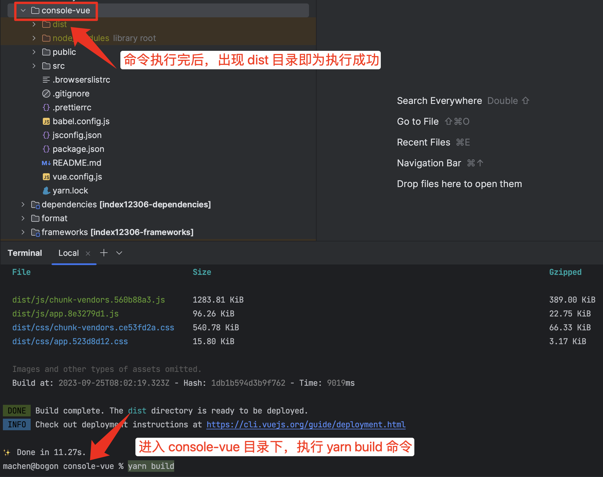

将该 dist 目录上传到云服务器 `/home/12306` 目录下。上传前记得压缩下 dist 目录，上传方便些，上传成功后再解压。

上传后的目录如下：

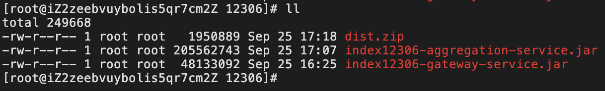

执行解压缩命令：`unzip dist.zip` 完成压缩包解压。

### 安装中间件环境
和咱们本地启动模式一样，只有 MySQL 是大家必须安装的，这里采用极简模式，让大家其它中间件使用星球云中间件环境。

MySQL 服务安装以及数据库初始化参考：[手摸手之初始数据库表信息](https://www.yuque.com/magestack/12306/kwtxpe0cbugek9ue)。

## 启动项目
### 启动后端项目
在 12306 目录下创建 logs 文件夹。

```shell
mkdir -p /home/12306/logs
```

进入 `/home/12306` 文件夹下，开始启动后端项目。

先启动聚合服务。下面需要替换的配置项从 [安装中间件环境](https://www.yuque.com/magestack/12306/gu8d4uvn5cdzuig9) 文章中获取。

```shell
nohup /usr/local/java/zulu17.44.53-ca-jdk17.0.8.1-linux_x64/bin/java \
-Xms2048m -Xmx2048m \
-Dunique-name=-xxx \
-Dframework.cache.redis.prefix=xxx: \
-Dspring.data.redis.password=Sm9sVXBOYJjI030b5tz0trjpzvZzRhtZmEbv0uOImcD1wEDOPfeaqNU4PxHob/Wp \
-Dspring.data.redis.port=19389 \
-Dspring.data.redis.host=xxx \
-Drocketmq.name-server=xxx \
-Dspring.cloud.nacos.discovery.server-addr=xxx \
-Dpay.alipay.notify-url=http://服务器外网IP:9000/api/pay-service/callback/alipay \
-jar /home/12306/index12306-aggregation-service.jar > logs/index12306-aggregation-service.file 2>&1 &
```

执行 `tail -f logs/index12306-aggregation-service.file` 命令查看日志是否启动成功。

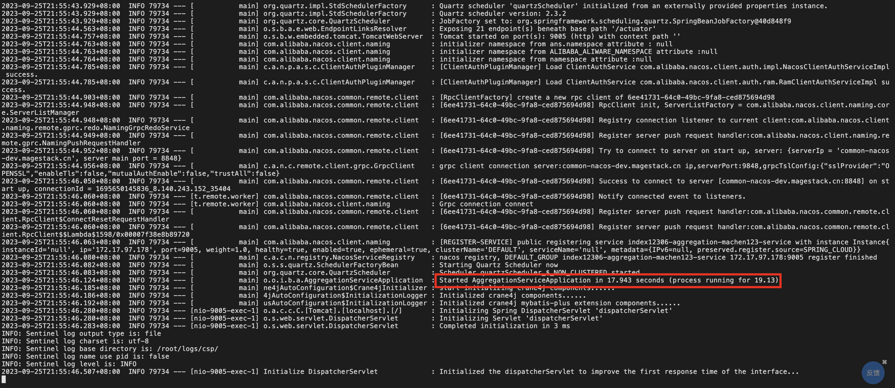

依次启动网关项目。

```shell
nohup /usr/local/java/zulu17.44.53-ca-jdk17.0.8.1-linux_x64/bin/java \
-Xms2048m -Xmx2048m \
-Dunique-name=-xxx \
-Dframework.cache.redis.prefix=xxx: \
-Dspring.data.redis.password=Sm9sVXBOYJjI030b5tz0trjpzvZzRhtZmEbv0uOImcD1wEDOPfeaqNU4PxHob/Wp \
-Dspring.data.redis.port=19389 \
-Dspring.data.redis.host=xxx \
-Dspring.cloud.nacos.discovery.server-addr=xxx \
-jar /home/12306/index12306-gateway-service.jar > logs/index12306-gateway-service.file 2>&1 &
```

执行 `tail -f logs/index12306-gateway-service.file` 命令查看网关服务是否启动成功。

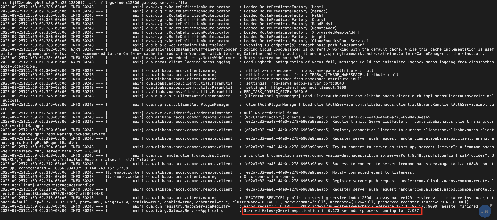

### Nginx 挂载前端项目
修改 Nginx 的配置，让前端可以访问。

```shell
sudo vim /etc/nginx/nginx.conf
```

将默认 Nginx `http/server`配置改为下述配置：

```nginx
http {
    # 只要保证 server 里的配置在 nginx 的 http 配置下就好
		server {
        listen       80;
        server_name  localhost;

         location / {
            root   /home/12306/dist;
            index  index.html index.htm;
            try_files $uri $uri/ /index.html;
        }

        location /api {
            proxy_read_timeout 10s;
            proxy_pass http://127.0.0.1:9000/api;
        }
    }
}
```

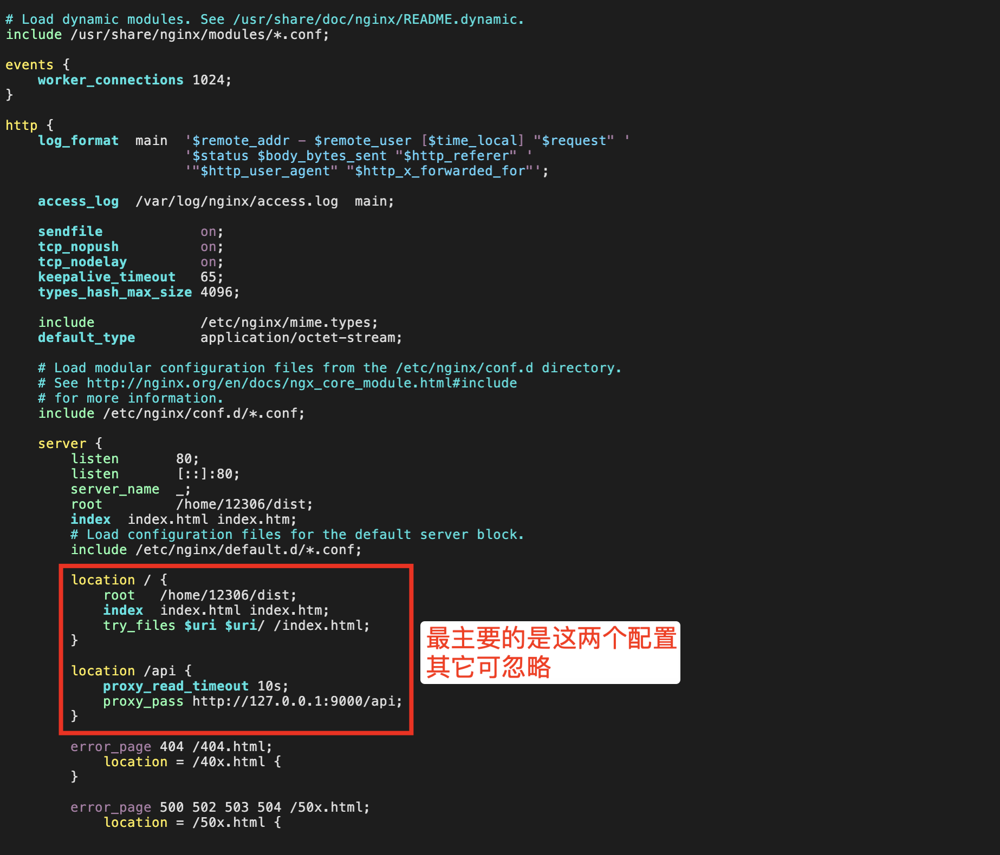

保存退出文件编辑状态，重载 Nginx 的配置。

```shell
sudo systemctl reload nginx
```

> 如果前端访问不生效，检查配置文件中这个配置是否被注释，没有的话需要注释掉。
>
> 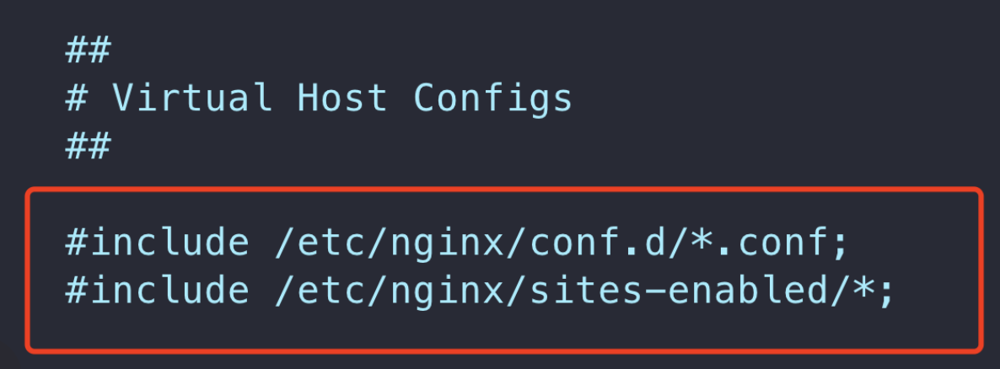
>

## 公网访问
浏览器访问：`http://公网IP` 即可看到对应的前端页面。

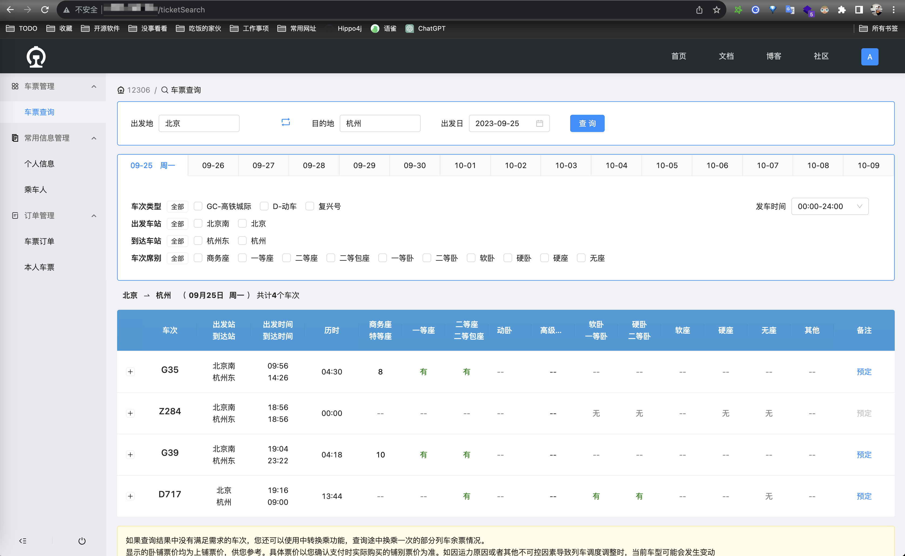


> 更新: 2023-10-14 10:03:22  
> 原文: <https://www.yuque.com/magestack/12306/bxcsdlnrsgzqtmnd>