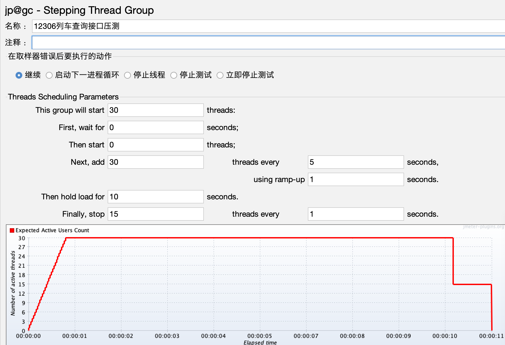
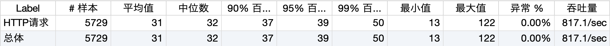
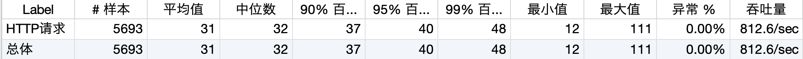
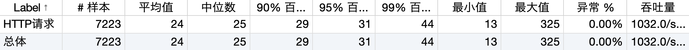
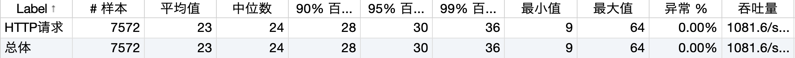
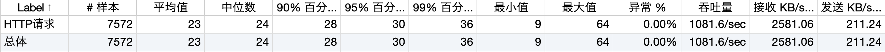
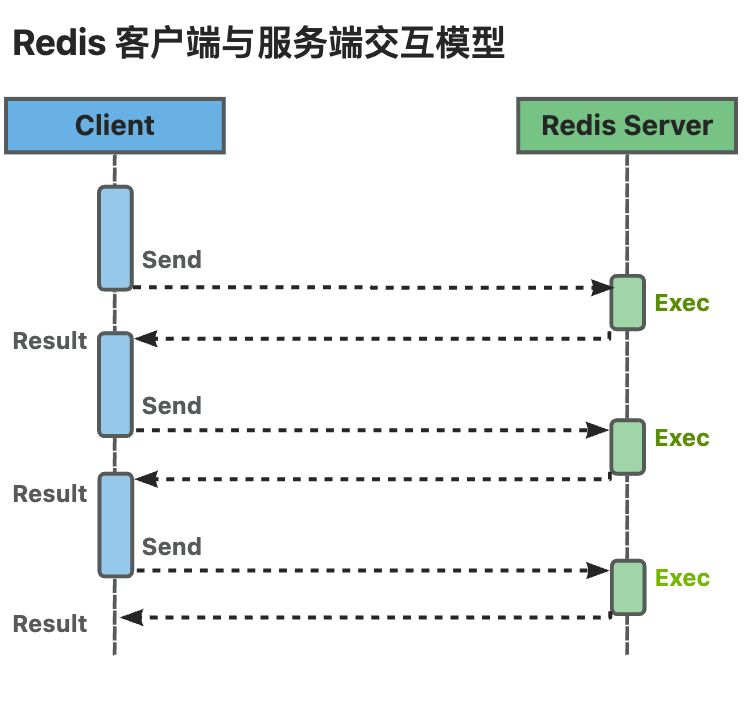
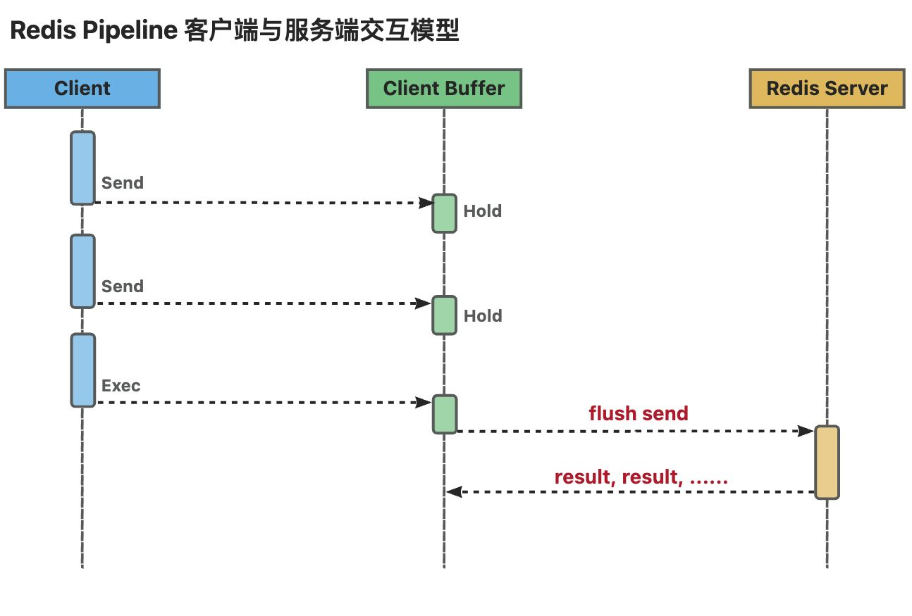
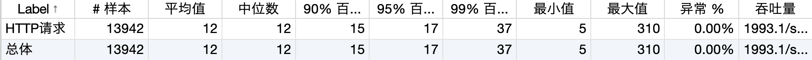
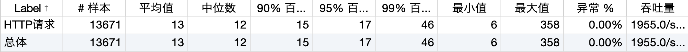

# 12306核心接口性能优化都做了什么？

## 本地服务压测
### 压测方案


阶段加压方案，相关参数如下所示：

+ `This group will start 100 threads`：设置线程组启动的线程总数为100个。
+ `First,wait for N seconds`：启动第一个线程之前，需要等待N秒。
+ `Then start N threads`：设置最开始时启动N个线程。
+ `Next,add 10 threads every 30 seconds,using ramp-up 5 seconds`：每隔30秒，在5秒内启动10个线程。
+ `Then hold load for 60 seconds`：启动的线程总数达到最大值之后，再持续运行60秒。
+ `Finally,stop 5 threads every 1 seconds`：每秒停止5个线程。

### 本地服务配置
修改了 JVM 最大和最小的内存参数。

```shell
-Xmx4000m -Xms4000m
```

### 不同场景压测报告
性能优化之：不要随便改中间件配置。以下压测报告改了 Tomcat 相关的线程池相关参数。

```yaml
server:
  tomcat:
    threads:
      max: 300
      min-spare: 300
    max-connections: 100000
    max-swallow-size: 1000
    accept-count: 1000
```






这个报告是 Tomcat 默认线程池参数，默认最小活跃线程参数是 10，最大值是 200。性能反而比上述线程较大的配置更好。





### 压测报告解读


以上述压测报告举例，每个值对应什么含义。

+ Label：每个 JMeter 的 element 的 Name 值，例如 HTTP Request 的 Name。
+ 样本：发出请求数量；模拟 xx 个用户，循环 xx 次，显示对应的结果。
+ 平均值：平均响应时间（单位：ms）；默认是单个 Request 的平均响应时间，当使用了 Transaction Controller 时，也可以以 Transaction 为单位显示平均响应时间。
+ 中位数：50% 的用户响应时间小于这个值。
+ 95%百分位：95% 的用户响应时间小于这个值。
+ 99%百分位：99% 的用户响应时间小于这个值。
+ 最小值：用户响应时间最小值。
+ 最大值：用户响应时间最大值。
+ 异常%：测试出现的错误请求数量百分比；请求的错误率 = 错误请求的数量/请求的总数；若出现错误就要看服务端的日志查找定位原因。
+ 吞吐量：Throughput 简称 TPS，吞吐量，默认情况下表示每秒处理的请求数，也就是指服务器处理能力，TPS 越高说明服务器处理能力越好。
+ 接收 KB/sec：每秒从服务器端接收到的数据量。
+ 发送 KB/sec：每秒从客户端接发出的数据量。

## 性能调优
### Pipelin 管道命令
常规模式下 Redis 客户端与服务端交互模型。




Redis 管道命令客户端与服务端交互模型。



### 优化后性能报告
使用管道命令优化后性能压测报告。非常直观的看出，比未使用管道命令前，性能提高了一倍！






> 更新: 2024-03-22 20:03:09  
> 原文: <https://www.yuque.com/magestack/12306/bh7c4x3i4sn682bn>