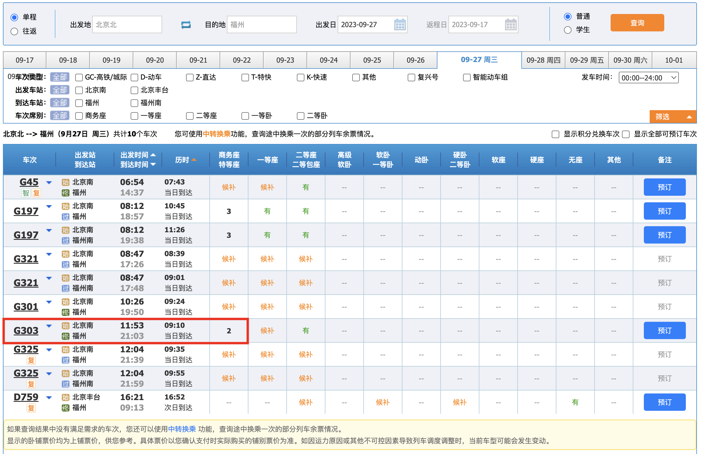
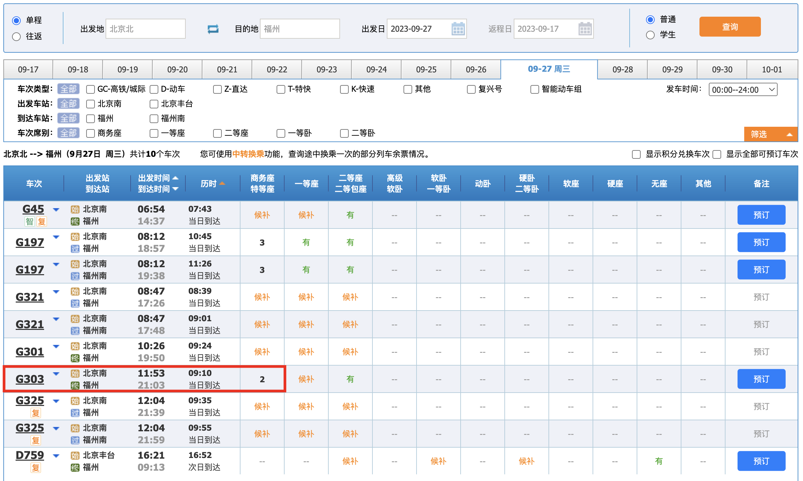

# 余票Binlog更新延迟问题如何解决？

这个问题本质上不是 Binlog 更新延迟问题，而是 Binlog 更新延迟后库存更新缓慢，就会导致列车查询中座位余量数据不准确。假如消费 Binlog 延迟了两秒，那列车座位余量就会相应有个两秒以上的更新延迟。

> 为什么是两秒以上？因为拿到 Binlog 还需要去修改 Redis 等，同样需要时间。
>

## 12306 怎么做的？
Binlog 数据更新方案一定有延迟，这是肯定的。

因为从用户的写请求到数据库，数据库触发 Binlog，Canal 监听到 Binlog 再投递到 RocketMQ，以及 12306 的购票服务监听到 RocketMQ 消息最终到 Redis，这是个不算是短链路。

根据已有经验来看，正常情况下本地更新延迟大概在300-1000ms左右，因为本地还连接着公网的服务器中间件，可能会慢一点。如果是生产环境，这个延迟会更低，因为生产环境的网络都在一个组里。

300-1000ms 算慢么？我理解不算。Canal 监听 Binlog 本身不会成为这个流程的短板，因为 Canal 的集群模式做的是主备，而不是多主多从架构，这就说明了，Canal 对自己监听和投递性能的绝对自信。

> 主备什么意思？哪怕你部署了集群，同一时间只有一个 Canal 实例生效。
>

而消息队列就更不用担心性能了，RocketMQ 支持多主多从集群架构，同一时间可以运行多个接收消息发送的 Broker，性能会随着 Broker 的增加，而成倍增加。

12306 应用和 Redis 就不过多描述了，也不会成为性能瓶颈。

基于此，我们思考一个问题：咱们自己说 300-1000ms 不算慢，那 12306 系统购买余票后什么时间刷新缓存？会不会比咱们这个 300-1000ms 更快呢？

带着这个疑问，我们生产正式下个单购买余票试下，实践出真知。

购买 G303 列车商务座，大家注意一点要买显示车票余量带数字的，方便你购买后查看余量到底减没减。

高铁 G303 列车商务座购买成功。

我等了5分钟，再去查看这个 G303 列车，商务座还是2张票，这个无语呀。。。

我赶紧去把票退了，这次实验证明，12306 根本不在乎余票更新的效率。毕竟5分钟都没更新，和没更新也没啥区别了。

## Binlog 更新延迟有什么问题？
我们想一下，如果列车座位余票展示的不及时，会不会发生超卖问题？毕竟展示有延迟可以接受，超卖问题就不能接受了。

余票防止超卖文档参考：[购买列车余票如何防止库存超卖？](https://www.yuque.com/magestack/12306/pemih6p8h7xaw2b3)

通过令牌限流容器可以有效防止座位超卖问题。用户把令牌申请完了就开始返回快速失败了，余票可能会有一个小的延迟更新。

这个延迟更新余票时间，大概会有300-1000ms，不管咋说，肯定比官方 12306 要快。

12306 的这种余票更新策略肯定有他们的原因，不过目前我还没有想到解决方案，大家有想法的可以大胆猜测，或者去网上找一些论文验证。

> 更新: 2024-03-27 13:08:22  
> 原文: <https://www.yuque.com/magestack/12306/kxuug8l6zslfyz21>