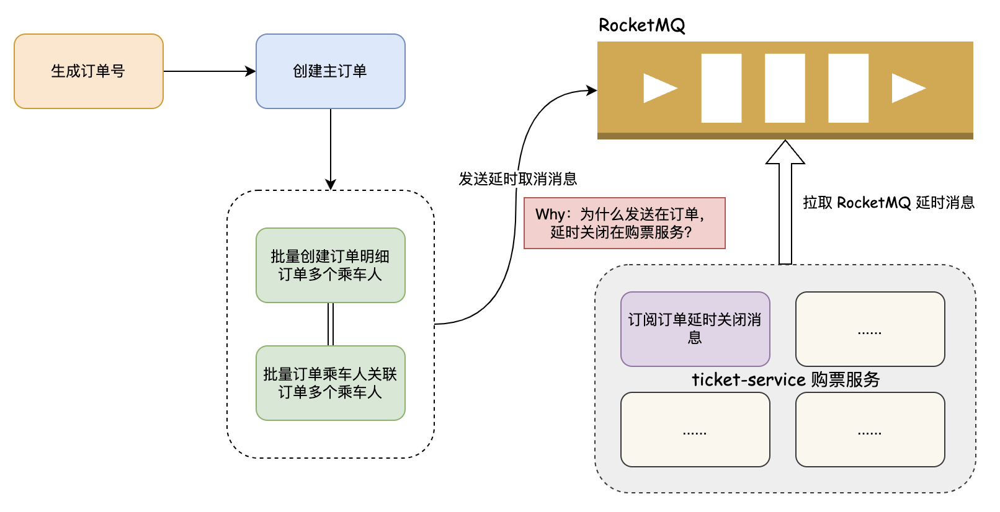

# 创建订单并支付后延时关闭订单消息怎么办？

## 问题背景
星球里很多老板问了我这么个问题：创建订单时会发送一个十分钟未支付则关闭订单的 RocketMQ 消息，如果说创建订单并且支付了，这个消息能删除么？

先说结论，不能删除。从最开始学习 RocketMQ、Kafka 这些消息中间件起，似乎就没有想过类似的问题。不过潜意识里告诉自己这不能删除，为此还特地找了相关的官方文档和技术博客，都没有相关的蛛丝马迹。

也就是说，延时消息一旦发出去，就一定会执行。所以，咱们要从业务逻辑上去判断，避免已支付的订单再被延时关闭。



## 业务中的延时发送消息
### 发送延时消息
订单延迟关闭的发送入口在订单服务的创建订单接口。

```java
try {
    // 发送 RocketMQ 延时消息，指定时间后取消订单
    DelayCloseOrderEvent delayCloseOrderEvent = DelayCloseOrderEvent.builder()
            .trainId(String.valueOf(requestParam.getTrainId()))
            .departure(requestParam.getDeparture())
            .arrival(requestParam.getArrival())
            .orderSn(orderSn)
            .trainPurchaseTicketResults(requestParam.getTicketOrderItems())
            .build();
    // 调用自定义延迟关闭订单消息生产者发送延迟关闭订单消息
    SendResult sendResult = delayCloseOrderSendProduce.sendMessage(delayCloseOrderEvent);
    if (!Objects.equals(sendResult.getSendStatus(), SendStatus.SEND_OK)) {
        throw new ServiceException("投递延迟关闭订单消息队列失败");
    }
} catch (Throwable ex) {
    log.error("延迟关闭订单消息队列发送错误，请求参数：{}", JSON.toJSONString(requestParam), ex);
    throw ex;
}
```


为了实现优雅一些，抽象了公共的 RocketMQ 发送消息组件，使用到了模板方法模式。

```java
package org.opengoofy.index12306.biz.orderservice.mq.produce;

import cn.hutool.core.util.StrUtil;
import com.alibaba.fastjson2.JSON;
import lombok.RequiredArgsConstructor;
import lombok.extern.slf4j.Slf4j;
import org.apache.rocketmq.client.producer.SendResult;
import org.apache.rocketmq.spring.core.RocketMQTemplate;
import org.springframework.messaging.Message;

import java.util.Optional;

/**
 * RocketMQ 抽象公共发送消息组件
 *
 * @公众号：马丁玩编程，回复：加群，添加马哥微信（备注：12306）获取项目资料
 */
@Slf4j
@RequiredArgsConstructor
public abstract class AbstractCommonSendProduceTemplate<T> {

    private final RocketMQTemplate rocketMQTemplate;

    /**
     * 构建消息发送事件基础扩充属性实体
     *
     * @param messageSendEvent 消息发送事件
     * @return 扩充属性实体
     */
    protected abstract BaseSendExtendDTO buildBaseSendExtendParam(T messageSendEvent);

    /**
     * 构建消息基本参数，请求头、Keys...
     *
     * @param messageSendEvent 消息发送事件
     * @param requestParam     扩充属性实体
     * @return 消息基本参数
     */
    protected abstract Message<?> buildMessage(T messageSendEvent, BaseSendExtendDTO requestParam);

    /**
     * 消息事件通用发送
     *
     * @param messageSendEvent 消息发送事件
     * @return 消息发送返回结果
     */
    public SendResult sendMessage(T messageSendEvent) {
        // 构建扩展参数，比如事件名称、Topic、Tag、Keys、发送超时时间、延迟消息级别
        // 因为每个消息发送生产者的参数都不一致，所以需要使用模板方法的扩展特性去收集
        BaseSendExtendDTO baseSendExtendDTO = buildBaseSendExtendParam(messageSendEvent);
        SendResult sendResult;
        try {
            // 构建 Topic:Tag，如果 Tag 存在则拼接，不存在只有 Topic
            StringBuilder destinationBuilder = StrUtil.builder().append(baseSendExtendDTO.getTopic());
            if (StrUtil.isNotBlank(baseSendExtendDTO.getTag())) {
                destinationBuilder.append(":").append(baseSendExtendDTO.getTag());
            }
            // 通过 RocketMQ 模板组件发送同步消息，并设置延迟级别
            sendResult = rocketMQTemplate.syncSend(
                    destinationBuilder.toString(),
                    buildMessage(messageSendEvent, baseSendExtendDTO),
                    baseSendExtendDTO.getSentTimeout(),
                    Optional.ofNullable(baseSendExtendDTO.getDelayLevel()).orElse(0)
            );
            // 第一个参数是事件类型，方便在业务代码里进行日志搜索以及看起来一目了然
            // 并输出对应的发送结果、消息 ID、Keys 等关键信息，如果业务出现问题，这些参数能“救命”
            log.info("[{}] 消息发送结果：{}，消息ID：{}，消息Keys：{}", baseSendExtendDTO.getEventName(), sendResult.getSendStatus(), sendResult.getMsgId(), baseSendExtendDTO.getKeys());
        } catch (Throwable ex) {
            // 异常后一定要打印相关的消息内容
            log.error("[{}] 消息发送失败，消息体：{}", baseSendExtendDTO.getEventName(), JSON.toJSONString(messageSendEvent), ex);
            throw ex;
        }
        return sendResult;
    }
}
```

关于消息队列的正确使用方式参考文档：[手摸手之消息队列正确使用姿势](https://www.yuque.com/magestack/12306/dhm3lr598gtt23od)。

### 消费延时消息
考虑到项目依赖关系的关系，延迟关闭订单消息的消费者并没有放到订单服务，而是放在了购票服务。先来一波简单的项目调用关系梳理，然后会和大家说我为什么这么设计。

大家通过调用关系得知，用户购买车票是先调用购票服务，然后购票服务调用订单服务创建订单。那么，此时已知购票服务依赖订单服务。

这个时候，咱们再来看看延时取消订单业务逻辑都在做什么事情：

+ 修改订单相关状态，比如将待支付变更为已取消。
+ 解锁订单相关的座位状态，咱们下单时锁定了用户提交的座位状态为锁定状态，需要解锁。
+ 回退订单中乘车人购买车座类型的缓存余票数量。
+ 回退订单中乘车人购买车座类型的令牌限流数量。

<font style="background-color:#FBDE28;">延时关闭订单同时需要操作购票服务和订单服务，已知购票服务依赖订单服务，从微服务架构设计上，应尽量避免循环依赖问题。</font>

所以我们将延时关闭订单的消费者放到购票服务，再通过购票服务远程调用订单服务修改订单状态。

```java
import cn.hutool.core.util.StrUtil;
import com.alibaba.fastjson.JSON;
import lombok.RequiredArgsConstructor;
import lombok.extern.slf4j.Slf4j;
import org.apache.rocketmq.spring.annotation.RocketMQMessageListener;
import org.apache.rocketmq.spring.core.RocketMQListener;
import org.opengoofy.index12306.biz.ticketservice.common.constant.TicketRocketMQConstant;
import org.opengoofy.index12306.biz.ticketservice.dto.req.CancelTicketOrderReqDTO;
import org.opengoofy.index12306.biz.ticketservice.mq.domain.MessageWrapper;
import org.opengoofy.index12306.biz.ticketservice.mq.event.DelayCloseOrderEvent;
import org.opengoofy.index12306.biz.ticketservice.remote.TicketOrderRemoteService;
import org.opengoofy.index12306.biz.ticketservice.remote.dto.TicketOrderDetailRespDTO;
import org.opengoofy.index12306.biz.ticketservice.service.SeatService;
import org.opengoofy.index12306.biz.ticketservice.service.handler.ticket.dto.TrainPurchaseTicketRespDTO;
import org.opengoofy.index12306.biz.ticketservice.service.handler.ticket.tokenbucket.TicketAvailabilityTokenBucket;
import org.opengoofy.index12306.framework.starter.cache.DistributedCache;
import org.opengoofy.index12306.framework.starter.common.toolkit.BeanUtil;
import org.opengoofy.index12306.framework.starter.convention.result.Result;
import org.springframework.beans.factory.annotation.Value;
import org.springframework.data.redis.core.StringRedisTemplate;
import org.springframework.stereotype.Component;

import java.util.List;
import java.util.Map;
import java.util.stream.Collectors;

import static org.opengoofy.index12306.biz.ticketservice.common.constant.RedisKeyConstant.TRAIN_STATION_REMAINING_TICKET;

/**
 * 延迟关闭订单消费者
 *
 * @公众号：马丁玩编程，回复：加群，添加马哥微信（备注：12306）获取项目资料
 */
@Slf4j
@Component
@RequiredArgsConstructor
@RocketMQMessageListener(
        topic = TicketRocketMQConstant.ORDER_DELAY_CLOSE_TOPIC_KEY,
        selectorExpression = TicketRocketMQConstant.ORDER_DELAY_CLOSE_TAG_KEY,
        consumerGroup = TicketRocketMQConstant.TICKET_DELAY_CLOSE_CG_KEY
)
public final class DelayCloseOrderConsumer implements RocketMQListener<MessageWrapper<DelayCloseOrderEvent>> {

    private final SeatService seatService;
    private final TicketOrderRemoteService ticketOrderRemoteService;
    private final DistributedCache distributedCache;
    private final TicketAvailabilityTokenBucket ticketAvailabilityTokenBucket;

    @Value("${ticket.availability.cache-update.type:}")
    private String ticketAvailabilityCacheUpdateType;

    @Override
    public void onMessage(MessageWrapper<DelayCloseOrderEvent> delayCloseOrderEventMessageWrapper) {
        log.info("[延迟关闭订单] 开始消费：{}", JSON.toJSONString(delayCloseOrderEventMessageWrapper));
        DelayCloseOrderEvent delayCloseOrderEvent = delayCloseOrderEventMessageWrapper.getMessage();
        String orderSn = delayCloseOrderEvent.getOrderSn();
        Result<Boolean> closedTickOrder;
        try {
            // 调用订单服务修改订单相关状态，比如将待支付变更为已取消
            closedTickOrder = ticketOrderRemoteService.closeTickOrder(new CancelTicketOrderReqDTO(orderSn));
        } catch (Throwable ex) {
            log.error("[延迟关闭订单] 订单号：{} 远程调用订单服务失败", orderSn, ex);
            throw ex;
        }
        // 订单取消成功没有报错并且返回标识也是成功
        if (closedTickOrder.isSuccess() && closedTickOrder.getData() && !StrUtil.equals(ticketAvailabilityCacheUpdateType, "binlog")) {
            String trainId = delayCloseOrderEvent.getTrainId();
            String departure = delayCloseOrderEvent.getDeparture();
            String arrival = delayCloseOrderEvent.getArrival();
            List<TrainPurchaseTicketRespDTO> trainPurchaseTicketResults = delayCloseOrderEvent.getTrainPurchaseTicketResults();
            try {
                // 锁订单相关的座位状态，咱们下单时锁定了用户提交的座位状态为锁定状态，需要解锁
                seatService.unlock(trainId, departure, arrival, trainPurchaseTicketResults);
            } catch (Throwable ex) {
                log.error("[延迟关闭订单] 订单号：{} 回滚列车DB座位状态失败", orderSn, ex);
                throw ex;
            }
            try {
                String keySuffix = StrUtil.join("_", trainId, departure, arrival);
                StringRedisTemplate stringRedisTemplate = (StringRedisTemplate) distributedCache.getInstance();
                Map<Integer, List<TrainPurchaseTicketRespDTO>> seatTypeMap = trainPurchaseTicketResults.stream()
                        .collect(Collectors.groupingBy(TrainPurchaseTicketRespDTO::getSeatType));
                // 回退订单中乘车人购买车座类型的缓存余票数量
                seatTypeMap.forEach(
                        (seatType, passengerSeatDetails) -> stringRedisTemplate.opsForHash()
                                .increment(TRAIN_STATION_REMAINING_TICKET + keySuffix, String.valueOf(seatType), passengerSeatDetails.size())
                );
                // 回退订单中乘车人购买车座类型的令牌限流数量
                ticketAvailabilityTokenBucket.rollbackInBucket(BeanUtil.convert(delayCloseOrderEvent, TicketOrderDetailRespDTO.class));
            } catch (Throwable ex) {
                log.error("[延迟关闭订单] 订单号：{} 回滚列车Cache余票失败", orderSn, ex);
                throw ex;
            }
        }
    }
}
```

## 已支付订单如何取消？
已经支付的订单肯定是不能被延时取消的，而我们又不能去删除 RocketMQ 的延时消息，前后两难的情况，只能在业务上找寻一些突破口。比如：延时消息照常执行，执行前判断订单状态，如果是已支付，则直接返回成功不执行后续的取消逻辑。

订单服务关闭列车订单方法如下：

```java
@Override
public boolean closeTickOrder(CancelTicketOrderReqDTO requestParam) {
    String orderSn = requestParam.getOrderSn();
    LambdaQueryWrapper<OrderDO> queryWrapper = Wrappers.lambdaQuery(OrderDO.class)
            .eq(OrderDO::getOrderSn, orderSn)
            .select(OrderDO::getStatus);
	// 根据订单号获取订单
    OrderDO orderDO = orderMapper.selectOne(queryWrapper);
	// 订单如果等于空或者订单状态不等于待支付返回 false
    if (Objects.isNull(orderDO) || orderDO.getStatus() != OrderStatusEnum.PENDING_PAYMENT.getStatus()) {
        return false;
    }
	// 订单状态等于待支付执行订单取消逻辑
    return cancelTickOrder(requestParam);
}
```

<font style="background-color:#FBDE28;">真相了，原来是订单取消前进行了状态判断，如果是非待支付的状态直接返回 false，就不会进行下面的流程。</font>

订单取消接口返回 false 之后，购票服务判断返回值为 false 就不进行接下来的座位解锁、余票更新等操作。


> 更新: 2023-09-08 17:08:11  
> 原文: <https://www.yuque.com/magestack/12306/ldw8nxp96yfg7cgx>