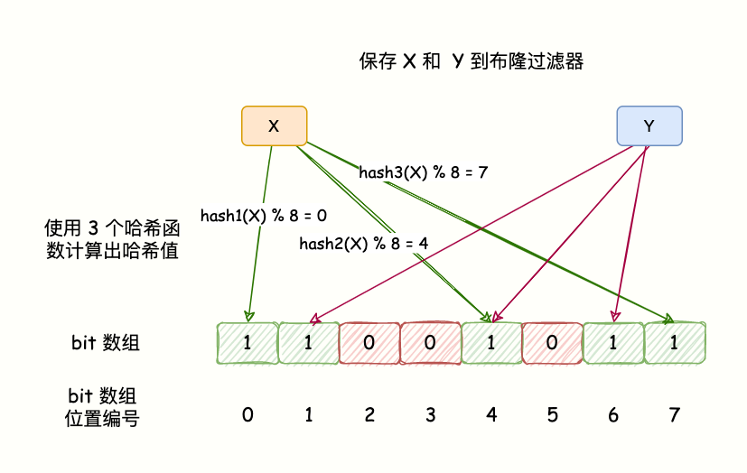
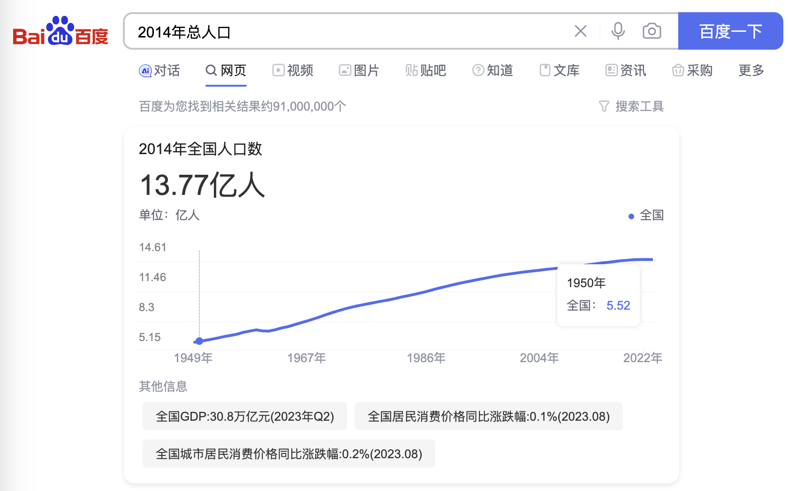

# 用户注册布隆过滤器容量设置以及碰撞率问题

## 什么是布隆过滤器
布隆过滤器（Bloom Filter）是一种高效的数据结构，用于判断一个元素是否存在于一个集合中。它利用位数组和多个哈希函数来实现快速的成员查询。

布隆过滤器的核心思想是用一个位数组（通常用二进制位表示）来表示一个集合，初始时所有位都置为0。

然后，对于每个要加入集合的元素，通过多个哈希函数计算出多个哈希值，然后将位数组中对应的位置置为1。

判断一个元素是否存在于集合时，同样使用多个哈希函数计算出对应的哈希值，然后检查位数组中对应的位置是否都为1，如果有任意一个位置为0，则说明该元素不存在于集合中；如果所有位置都为1，则该元素可能存在于集合中（因为有可能发生哈希碰撞），需要进一步查询底层数据结构来确认。



## 查询碰撞误判问题
碰撞误判问题用一句话说：指的是当布隆过滤器判断一个元素不存在于集合中时，调用判断是否存在方法它可能会返回给你存在。这种情况主要由于哈希碰撞和过滤器容量不足等原因造成的。

以下是导致布隆过滤器重复误判的一些主要原因：

1. 哈希碰撞：布隆过滤器使用多个哈希函数将一个元素映射到多个位置。在极少数情况下，不同的元素可能会映射到相同的位置，导致误判。
2. 过滤器容量不足：如果布隆过滤器的容量设置得不够大，会增加误判的可能性。过小的容量可能会导致哈希冲突增多，从而提高误判率。
3. 删除操作：Redis 的布隆过滤器不支持删除操作。一旦一个元素被添加，就无法从布隆过滤器中删除。如果需要删除，可能会导致一些误判。
4. 误判率设置不合理：布隆过滤器的误判率是可以通过合适的参数设置进行调节的。如果误判率设置得过高，可能会导致误判问题。
5. 业务场景要求高准确性：如果业务场景对准确性要求极高，布隆过滤器可能不是最合适的选择，应该考虑其他更准确的数据结构或算法。

## 用户注册场景布隆过滤器实战
### 容量如何评估
不管任何业务或者任何技术的容量评估都不会是一拍脑门决定的。

如果淘宝商城第一年做业务时，他们可能很难预估订单量。因为他们不清楚运营会带给他们多少流量以及订单，也没有往年的相关数据参考。这种是比较难评估的。但是咱们 12306 的用户注册场景，明显不在这个范围内。

当面试官问布隆过滤器的大小时，我们可以先说一个容量评估思路。比如：用户注册场景下布隆过滤器的主要评估来源是使用 12306 的用户，从系统刚开始运行就开始估算，大概会有多少用户会注册该平台。

2013年12月8日推出平台，同年国内人口约等于14亿，算上前几年大部分人不会使用系统，再加上国内每年的新增人口数量，估算出一个大概值即可。该题重点在一个解题思路，并不一定需要准备的数值。如果非要说的话，让不使用 12306 的人和未来十年的增长起一个对冲，设置 14 亿即可。意味着 10 年内 14 亿这个数据量不会出问题。



### 碰撞率如何评估
如果需要选择一个较低的碰撞率目标。通常情况下，布隆过滤器的碰撞率可以设置在非常低的范围内，例如 0.1%或更低。

这从根本上来说是一个空间和重复碰撞的博弈。希望空间占用小，那就尽可能让碰撞率调高。如果希望碰撞率低，那就把空间调大。

布隆过滤器的内存需求可以通过以下公式来计算：

```shell
m = -(n * ln(p)) / (ln(2)^2)
```

其中：

+ m 是所需要的位数。
+ n 是过滤器中元素的数量。
+ p 是期望的误报率。

在给定的条件下，其中 n 是10^9（10亿），p 是0.001（0.1%），我们可以将这些值带入公式中：

```shell
m = -(10^9 * ln(0.001)) / (ln(2)^2)
```

运算后，我们得到的结果 m 大约为 2.88*10^10 位。为了将位转换为字节（1字节 = 8位），我们需要除以8：

```shell
m_in_bytes = m / 8
```

这将得到大约 3.6*10^9 字节，或者说约 3.6 GB 的内存需求。

但是请注意，这是一个理想的估计值。实际上，在实际设备和实现中，布隆过滤器可能需要稍微多一些的内存。例如，Redis 的布隆过滤器插件（如 RedisBloom）可能需要一些额外的内存来维护元数据和内部结构。

### 初始容量评估不够用怎么办
如果随着国内人口的越来越多，之前评估的布隆过滤器容量不够了怎么办？

我们可以有个定时任务，每天统计已注册人数有多少，和布隆过滤器的预期值差值还有多少。假设布隆过滤器容量设置 14 亿，当已注册人数达到这个数量 80%时，我们通过后台任务重建布隆过滤器，在 14 亿的基础上再增加一定的数量即可。

  


> 更新: 2023-09-12 21:28:07  
> 原文: <https://www.yuque.com/magestack/12306/fr3zurztaq3xwfkc>