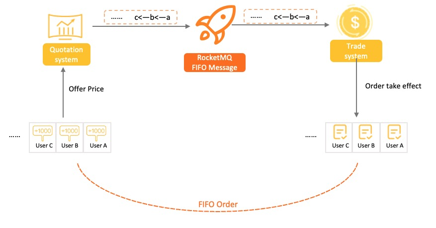
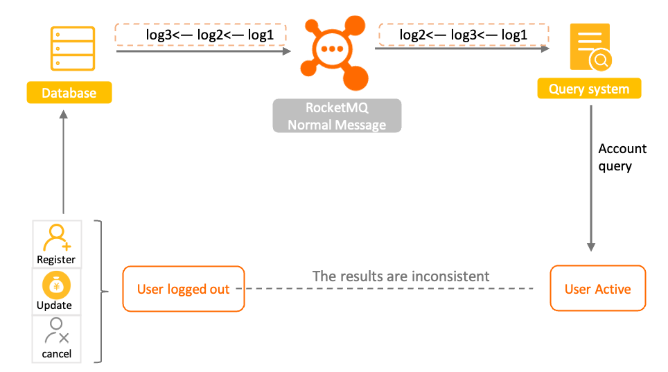
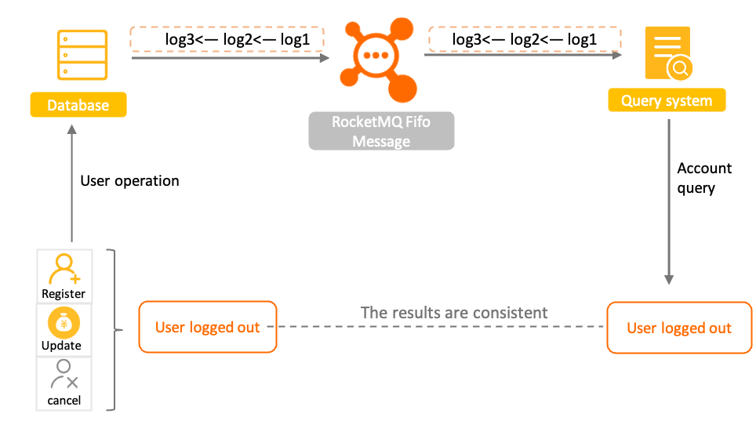
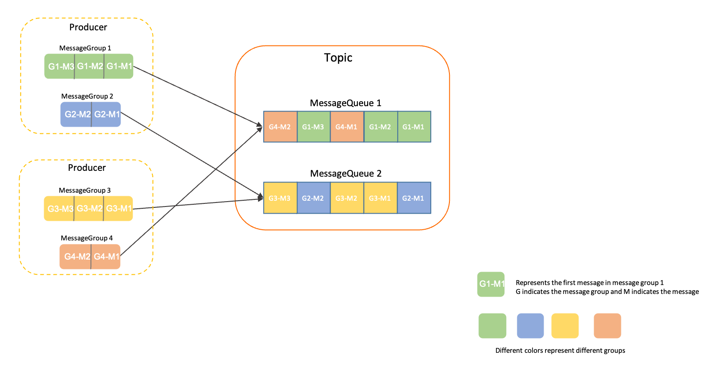

# 监听Binlog的RocketMQ如何保证顺序性？

招银面试官问了一个问题，监听 Binlog 的 RocketMQ 客户端如何保证扣减列车座位的顺序性？

其实这是一个烟雾弹问题。在正式回答这个问题前，先思考一个问题，如果我们能保证 Canal 投递 RocketMQ 的顺序性，再保证 RocketMQ 消费的顺序性，是不是就没有面试官问的这个问题了？

## RocketMQ 如何保证消费顺序性？
顺序消息为 Apache RocketMQ 中的高级特性消息，本文为您介绍顺序消息的应用场景、功能原理、使用限制、使用方法和使用建议。

### 应用场景
在有序事件处理、撮合交易、数据实时增量同步等场景下，异构系统间需要维持强一致的状态同步，上游的事件变更需要按照顺序传递到下游进行处理。在这类场景下使用 Apache RocketMQ 的顺序消息可以有效保证数据传输的顺序性。

**典型场景一：撮合交易**

以证券、股票交易撮合场景为例，对于出价相同的交易单，坚持按照先出价先交易的原则，下游处理订单的系统需要严格按照出价顺序来处理订单。

**典型场景二：数据实时增量同步**

普通消息

顺序消息

以数据库变更增量同步场景为例，上游源端数据库按需执行增删改操作，将二进制操作日志作为消息，通过 Apache RocketMQ 传输到下游搜索系统，下游系统按顺序还原消息数据，实现状态数据按序刷新。如果是普通消息则可能会导致状态混乱，和预期操作结果不符，基于顺序消息可以实现下游状态和上游操作结果一致。

### 功能原理
**什么是顺序消息**

顺序消息是 Apache RocketMQ 提供的一种高级消息类型，支持消费者按照发送消息的先后顺序获取消息，从而实现业务场景中的顺序处理。 相比其他类型消息，顺序消息在发送、存储和投递的处理过程中，更多强调多条消息间的先后顺序关系。

Apache RocketMQ 顺序消息的顺序关系通过消息组（MessageGroup）判定和识别，发送顺序消息时需要为每条消息设置归属的消息组，相同消息组的多条消息之间遵循先进先出的顺序关系，不同消息组、无消息组的消息之间不涉及顺序性。

基于消息组的顺序判定逻辑，支持按照业务逻辑做细粒度拆分，可以在满足业务局部顺序的前提下提高系统的并行度和吞吐能力。

**如何保证消息的顺序性**

Apache RocketMQ 的消息的顺序性分为两部分，生产顺序性和消费顺序性。

+ 生产顺序性 ：Apache RocketMQ 通过生产者和服务端的协议保障单个生产者串行地发送消息，并按序存储和持久化。如需保证消息生产的顺序性，则必须满足以下条件：
    - 单一生产者：消息生产的顺序性仅支持单一生产者，不同生产者分布在不同的系统，即使设置相同的消息组，不同生产者之间产生的消息也无法判定其先后顺序。
    - 串行发送：Apache RocketMQ 生产者客户端支持多线程安全访问，但如果生产者使用多线程并行发送，则不同线程间产生的消息将无法判定其先后顺序。
+ 满足以上条件的生产者，将顺序消息发送至 Apache RocketMQ 后，会保证设置了同一消息组的消息，按照发送顺序存储在同一队列中。服务端顺序存储逻辑如下：
    - 相同消息组的消息按照先后顺序被存储在同一个队列。
    - 不同消息组的消息可以混合在同一个队列中，且不保证连续。

如上图所示，消息组1和消息组4的消息混合存储在队列1中， Apache RocketMQ 保证消息组1中的消息G1-M1、G1-M2、G1-M3是按发送顺序存储，且消息组4的消息G4-M1、G4-M2也是按顺序存储，但消息组1和消息组4中的消息不涉及顺序关系。

+ 消费顺序性 ：Apache RocketMQ 通过消费者和服务端的协议保障消息消费严格按照存储的先后顺序来处理。如需保证消息消费的顺序性，则必须满足以下条件：
    - 投递顺序Apache RocketMQ 通过客户端SDK和服务端通信协议保障消息按照服务端存储顺序投递，但业务方消费消息时需要严格按照接收---处理---应答的语义处理消息，避免因异步处理导致消息乱序。备注消费者类型为PushConsumer时， Apache RocketMQ 保证消息按照存储顺序一条一条投递给消费者，若消费者类型为SimpleConsumer，则消费者有可能一次拉取多条消息。此时，消息消费的顺序性需要由业务方自行保证。消费者类型的具体信息，请参见[消费者分类](https://rocketmq.apache.org/zh/docs/featureBehavior/06consumertype)。
    - 有限重试Apache RocketMQ 顺序消息投递仅在重试次数限定范围内，即一条消息如果一直重试失败，超过最大重试次数后将不再重试，跳过这条消息消费，不会一直阻塞后续消息处理。对于需要严格保证消费顺序的场景，请务设置合理的重试次数，避免参数不合理导致消息乱序。

**生产顺序性和消费顺序性组合**

如果消息需要严格按照先进先出（FIFO）的原则处理，即先发送的先消费、后发送的后消费，则必须要同时满足生产顺序性和消费顺序性。

一般业务场景下，同一个生产者可能对接多个下游消费者，不一定所有的消费者业务都需要顺序消费，您可以将生产顺序性和消费顺序性进行差异化组合，应用于不同的业务场景。例如发送顺序消息，但使用非顺序的并发消费方式来提高吞吐能力。更多组合方式如下表所示：

| 生产顺序 | 消费顺序 | 顺序性效果 |
| --- | --- | --- |
| 设置消息组，保证消息顺序发送。 | 顺序消费 | 按照消息组粒度，严格保证消息顺序。 同一消息组内的消息的消费顺序和发送顺序完全一致。 |
| 设置消息组，保证消息顺序发送。 | 并发消费 | 并发消费，尽可能按时间顺序处理。 |
| 未设置消息组，消息乱序发送。 | 顺序消费 | 按队列存储粒度，严格顺序。 基于 Apache RocketMQ 本身队列的属性，消费顺序和队列存储的顺序一致，但不保证和发送顺序一致。 |
| 未设置消息组，消息乱序发送。 | 并发消费 | 并发消费，尽可能按照时间顺序处理。 |

**顺序消息生命周期**

+ 初始化：消息被生产者构建并完成初始化，待发送到服务端的状态。
+ 待消费：消息被发送到服务端，对消费者可见，等待消费者消费的状态。
+ 消费中：消息被消费者获取，并按照消费者本地的业务逻辑进行处理的过程。 此时服务端会等待消费者完成消费并提交消费结果，如果一定时间后没有收到消费者的响应，Apache RocketMQ会对消息进行重试处理。具体信息，请参见[消费重试](https://rocketmq.apache.org/zh/docs/featureBehavior/10consumerretrypolicy)。
+ 消费提交：消费者完成消费处理，并向服务端提交消费结果，服务端标记当前消息已经被处理（包括消费成功和失败）。 Apache RocketMQ 默认支持保留所有消息，此时消息数据并不会立即被删除，只是逻辑标记已消费。消息在保存时间到期或存储空间不足被删除前，消费者仍然可以回溯消息重新消费。
+ 消息删除：Apache RocketMQ按照消息保存机制滚动清理最早的消息数据，将消息从物理文件中删除。更多信息，请参见[消息存储和清理机制](https://rocketmq.apache.org/zh/docs/featureBehavior/11messagestorepolicy)。

> 备注：
>
> + 消息消费失败或消费超时，会触发服务端重试逻辑，重试消息属于新的消息，原消息的生命周期已结束。
> + 顺序消息消费失败进行消费重试时，为保障消息的顺序性，后续消息不可被消费，必须等待前面的消息消费完成后才能被处理。
>

### 使用限制
顺序消息仅支持使用MessageType为FIFO的主题，即顺序消息只能发送至类型为顺序消息的主题中，发送的消息的类型必须和主题的类型一致。

### 使用建议
**串行消费，避免批量消费导致乱序**

消息消费建议串行处理，避免一次消费多条消费，否则可能出现乱序情况。

例如：发送顺序为1->2->3->4，消费时批量消费，消费顺序为1->23（批量处理，失败）->23（重试处理）->4，此时可能由于消息3的失败导致消息2被重复处理，最后导致消息消费乱序。

**消息组尽可能打散，避免集中导致热点**

Apache RocketMQ 保证相同消息组的消息存储在同一个队列中，如果不同业务场景的消息都集中在少量或一个消息组中，则这些消息存储压力都会集中到服务端的少量队列或一个队列中。容易导致性能热点，且不利于扩展。一般建议的消息组设计会采用订单ID、用户ID作为顺序参考，即同一个终端用户的消息保证顺序，不同用户的消息无需保证顺序。

因此建议将业务以消息组粒度进行拆分，例如，将订单ID、用户ID作为消息组关键字，可实现同一终端用户的消息按照顺序处理，不同用户的消息无需保证顺序。

## 有没有必要保证顺序消费？
通过上面摘抄 [Apache RocketMQ 官网的内容](https://rocketmq.apache.org/zh/docs/featureBehavior/03fifomessage)，可以很方便看出，RocketMQ 支持顺序消费，不需要我们做太多的改造。

那回到这个问题上，咱们列车座位余票扣减上，有没有必要实现顺序扣减缓存余量？答案是没必要顺序。

大家先想一下，无序的 RocketMQ 消费扣减余量有什么问题么？是会造成执行错误还是会造成数据错误？都不会。

因为我们做了一层令牌大闸，隔绝了所有的无效流量，并且令牌大闸里的令牌数量和列车座位数量是一一对应的，可以保证绝对不会超卖。

那在这个前提下，车辆余票的缓存早一点扣减和晚一点扣减，再或者扣减顺序是否一致又有什么关系呢，最终结果绝对是符合预期的。

大家仔细梳理下这个逻辑，看看是不是这样。另外，**一定要从底层原理以及业务上理解这个问题，这样能保证你在面试官那里，不管问什么问题，以及不管怎么拐着弯问，都可以做到游刃有余**。

> 更新: 2023-09-17 16:09:53  
> 原文: <https://www.yuque.com/magestack/12306/fhxlldkdp4gvtu8n>