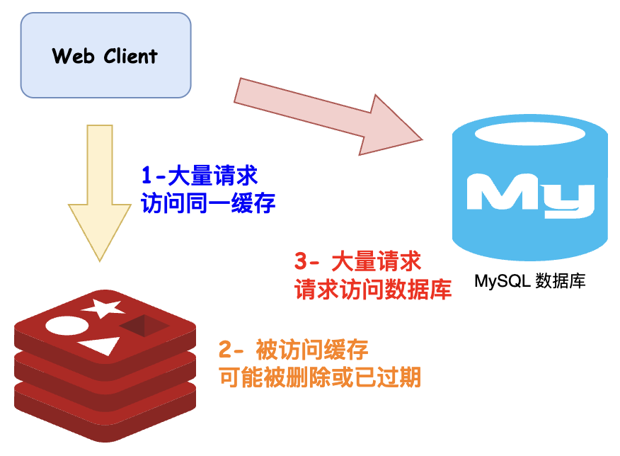
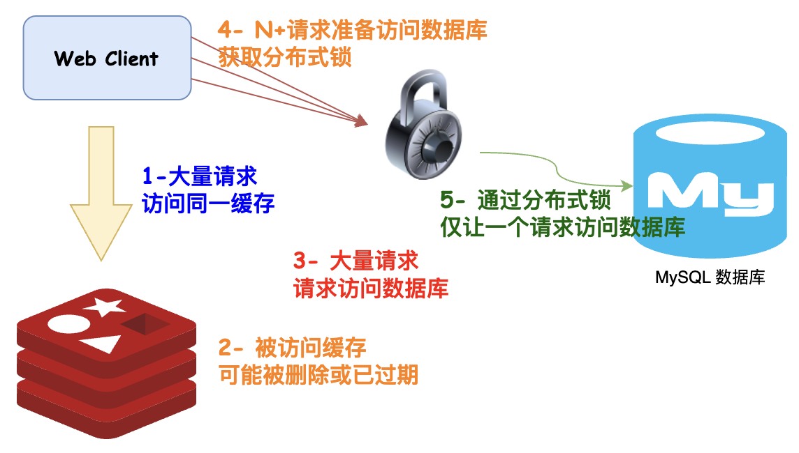
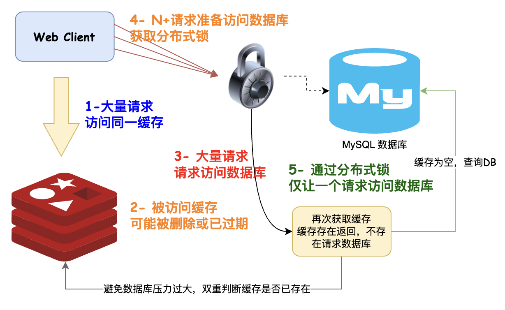

# 缓存击穿之双重判定锁如何优化性能？

网上但凡看得见的文章，大部分在说缓存穿透时都是无脑分布式锁，分布式锁一点问题都没有么？还能不能再进一步优化？

在聊聊缓存击穿的双重判定锁之前，我们将按照循循渐进的方式讲解，什么是缓存击穿？如何解决缓存击穿？缓存击穿解决方案能不能进一步优化？

## 什么是缓存击穿？
缓存击穿是指一个缓存中的数据因为某种原因（通常是缓存中的数据过期或者被删除），在短时间内遭受大量的请求，导致这些请求直接穿透到数据库或其他后端存储系统，增加了后端系统的负载。

缓存击穿通常在以下情况下发生：

1. 热点数据过期：当缓存中存储的热门数据过期时，大量的请求会同时查询后端数据库。
2. 第一次请求：对于一个之前从未被请求过的数据，当它第一次被请求时，缓存中没有这个数据，从而导致请求穿透到后端存储。



## 如何解决缓存击穿？
为了解决Redis缓存击穿问题，可以采取以下常见的方案：

1. 设置热点数据永不过期：对于一些热点数据，可以将其永不过期，确保即使数据过期后，仍然可以从缓存中获取。
2. 使用互斥锁：在获取数据时，使用分布式锁（如 Redis 的分布式锁）来控制同时只有一个请求可以去后端获取数据，其他请求需要等待锁释放。这样可以防止多个请求同时穿透到后端存储。

设置热点数据永不过期属于是业务范围应该考虑的事情，这个数据是否应该永不过期？或者说活动时设置过期时间为 -1，活动后再执行程序删除。有一点可以确认，缓存数据不可能全部都是永不过期，因为缓存的存储压力会比较大，所以该方案无法作为通用方案。

那我们可以从互斥锁上面下下文章，如何通过互斥锁完成缓存击穿场景解决方案？

### 查询缓存不存在请求数据库
第一版，查询数据缓存是否存在，不存在的话请求数据库，数据库存在则把当前数据回写到缓存。

问题比较明显，如果缓存过期或被删除，大量请求就会全部请求到数据库，导致数据库压力暴涨。

伪代码如下：

```java
public String selectTrain(String id) {
	String cacheData = cache.get(id);
	if (StrUtil.isBlank(cacheData)) {
        String dbData = trainMapper.selectId(id);
        if (StrUtil.isNotBlank(dbData)) {
    		cahce.set(id, dbData);
            cacheData = dbData;
        }
    }
	return cacheData;
}
```

### 分布式互斥锁优化数据库压力
在获取数据时，使用分布式锁（如 Redis 的分布式锁）来控制同时只有一个请求可以去后端获取数据，其他请求需要等待锁释放。这样可以防止多个请求同时穿透到后端存储。



在原有基础上继续改进，伪代码如下：

```java
public String selectTrain(String id) {
	String cacheData = cache.get(id);
	if (StrUtil.isBlank(cacheData)) {
        Lock lock = getLock(id);
        lock.lock();
        try {
            String dbData = trainMapper.selectId(id);
            if (StrUtil.isNotBlank(dbData)) {
        		cahce.set(id, dbData);
                cacheData = dbData;
            }
        } finally {
            lock.unlock();
        }
    }
	return cacheData;
}
```

这种方案有效地避免了缓存穿透问题，因为只有一个线程能够在同一时间内查询数据库，其他线程需要等待，不会同时穿透到后端存储系统。

完美解决问题，但是很多老板比较疑惑，为什么我在之前很多文档里都说了双重判定锁这个东西？这玩意是个啥，跟着马哥一起往下看，技术揭秘。

### 双重判定锁
上边还有一个问题就是，假如 100w 的请求读取一个缓存，100w 的请求全部卡在 lock.lock 获取分布式锁处，只有一个线程会执行逻辑请求数据库并放入缓存。问题来了，因为接下来的所有请求，99.99...w 还是会继续请求数据库，大家读一下上面的伪代码就明白了。

这会造成两个实际的问题：

1. 全部用户获取锁后查询数据库，会对数据库造成无用的性能浪费，因为这 100w 的请求，只有第一次是有效的。
2. 查询数据库会造成用户响应时间变长，接口吞吐量下降。

双重判断：获取锁后，在查询数据库之前，再次检查一下缓存中是否存在数据。这是一个双重判断，如果缓存中存在数据，就直接返回；如果不存在，才继续执行查询数据库的操作。



伪代码如下：

```java
public String selectTrain(String id) {
	String cacheData = cache.get(id);
	if (StrUtil.isBlank(cacheData)) {
        Lock lock = getLock(id);
        lock.lock();
        try {
            cacheData = cache.get(id);
            if (StrUtil.isBlank(cacheData)) {
                String dbData = trainMapper.selectId(id);
                if (StrUtil.isNotBlank(dbData)) {
            		cahce.set(id, dbData);
                    cacheData = dbData;
                }
            }
        } finally {
            lock.unlock();
        }
    }
	return cacheData;
}
```

下面是这种解决方案的一般步骤：

1. 获取锁：在查询数据库前，首先尝试获取一个分布式锁。只有一个线程能够成功获取锁，其他线程需要等待。
2. 查询数据库：如果双重判断确认数据确实不存在于缓存中，那么就执行查询数据库的操作，获取数据。
3. 写入缓存：获取到数据后，将数据写入缓存，并设置一个合适的过期时间，以防止缓存永远不会被更新。
4. 释放锁：最后，释放获取的锁，以便其他线程可以继续使用这个锁。

## 文末总结
本文深入探讨了缓存击穿问题以及解决方案。首先，我们了解了缓存击穿是指一个缓存中的数据因为某种原因（通常是缓存中的数据过期或者被删除），在短时间内遭受大量的请求，从而直接查询数据库，对系统性能造成了巨大的压力。然后，我们介绍了解决缓存击穿问题的一种有效方式——分布式互斥锁，以及分布式互斥锁的升级版本——双重判定锁。

总结一下：

+ 缓存击穿问题是指某些请求查询缓存中不存在的数据，导致大量请求直接穿透到后端数据库，对系统性能造成严重影响。
+ 分布式互斥锁是一种解决缓存击穿的有效方式。它通过在查询缓存之前尝试获取锁，只有一个线程能够成功获取锁，其他线程需要等待。这确保了只有一个线程可以查询数据库，避免了大规模的穿透。
+ 双重判定锁是分布式互斥锁的升级版本。它在获取锁后，再次检查缓存中是否存在数据，以避免重复查询数据库。只有在确认缓存中不存在数据时，才继续查询数据库。

这两种解决方案都能够有效地应对缓存击穿问题，但需要根据实际情况选择合适的方式。分布式互斥锁适用于大多数场景，而双重判定锁则提供了更高的效率，适用于一些特定的场景。选择合适的解决方案，可以保护系统免受缓存击穿问题的困扰，提高性能和可靠性。


> 更新: 2023-09-17 23:37:25  
> 原文: <https://www.yuque.com/magestack/12306/xrtg5mibquardvvi>