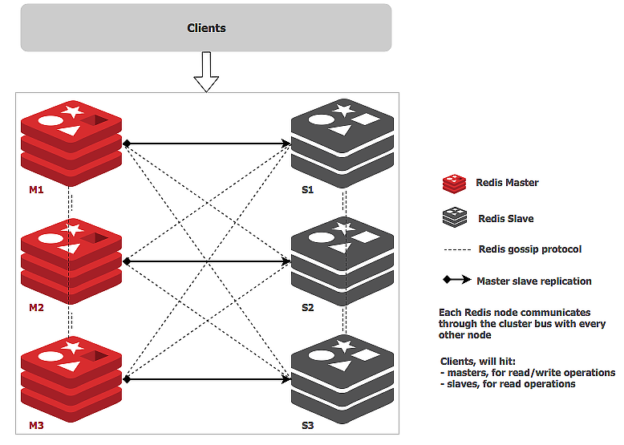
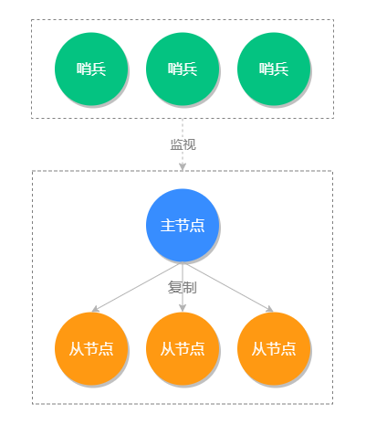
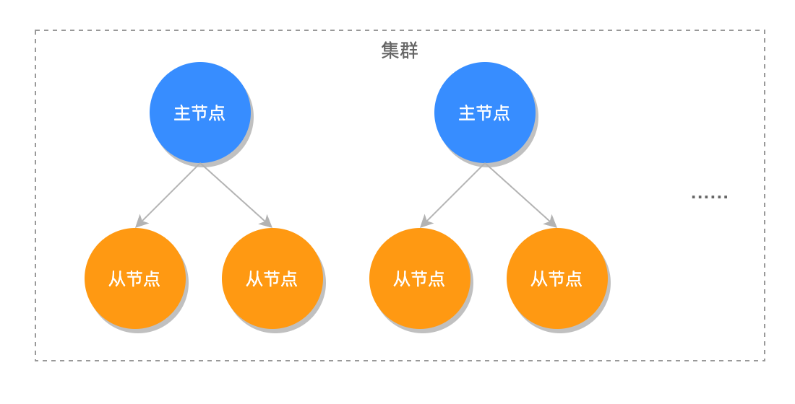
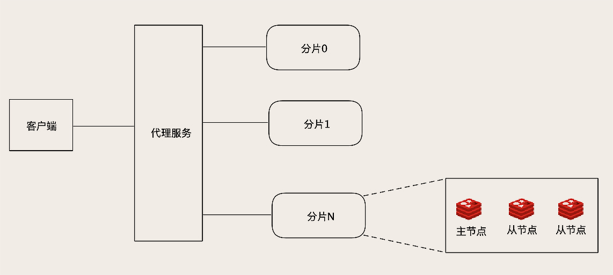
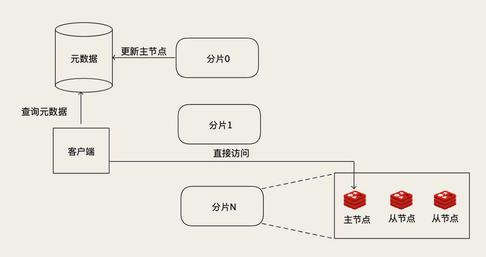
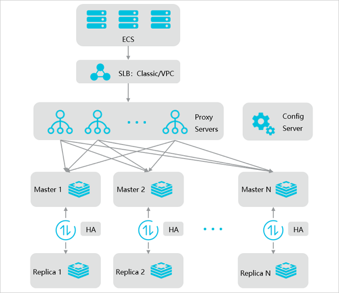

# 节假日高并发购票Redis能扛得住么？

## Redis 常用部署架构
Redis 可以以多种方式进行部署，具体的部署架构会根据应用场景、性能需求和可用资源等因素而有所不同。以下是一些常用的 Redis 部署架构以及对应的一些可能遇到的问题：

### 单机部署
+ 架构描述：单台服务器上运行 Redis 服务。
+ 可能问题：
    - 单点故障：如果 Redis 实例所在的服务器发生故障，会导致整个服务不可用。
    - 有限的内存：受限于单台服务器的内存容量，无法处理大规模数据集。

### 主从复制（Master-Slave）
+ 架构描述：一个 Redis 主节点负责写操作，多个从节点复制主节点的数据，并处理读操作。
+ 可能问题：
    - 主节点故障：如果主节点发生故障，需要手动进行故障转移或者通过 Sentinel 进行自动故障转移。
    - 从节点复制延迟：由于复制是异步的，从节点可能会有一定程度的数据延迟。

### Sentinel 哨兵模式
+ 架构描述：Sentinel 是 Redis 提供的一种用于监控和自动故障转移的工具。它可以监控多个 Redis 主从节点，并在主节点故障时自动将一个从节点提升为新的主节点。
+ 可能问题：
    - Sentinel 故障：如果 Sentinel 集群本身发生故障，可能会影响自动故障转移的功能。
    - 故障转移过程中的数据一致性：在故障转移期间可能会出现数据不一致的情况。

### Redis Cluster
+ 架构描述：Redis Cluster 是 Redis 提供的分布式解决方案，它将数据分片存储在多个节点上，并提供了自动数据分片和故障转移的功能。
+ 可能问题：
    - 故障转移的延迟：在发生故障时，Redis Cluster 需要一定时间来进行故障转移和数据恢复。
    - 数据分片策略的选择：合适的数据分片策略对于集群性能和负载均衡非常重要。

海量并发场景需要 Redis 提供很高的读写性能以及容灾能力，大家对于 Redis Cluster 了解会比较多，也认为这个架构是最能扛住海量并发场景的。但其实不是这样，对于小规模集群 Redis Cluster 使用是没问题的，如果对于大规模集群就有点捉襟见肘了。

## 如何看待 Cluster 模式应对海量并发？
### 为什么 Cluster 模式不适合超大规模集群？
Redis Cluster 的优点是易于使用。分片、主从复制、弹性扩容这些功能都可以做到自动化，通过简单的部署就可以获得一个大容量、高可靠、高可用的 Redis 集群，并且对于应用来说，近乎于是透明的。

所以，**Redis Cluster 是非常适合构建中小规模 Redis 集群**，这里的中小规模指的是，大概几个到几十个节点这样规模的 Redis 集群。

**但是 Redis Cluster 不太适合构建超大规模集群，主要原因是，它采用了去中心化的设计。**刚刚我们讲了，Redis 的每个节点上，都保存了所有槽和节点的映射关系表，客户端可以访问任意一个节点，再通过重定向命令，找到数据所在的那个节点。那你有没有想过一个问题，这个映射关系表，它是如何更新的呢？比如说，集群加入了新节点，或者某个主节点宕机了，新的主节点被选举出来，这些情况下，都需要更新集群每一个节点上的映射关系表。

Redis Cluster 采用了一种去中心化的 **流言 (Gossip) 协议** 来传播集群配置的变化。一般涉及到协议都比较复杂，这里我们不去深究具体协议和实现算法，我大概给你讲一下这个协议原理。

所谓流言，就是八卦，比如说，我们上学的时候，班上谁和谁偷偷好上了，搞对象，那用不了一天，全班同学都知道了。咋知道的？张三看见了，告诉李四，李四和王小二特别好，又告诉了王小二，这样人传人，不久就传遍全班了。这个就是八卦协议的传播原理。

这个八卦协议它的好处是去中心化，传八卦不需要组织，吃瓜群众自发就传开了。这样部署和维护就更简单，也能避免中心节点的单点故障。**八卦协议的缺点就是传播速度慢，并且是集群规模越大，传播的越慢。**这个也很好理解，比如说，换成某两个特别出名的明星搞对象，即使是全国人民都很八卦，但要想让全国每一个人都知道这个消息，还是需要很长的时间。在集群规模太大的情况下，数据不同步的问题会被明显放大，还有一定的不确定性，如果出现问题很难排查。

### 如何用 Redis 构建超大规模集群？
Redis Cluster 不太适合用于大规模集群，所以很多大厂，都选择自己去搭建 Redis 集群。这里面，每一家的解决方案都有自己的特色，但其实总体的架构都是大同小异的。

一种是基于代理的方式，**在客户端和 Redis 节点之间，还需要增加一层代理服务**。这个代理服务有三个作用:

1. 第一个作用：**负责在客户端和 Redis 节点之间转发请求和响应**。客户端只和代理服务打交道，代理收到客户端的请求之后，再转发到对应的 Redis 节点上，节点返回的响应再经由代理转发返回给客户端。
2. 第二个作用：**负责监控集群中所有 Redis 节点状态**，如果发现有问题节点，及时进行主从切换。
3. 第三个作用：**维护集群的元数据。**这个元数据主要就是集群所有节点的主从信息，以及槽和节点关系映射表。**HAProxy+Keepalived 来代理 MySQL 请求的架构是类似的，只是多了一个自动分片路由的功能** 而已。

像开源的 Redis 集群方案 twemproxy 和 Codis，都是这种架构的。

这个架构最大的优点是对客户端透明，在客户端视角来看，**整个集群和一个超大容量的单节点 Redis 是一样的**。并且，由于分片算法是代理服务控制的，扩容也比较方便，新节点加入集群后，直接修改代理服务中的元数据就可以完成扩容。

不过，这个架构的缺点也很突出，增加了一层代理转发，每次数据访问的链路更长了，必然会带来一定的性能损失。而且，代理服务本身又是集群的一个单点，当然，我们可以把代理服务也做成一个集群来解决单点问题，那样集群就更复杂了。

另外一种方式是，不用这个代理服务，把代理服务的寻址功能前移到客户端中去。客户端在发起请求之前，先去查询元数据，就可以知道要访问的是哪个分片和哪个节点，然后直连对应的 Redis 节点访问数据。JAVA 客户端 Jedis 就支持这个功能。

当然，客户端不用每次都去查询元数据，因为这个元数据是不怎么变化的，客户端可以自己缓存元数据，这样访问性能基本上和单机版的 Redis 是一样的。如果某个分片的主节点宕机了，新的主节点被选举出来之后，更新元数据里面的信息。对集群的扩容操作也比较简单，除了迁移数据的工作必须要做以外，更新一下元数据就可以了。

虽然说，这个元数据服务仍然是一个单点，但是它的数据量不大，访问量也不大，相对就比较容易实现。我们可以用 ZooKeeper、etcd 甚至 MySQL 都能满足要求。

**这个方案应该是最适合超大规模 Redis 集群的方案了，在性能、弹性、高可用几方面表现都非常好**，缺点是整个架构比较复杂，客户端不能通用，需要开发定制化的 Redis 客户端，只有规模足够大的企业才负担得起。

> 扩展文章，得物 Redis 缓存架构，基本上与上面讲的架构模型一致，详情查看：[得物 Redis 设计与实践](https://mp.weixin.qq.com/s/dnlxCXgAxHsfyVNYTDsewA)
>

## 云厂商如何实现集群模式？
为了贴合真实场景，我直接看了对应云厂商的集群版本。看完之后，心里久久不能平静。不得不说，钱到位，真TM 的牛逼！

### 阿里云云数据库 Redis 版
#### 集群模式
集群模式数据将会自动分片，系统将提供数据均衡，数据迁移功能。

集群模式的命令相对于非集群模式有一定的兼容性，主要体现在跨 Slot（槽位）数据访问。

#### 集群规格
分片规格（GB）：1、2、4、8、12、16、20、24、32、40、48、64

分片数量：1、3、5、8、12、16、24、32、40、48、64、80、96、128

副本数量：1、2、3、4、5

> 看到这个分片规格和分片数我都要跪了，只要钱到位，啥都能给你整出来。对了，每个分片的 QPS 大概在 8-10万，记住是每个分片，不是整个集群！
>

#### 副本说明
副本数等于1时，Redis 提供数据主从实时热备，提供数据高可靠和高可用（同一可用区内，跨服务器高可用），HA 系统监测到节点故障后，会将请求切换到从节点，并且新增一个从节点加入到系统。

副本数大于1时，Redis 提供数据主从实时热备，并且提供从节点只读功能。

#### 代理模式部署架构

### 腾讯云云数据库 Redis 版
腾讯云的云数据 Redis 版本基本和阿里云的类似，这里就不一一介绍了。

### 云厂商 Redis 提供了哪些能力？
#### 海量并发
标准版性能高达10万+ QPS 并发响应，集群版随着分片线性增长，最大支持千万级 QPS。超高的性能可以满足用户绝大部分场景需求。

单节点支持 10000 连接数（最大可调整到40000）以及 10万+ 的 QPS 性能。如果是集群版，分片数量 * 单节点分片性能。

#### 突发流量
**读扩展**：热 Key 场景，支持动态增加副本扩展读性能，最大支持5副本，提供最大50W的热 Key 读取性能。

**写扩展**：集群版的性能 = 分片数 * 单分片性能。性能水平扩展线性增长，支持从3分片到128分片扩展。

扩容、缩容，规格变更过程业务几乎无感知，保证服务最大可用性。

#### 容灾能力
云数据库 Redis 采用双机热备架构，主机故障后，访问秒级切换到备机，整个过程用户无需做任何处理。节省了开发主从系统带来的人力和时间成本。

#### 性能监控
**系统监控**：实例使用过程中完全透明，支持通过腾讯云可观测平台配置告警规则，提供多达30余项的自动化监控指标。辅助您随时掌控云数据库 Redis 服务的运行状态，快速排障解决问题。

**数据库智能管家（TencentDB for DBbrain，DBbrain）**：可实时监控诊断数据库实例异常，包括：慢日志分析、大 Key 及热 Key 分析、延迟分析等，自动生成健康报告，给出专家级的优化建议，帮助您及时优化数据库性能。

**管控类 API 接口**：云数据库 Redis 提供了一整套完备的管控类 API 接口，用于实现一系列的资源自主管理和运维功能。

---

总而言之一句话，只要钱到位，12306？再加个双 11 的流量照样给你顶上。

来个小问题，大家想一下，Redis 节点的 CPU 核数是不是越高越好？我想可能很多同学没有仔细思考过这个问题，潜意识认为肯定是核数越多越好。但其实不是，已知 Redis 有个主线程处理任务，另外还有很多异步线程操作，这样的话分配2核就可以了。

腾讯云默认位每个节点分配2核 CPU，其中1个 CPU 用于处理后台任务。

## 单机性能瓶颈如何解决？
虽然上述说的 Redis 超大集群能提供海量并发场景，但 Redis 单机版本也是有瓶颈的，如果出现过热列车就会打向 Redis 单片，会造成单片性能抖动。这也是面试常问的热 Key 问题。

如何解决这个问题？请看下回解析。

> 更新: 2023-10-09 18:35:40  
> 原文: <https://www.yuque.com/magestack/12306/eq6v9p9dfre117mg>