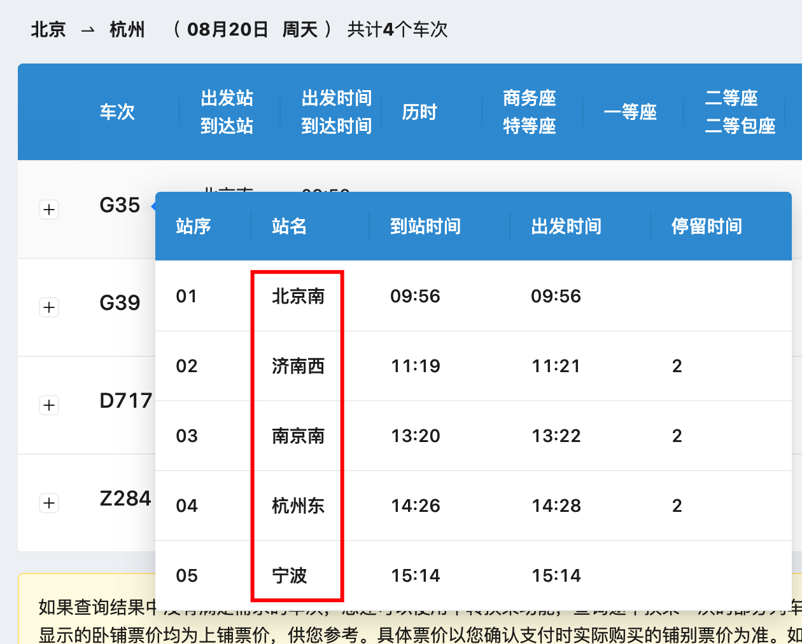
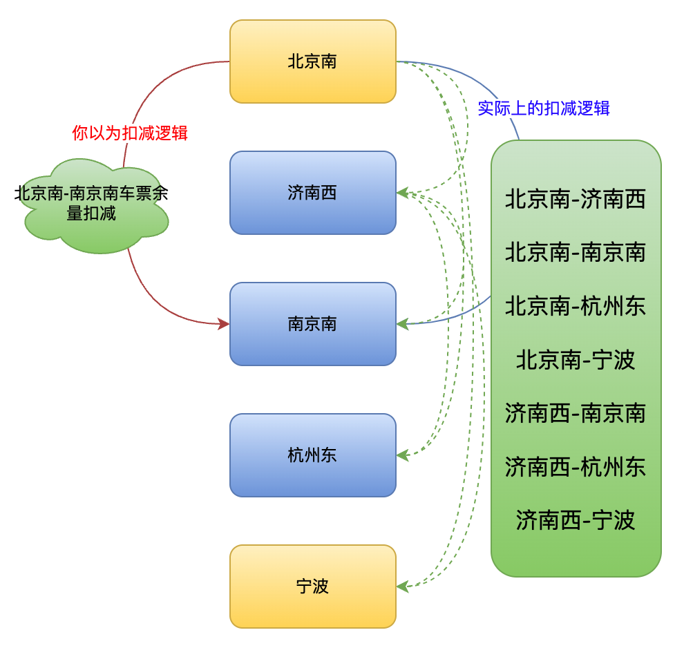
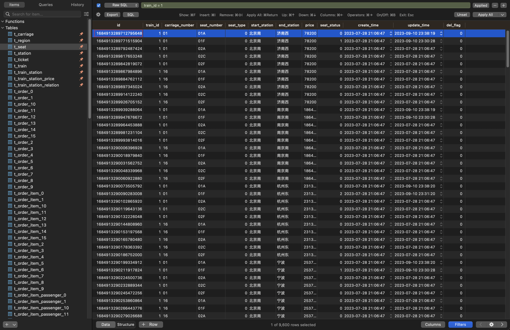
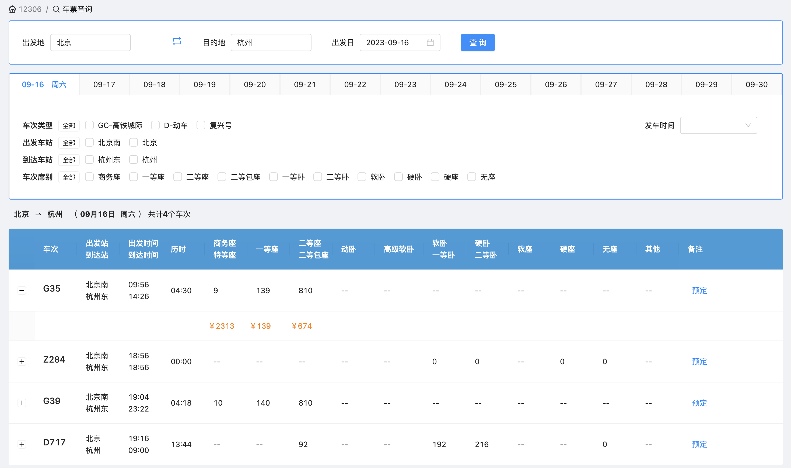
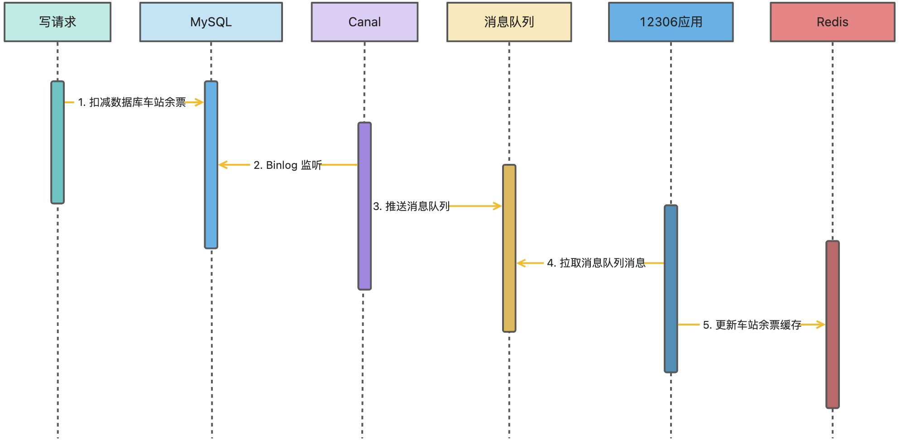

# 购买列车中间站点余票如何更新？

先说一点，你如果把列车中间的站点买完，那么整个列车的绝大部分站点售票都有影响。

以下文章中，我们以 12306 的 G35 列车举例，为什么是这个？因为当时想从北京去杭州旅游来着，哈哈。



## 扣减余票业务
刚接触 12306 的大部分同学可能会误以为，如果购买了从北京南到南京南的车票，只会扣减北京南到南京南站点的车票。但实际情况并非如此。购买了北京南到南京南的列车票时，会扣减沿途站点的库存。

假设购买商务座，列车站点间的初始库存是一致的。下面是购买北京南到南京南车票的流程图示：



再来一个进阶版本的，如果购买济南西到杭州东的车票，流程图如下所示。大家可能会比较疑惑，为什么要扣减北京南到南京南、北京南到宁波、北京南到杭州东以及北京南到宁波？这是因为中间车票被购买了，北京南作为始发站，只能购买北京南到济南西的车票。


刚开始梳理出这个逻辑前，我起码写错了两个版本的代码，大家看代码提交记录也能查到些蛛丝马迹。原因就是，12306 的这个列车余座扣减逻辑太复杂了，电商的 SKU 库存和这个比起来，弟弟都算不上。

大家往下看之前，先把这个梳理清楚，不然可能都不清楚下文在说什么。

## 扣减余票逻辑
余票扣减伴随着两个逻辑：

1. 一个是锁定数据库的列车座位车票状态记录，从可售状态变更为锁定状态。
2. 另一个是将缓存中的座位余量进行扣减，卖出去一个自减一，卖出去两个自减二。

### 更新列车座位车票状态
列车车票表如下所示：

```sql
CREATE TABLE `t_seat` (
  `id` bigint(20) unsigned NOT NULL AUTO_INCREMENT COMMENT 'ID',
  `train_id` bigint(20) DEFAULT NULL COMMENT '列车ID',
  `carriage_number` varchar(64) COLLATE utf8mb4_unicode_ci DEFAULT NULL COMMENT '车厢号',
  `seat_number` varchar(64) COLLATE utf8mb4_unicode_ci DEFAULT NULL COMMENT '座位号',
  `seat_type` int(3) DEFAULT NULL COMMENT '座位类型',
  `start_station` varchar(256) COLLATE utf8mb4_unicode_ci DEFAULT NULL COMMENT '起始站',
  `end_station` varchar(256) COLLATE utf8mb4_unicode_ci DEFAULT NULL COMMENT '终点站',
  `price` int(11) DEFAULT NULL COMMENT '车票价格',
  `seat_status` int(3) DEFAULT NULL COMMENT '座位状态',
  `create_time` datetime DEFAULT NULL COMMENT '创建时间',
  `update_time` datetime DEFAULT NULL COMMENT '修改时间',
  `del_flag` tinyint(1) DEFAULT NULL COMMENT '删除标识',
  PRIMARY KEY (`id`),
  KEY `idx_train_id` (`train_id`) USING BTREE
) ENGINE=InnoDB AUTO_INCREMENT=1685114673839570945 DEFAULT CHARSET=utf8mb4 COLLATE=utf8mb4_unicode_ci COMMENT='座位表';
```


列车座位状态枚举如下所示，共有三个状态：可售、锁定、已售。

```java
package org.opengoofy.index12306.biz.ticketservice.common.enums;

import lombok.Getter;
import lombok.RequiredArgsConstructor;

/**
 * 座位状态枚举
 *
 * @公众号：马丁玩编程，回复：加群，添加马哥微信（备注：12306）获取项目资料
 */
@RequiredArgsConstructor
public enum SeatStatusEnum {

    /**
     * 可售：列车座位初始化时状态
     */
    AVAILABLE(0),

    /**
     * 锁定：用户下单选中了座位，改为锁定状态，将不能再被选中
     */
    LOCKED(1),

    /**
     * 已售：用户订单支付后，修改为已售状态
     */
    SOLD(2);

    @Getter
    private final Integer code;
}
```


每一个列车的车厢座位都代表着一条记录，初始化列车座位时状态为可售状态。




在购票请求里，会有出发站点和到达站点，但如果要对相关站点进行扣减，只知道出发站点和到达站点是不够的，需要知道列车所有站点，并根据扣减逻辑进行计算相关的站点。

```java
@Override
public List<RouteDTO> listTakeoutTrainStationRoute(String trainId, String departure, String arrival) {
    LambdaQueryWrapper<TrainStationDO> queryWrapper = Wrappers.lambdaQuery(TrainStationDO.class)
            .eq(TrainStationDO::getTrainId, trainId)
            .select(TrainStationDO::getDeparture);
    // 获取列车所有站点，通过所有站点计算需要锁定座位的站点集合
    List<TrainStationDO> trainStationDOList = trainStationMapper.selectList(queryWrapper);
    List<String> trainStationAllList = trainStationDOList.stream().map(TrainStationDO::getDeparture).collect(Collectors.toList());
    // 根据工具类计算需要扣减沿途关联的站点
    return StationCalculateUtil.takeoutStation(trainStationAllList, departure, arrival);
}

/**
 * 计算出发站和终点站需要扣减余票的站点（包含出发站和终点站）
 * 整体比较复杂，建议大家知道有这个东西就好，没必要研究细节
 *
 * @param stations     所有站点数据
 * @param startStation 出发站
 * @param endStation   终点站
 * @return 出发站和终点站需要扣减余票的站点（包含出发站和终点站）
 */
public static List<RouteDTO> takeoutStation(List<String> stations, String startStation, String endStation) {
    List<RouteDTO> takeoutStationList = new ArrayList<>();
    int startIndex = stations.indexOf(startStation);
    int endIndex = stations.indexOf(endStation);
    if (startIndex == -1 || endIndex == -1 || startIndex >= endIndex) {
        return takeoutStationList;
    }
    if (startIndex != 0) {
        for (int i = 0; i < startIndex; i++) {
            for (int j = 1; j < stations.size() - startIndex; j++) {
                takeoutStationList.add(new RouteDTO(stations.get(i), stations.get(startIndex + j)));
            }
        }
    }
    for (int i = startIndex; i <= endIndex; i++) {
        for (int j = i + 1; j < stations.size() && i < endIndex; j++) {
            takeoutStationList.add(new RouteDTO(stations.get(i), stations.get(j)));
        }
    }
    return takeoutStationList;
}
```

`takeoutStation` 方法就是上面两张图的逻辑实现原理，将需要扣减的站点计算出来。


通过上述逻辑，已经知道列车 ID、出发站、到达站以及乘车人和对应的座位信息。接下来我们通过出发站和到达站计算出都需要改变哪些站点的座位状态。

```java
/**
 * 锁定选中以及沿途车票状态
 *
 * @param trainId                     列车 ID
 * @param departure                   出发站
 * @param arrival                     到达站
 * @param trainPurchaseTicketRespList 乘车人以及座位信息
 */
void lockSeat(String trainId, String departure, String arrival, List<TrainPurchaseTicketRespDTO> trainPurchaseTicketRespList);

@Override
public void lockSeat(String trainId, String departure, String arrival, List<TrainPurchaseTicketRespDTO> trainPurchaseTicketRespList) {
    // 获取出发站和到达站获取需要扣减的站点集合
    List<RouteDTO> routeList = trainStationService.listTakeoutTrainStationRoute(trainId, departure, arrival);
    trainPurchaseTicketRespList.forEach(each -> routeList.forEach(item -> {
        LambdaUpdateWrapper<SeatDO> updateWrapper = Wrappers.lambdaUpdate(SeatDO.class)
                .eq(SeatDO::getTrainId, trainId)
                .eq(SeatDO::getCarriageNumber, each.getCarriageNumber())
                .eq(SeatDO::getStartStation, item.getStartStation())
                .eq(SeatDO::getEndStation, item.getEndStation())
                .eq(SeatDO::getSeatNumber, each.getSeatNumber());
        SeatDO updateSeatDO = SeatDO.builder()
                .seatStatus(SeatStatusEnum.LOCKED.getCode())
                .build();
        // 修改座位状态
        seatMapper.update(updateSeatDO, updateWrapper);
    }));
}
```

经过 `lockSeat` 方法就可以锁定出发站点和到达站点沿途各站对应的座位状态，从可售变更为锁定。

### 扣减缓存座位余量
大家都知道，咱们 12306 的列车信息以及对应站点的座位余量都是从缓存读的。




上面说的是把数据库的列车座位记录状态从可售变更为锁定状态，同时也要把缓存相关的余量进行对应的扣减。

说到这里，就不得不提数据库和缓存一致性问题了，建议大家先看过咱们的这两篇文章：

+ [缓存与数据库一致性如何解决？](https://www.yuque.com/magestack/12306/wocbrht50ctg14nv)
+ [手摸手之列车余票如何保障缓存数据库一致性](https://www.yuque.com/magestack/12306/glv5e0785b2d7oag)


扣减缓存有两种方案，一种是 Demo 级别的，一种是生产级别的。Demo 使用起来比较简单，生产级别的技术方案还需要引入单独中间件，所以默认是 Demo 级别的。

Demo 的话，就是把扣减数据库和缓存扣减放在一个流程里，咱们举例：

```java
@Override
public List<TrainPurchaseTicketRespDTO> executeResp(SelectSeatDTO requestParam) {
	// 根据乘车人选择对应座位
    List<TrainPurchaseTicketRespDTO> actualResult = selectSeats(requestParam);
    // 扣减车厢余票缓存，扣减站点余票缓存
    if (CollUtil.isNotEmpty(actualResult) && !StrUtil.equals(ticketAvailabilityCacheUpdateType, "binlog")) {
        String trainId = requestParam.getRequestParam().getTrainId();
        String departure = requestParam.getRequestParam().getDeparture();
        String arrival = requestParam.getRequestParam().getArrival();
        StringRedisTemplate stringRedisTemplate = (StringRedisTemplate) distributedCache.getInstance();
        List<RouteDTO> routeDTOList = trainStationService.listTakeoutTrainStationRoute(trainId, departure, arrival);
        routeDTOList.forEach(each -> {
            String keySuffix = StrUtil.join("_", trainId, each.getStartStation(), each.getEndStation());
            // 扣减列车对应站点的对应座位类型余量
            stringRedisTemplate.opsForHash().increment(TRAIN_STATION_REMAINING_TICKET + keySuffix, String.valueOf(requestParam.getSeatType()), -actualResult.size());
        });
    }
    return actualResult;
}
```

大家思考一个问题，如果用户买了三张票，在扣减过程中，或者全部扣减完之后，程序直接宕机了怎么办？

数据库的记录可以通过事务回滚方式保证数据正确性，那 Redis 中这个数据就没办法回滚了。就会造成列车数据明明没有被卖，但是展示没有余票。


为此，我们使用第二种生产级方案：通过监听 MySQL Binlog 发送消息队列，在消息队列消费端监听到消息进行扣减 Redis 库存。




> 更新: 2023-09-16 17:12:31  
> 原文: <https://www.yuque.com/magestack/12306/efhhtogdr8ouz6t2>