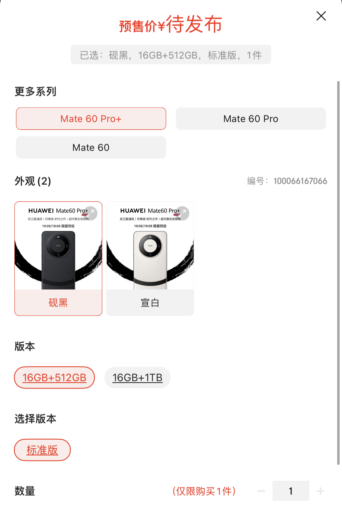
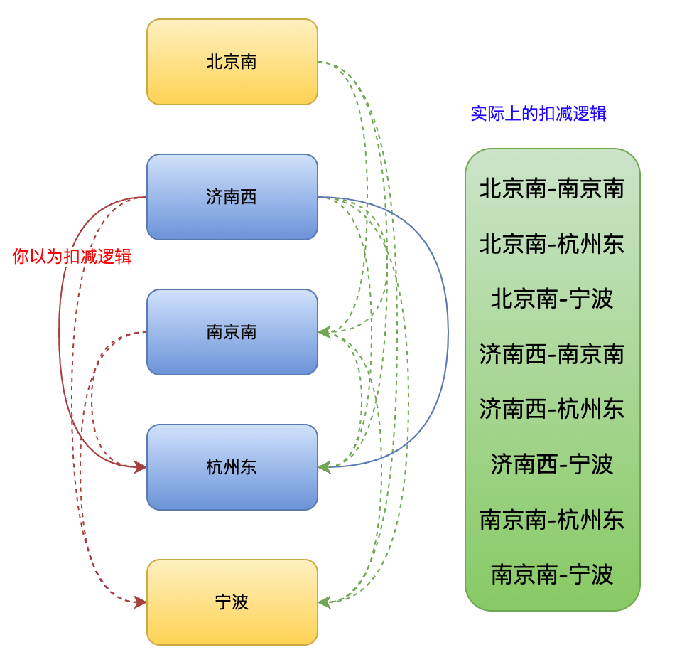
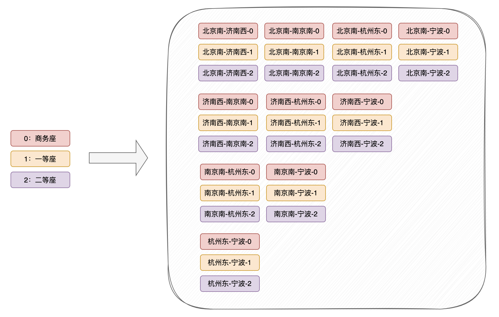
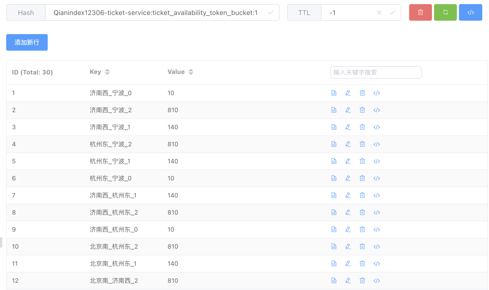
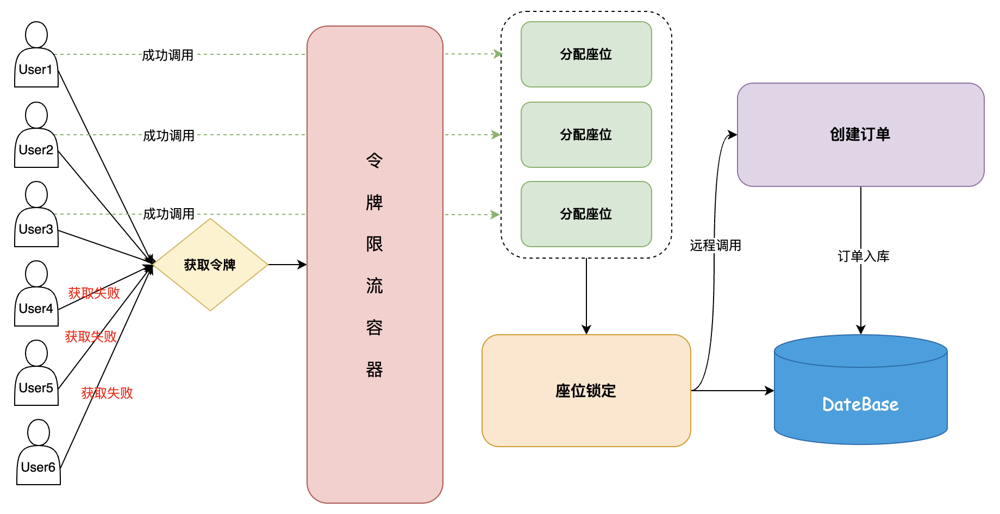

# 购买列车余票如何防止库存超卖？

很多老板对于列车余票是如何防止库存超卖的比较疑惑，这篇文章统一给老板们解个惑。

## 常见库存超卖解决方案
我们以常见的电商系统秒杀逻辑来解析 12306 为什么不用下述技术来解决列车余量扣减。

### 数据库乐观锁
判断库存数量 stock 大于扣减数量 pendingCounts，判断正确才会更新 SQL。

伪代码如下：

```sql
UPDATE
	product_stock
SET
	stock = stock - #{pendingCounts} 
WHERE 
	id = #{skuId} and stock >= #{pendingCounts}
```

应用中调用该方法后，判断数据修改行数是否大于0，如果条件判断不成功即修改失败，直接抛出异常即可。

### Redis 缓存余量扣减
将商品 SKU 库存放到缓存，存储一个字符串或 Hash 类型。Key 是商品 SKU ID，Value 是商品 SKU 对应的库存数量，利用 Redis 的 incrby 特性来扣减库存，可以解决超扣和性能问题。

扣减库存成功后，继续执行数据库的扣减以及下订单等一系列流程。

### 为什么不用？
假设，我们有一件商品华为 Mate 60 Pro，外观+版本+选择版本一起就组成了唯一的 SKU。



比如我购买了砚黑色，对宣白色的库存没有任何影响。但是大家想一下，12306 的库存是这样么？如果购买济南西到杭州东的车票，流程图如下所示，要扣减站点相关的多个站点库存，有关联属性。所以上面的这些版本并不适用于 12306 的列车座位余量扣减业务。



## 令牌限流算法
再提醒下大家，令牌限流算法并不等同于令牌桶限流算法，两者语义以及要解决的功能点不同。



以上这些都是令牌容器中的 Key，令牌容器是个 Hash 结构，上面这些都是 Hash 结构中的内部 Key。每个 Key 都会对应一个 Value，Value 也就是对应出发站点-到达站点-座位类型的余量。

Redis 中实际存储如下所示：



### 过滤多余请求流量
令牌限流同 Redis 缓存余量扣减逻辑类似，都是通过一个前置流程对无效流量进行限制，因为列车一共就那些票，你买的人再多，终归只有个别用户能成功，多余的流量在前置购票环节直接返回。



### 避免座位余量超卖
我们以 12306 G35 趟复兴号高铁为大家举例。


如果购买济南西到杭州东的车票，流程图如下所示，要扣减站点相关的多个站点库存。


令牌限流容器中的数据，是与列车余票一一对应的。  
流程就是获取到出发站点和到达站点之间的相关联站点，以上图为准。通过 Redis 查询这些关联站点的余票是否充足，如果充足则先从令牌限流算法中扣减相关的余量，通过 Redis Hash 结构的 hincrby 命令进行自减。

然后用户拿到令牌后，进行座位分配、座位锁定以及创建订单等逻辑。座位锁定时，和自减的令牌限流里的站点一致，参考上图所示。

这里有个问题，我们在令牌限流容器里进行自减，因为要操作多个 Hash Key，这个多站点的自减是非原子性的，所以我们需要通过 LUA 脚本完成。


> 更新: 2023-09-12 16:23:09  
> 原文: <https://www.yuque.com/magestack/12306/pemih6p8h7xaw2b3>