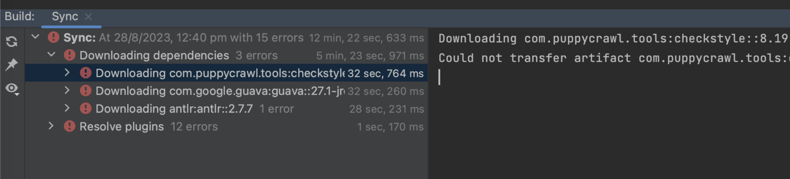

# Maven编译项目报错

最新星球小伙伴反馈说项目编译报错，类似于下面这种：

解决思路如下：

1. 检查电脑上的 Maven 是不是用的 IDEA 自带的，如果是自带的需要去下载个 Maven 替换原有的。
2. 如果你的 IDEA 是 2021 版本左右，下载 3.6.x 的 Maven 即可。
3. 如果你的 IDEA 版本较新，下载 3.9.x 的 Maven 即可。

我的 IDEA 是最新的版本，Maven 也是最新的，版本是 3.9.3。

> 更新: 2023-08-28 13:40:15  
> 原文: <https://www.yuque.com/magestack/12306/kih4ct49avuar70n>