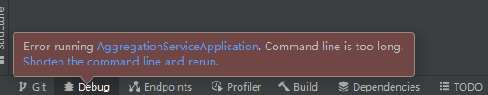
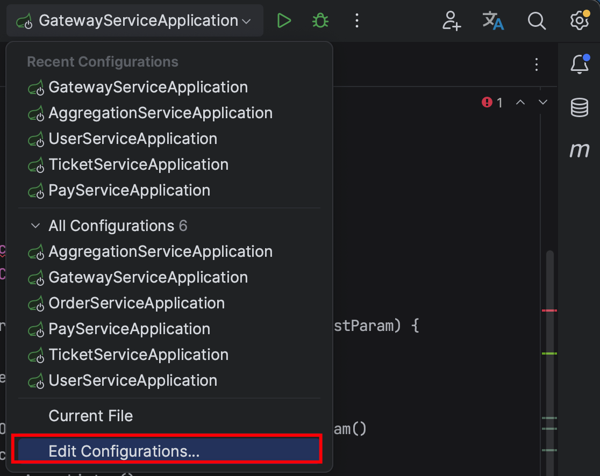
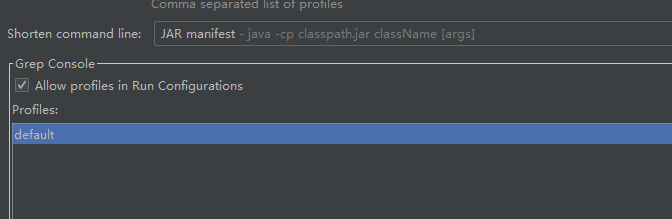

# Windows系统启动聚合服务报错 Command line is too long Shorten the command line and rerun

该问题仅 Windows 系统电脑会出现。

问题现状：

如何解决？

1）打开服务控制器。

选择聚合服务 `AggregationServiceApplication`，点击 `Modify options`，点击 `shorten command line`。

选择 `JAR manifest`，问题解决。

> 更新: 2023-08-05 11:01:27  
> 原文: <https://www.yuque.com/magestack/12306/vrn49fm2afegp0ug>