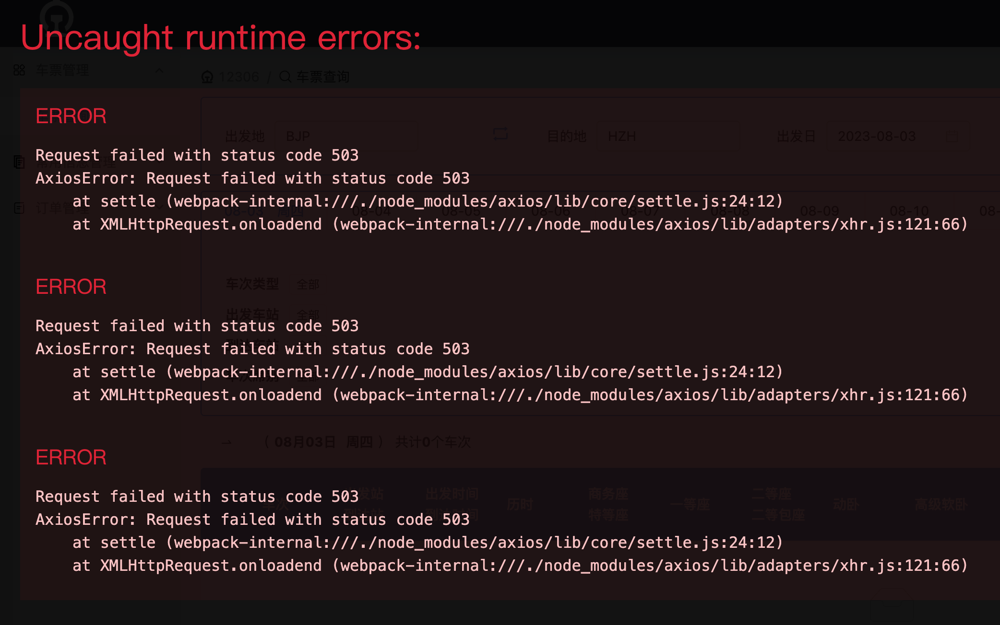
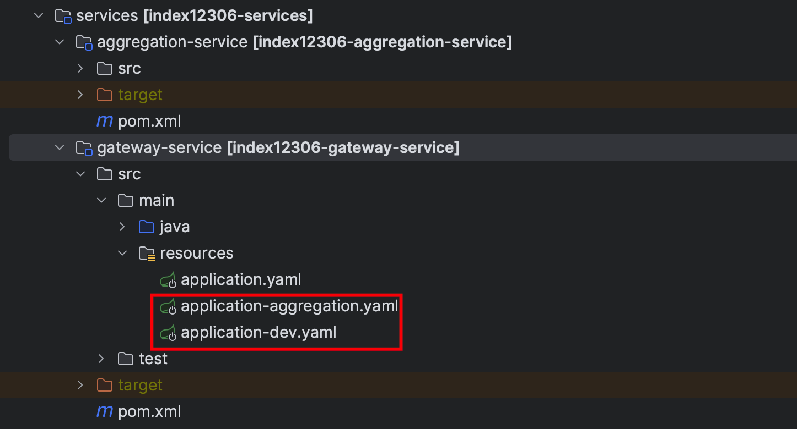

# 为什么分布式模式调用报错？

## 问题现状
星球小伙伴反馈说，通过分布式方式启动用户、购票、订单、支付以及网关服务，通过前端项目调用接口报错。



## 问题解决
这是因为 `gateway-service` 配置中默认是 SpringBoot 单体模式，如果你是以分布式方式启动，需要修改 `application.yaml` 配置文件中的属性。

SpringBoot 单体模式：

```yaml
server:
  port: 9000
spring:
  application:
    name: index12306-gateway${unique-name:}-service
  profiles:
    active: aggregation
    # active: dev
  cloud:
    nacos:
      discovery:
        server-addr: 127.0.0.1:8848
```


SpringCloud 分布式模式：

```yaml
server:
  port: 9000
spring:
  application:
    name: index12306-gateway${unique-name:}-service
  profiles:
    # active: aggregation
    active: dev
  cloud:
    nacos:
      discovery:
        server-addr: 127.0.0.1:8848
```


可以看到，我们将 `spring.profiles.active` 从 aggregation 修改为了 dev。

aggregation 代表着聚合模式也就是 SpringBoot 单体模式，dev 是分布式模式，分别对应两个配置文件。




通过 Spring 机制，加载不同的配置文件，起到网关调用不同模式服务的作用。

星球小伙伴修改网关配置后，问题得到解决。


> 更新: 2023-08-03 13:18:23  
> 原文: <https://www.yuque.com/magestack/12306/ihwdir1xs985a21m>